# CH.01 컴퓨터 네트워크와 인터넷

## 1.1 인터넷이란 무엇인가?
- 네트워크를 설명하는 방식
  - 네트워크의 구성요소를 설명
  - 네트워크 인프라 구조 관점에서의 인터넷를 설명

### 1.1.1 구성요소로 본 인터넷
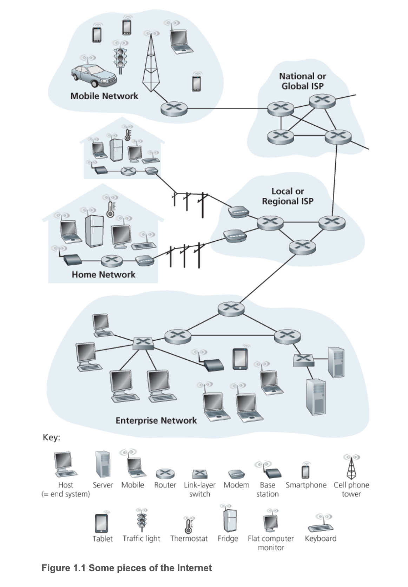

- 호스트, 종단 시스템(end system)
  - 노트북, 스마트폰, 아이패드, TV, 가전제품, 시계, 홈 보안 시스템 등등 ...
  - 2015년에 50억개 2020년에 250억개에 이를거라고 예상(지났네..?)
- 통신 링크(communication link)와 패킷 스위치(packet switch)
  - 종단 시스템을 연결
  - 다양한 전송률(transmission rate)를 가짐, bps(bit per second)
- 패킷
  - 데이터를 세그먼트(segment)로 나누고 각 세그먼트에 헤더(header)를 붙여서 전달
  - 종단 시스템에서 나눠진 패킷을 다시 데이터로 조립해서 사용
- 패킷 스위치
  - 라우터(router)와 링크 계층 스위치(link-layer switch)
  - 스위치는 액세스 네트워크 라우터는 네트워크 코어에서 사용
- 네트워크 경로(route or path)
  - 패킷이 source 에서 destination 종단 시스템으로 도달하는 동안 거쳐온 통신 링크와 패킷 스위치들
- ISP(Internet Service Provider)
  - 종단 시스템은 ISP를 통해서 인터넷에 접속
  - 지역 케이블, 전화 회사, 대학, ...
  - 패킷 스위치와 통신 링크로 이루어진 네트워크
  - CP(Content Provider)에게 인터넷 접속을 제공
  - ISP간의 연결
    - 계층이 존재
- 프로토콜(protocol)
  - 인터넷의 주요 프로토콜을 통칭하여 TCP/IP이라고 함
  - TCP(Transmission Control Protocol)
  - IP(Internet Protocol)
- RFCs(request for comments)
  - 인터넷 표준 문서
  - IETF에서 개발

### 1.1.2 서비스 측면에서 본 인터넷
- 애플리케이션에 서비스를 제공하는 인프라 구조
- 인터넷 애플리케이션은 종단 시스템에서 수행된다
  - 네트워크 코어에 있는 패킷 스위치에서 수행x
- 소켓 인터페이스(Socket interface)
  - 종단 시스템간에 **어떻게** 데이터 전달할지에 대한 규칙

### 1.1.3 프로토콜이란 무엇인가?
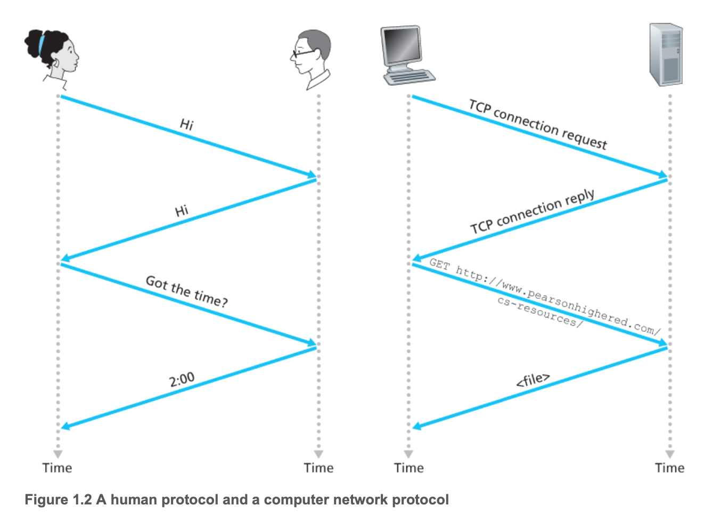

> "프로토콜은 둘 이상의 통신 개체 간에 교환되는 메세지 포맷과 순서뿐 아니라, 메세지 의 송수신과 다른 이벤트에 따른 행동들을 정의한다."

- 예시 1) 혼잡 제어 프로토콜
  - 송수신자 간에 전송되는 패킷률 조절
- 예시 2) HTTP
  - 브라우저에서 URL을 입력
  - 클라이언트 컴퓨터에서 서버로 연결 요청 메세지를 전송하고 기다림
  - 웹 서버는 연결 요청 메세지를 받고 연결 응답 메세지를 클라이언트로 전송
  - 클라이언트는 원하는 데이터에 대한 요청을 전송
  - 웹 서버는 클라이언트에서 원하는 데이터를 응답

## 1.2 네트워크의 가장자리(Edge)
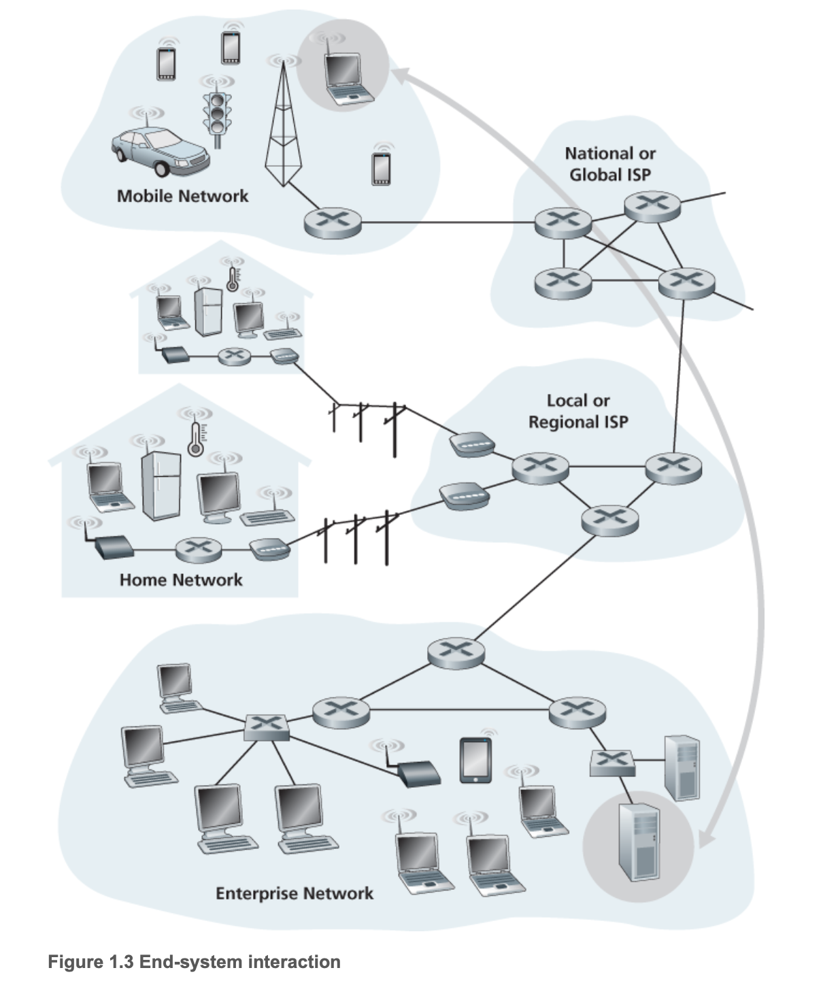
- 종단 시스템
- 데스크톱 컴퓨터, 서버, 모바일 기기, IOT 기기
- 브라우저, 서버, 메일 클라이언트같은 앱을 수행하는 **호스트**라고 불림 (호스트 = 종단 시스템)
- 클라이언트와 서버로 구분되기도함

### 1.2.1 접속 네트워크
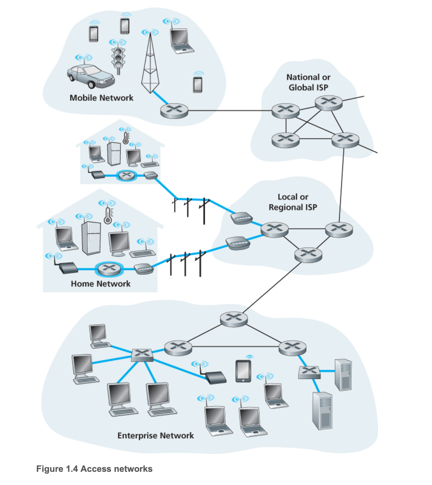

- 종단 시스템이 먼 곳의 다른 종단 시스템까지 경로상에 있는 첫 번째 라우터에 연결하는 네트워크
  - 네트워크 코어에 접속하기 위한 네트워크 구성 요소

#### DSL(Digital subscriber line)
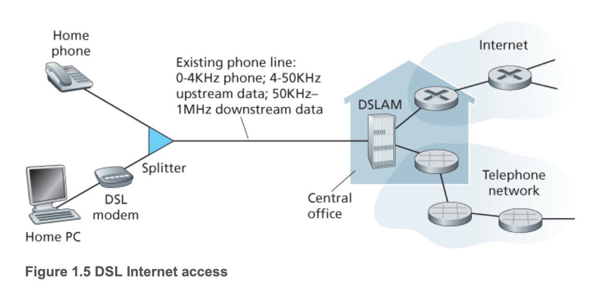
- 유선 전화 서비스를 제공하는 전화 회사로부터 DSL 인터넷 접속 서비스를 받음
- 가정 전화 회선은 데이터와 전화 신호를 동시에 전달하며 다른 주파수 대역을 사용
  - 같은 회선을 사용하지만 주파수 대역을 다르게 사용(circuit switching)
- 스플리터로 데이터와 전화 신호를 분리

#### 케이블
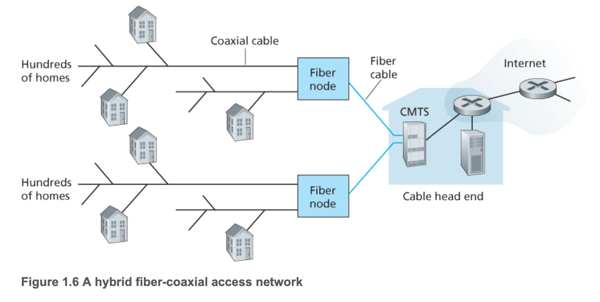
- 케이블 모뎀 필요
- 다운스트림 채널이 업스트림 채널보다 빠른 전송 속도가 할당
- 공유 방송 매체
  - 헤드엔트에서 보낸 모든 패킷이 모든 링크의 다운스트림 채널을 통해 모든 가정으로 전달
  - 여러 사용자가 다운스트림 채널에서 다른 비디오 파일을 동시에 수신하고 있다면, 각 사용자의 실제 수신율은 다운스트림 수신율보다 작아짐
  - 몇 명만 접속하고 웹서핑 중이라면, 각 사용자는 전체 다운스트림 전송률로 웹페이지 수신 가능(동시에 웹페이지를 요구하는 경우는 거의 없기 떄문에)

#### FTTH(fiber to the home)
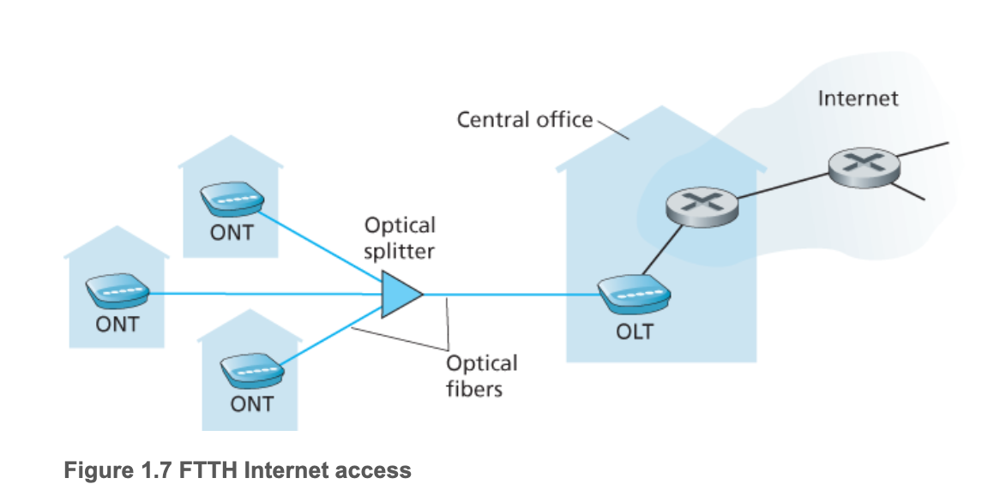
- CO부터 가정까지 광케이블로 바로 연결
- 스플리팅
  - 실제로는 CO에서 여러 가정이 공유하는 광스플리터로 데이터를 전송하면 이곳에서 데이터를 각 가정으로 분배해준다.
  - AON(active optical network), PON(passive optical network)
- 개빠르다
  - Gbps의 인터넷 접속속도 제공이 가능
- 우리나라에서 가장 많이 사용하는 방식

#### 이더넷과 와이파이
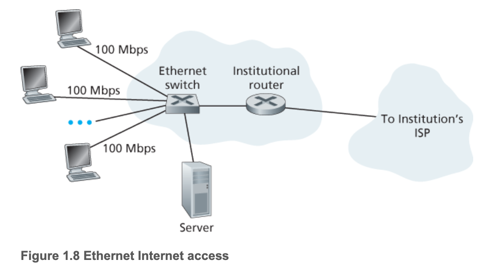

- 이더넷
  - 가장 많이 사용하는 LAN(local area network) 기술
  - 기업과 대학 캠퍼스등에서 LAN은 종단 시스템을 edge 라우터에 연결하기 위해 사용
- 와이파이
  - 무선랜 환경에서 무선 사용자들은 기업 네트워크에 연결된 AP(access point)로 패킷을 송신/수신하고 이 AP는 유선 네트워크에 연결

### 1.2.2 물리 매체(skip)
- 꼬임쌍선
- 동축케이블
- 광섬유
- 지상 라디오 채널
- 위성 라디오 채널

## 1.3 네트워크 코어

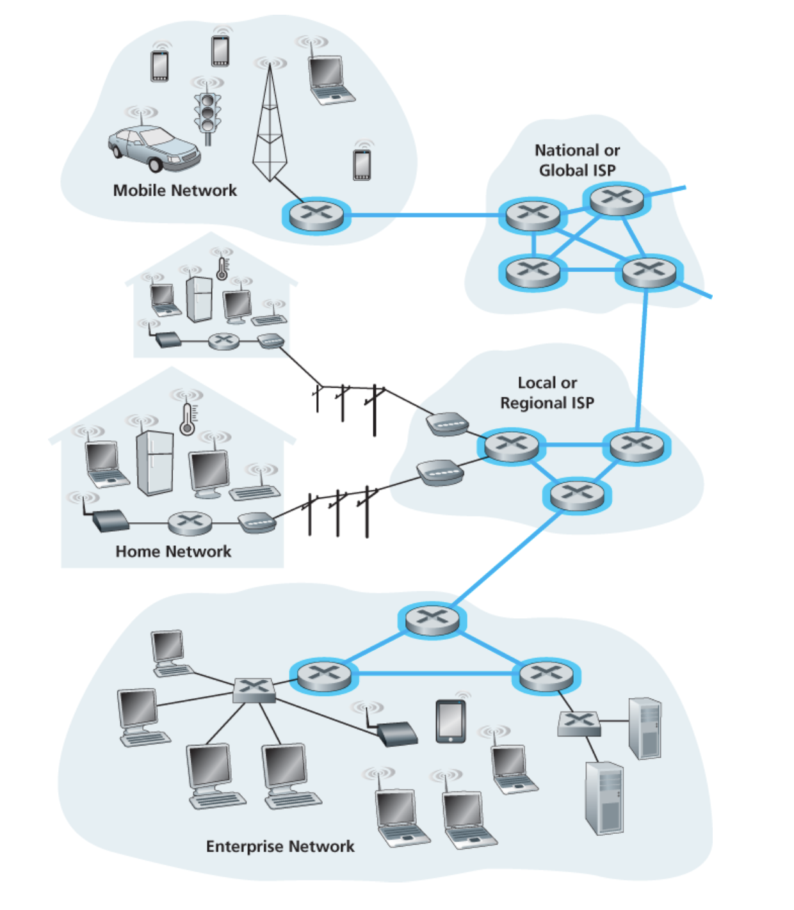

### 1.3.1 Packet Switching
- 네트워크 애플리케이션에서 종단 시스템들은 서로 메세지를 교환
- Source는 메세지를 패킷(Packet) 단위로 분할해서 전송한다
- Source와 Destination 사이에서 각 패킷은 통신 링크와 패킷 스위치(라우터 or 링크 계층 스위치)를 거친다
- 패킷은 링크의 최대 전송속도와 같은 속도로 각각의 통신 링크상에서 전송
- 패킷 스위치가 *R bits/sec* 속도로 *L bits* 의 패킷을 전송한다면, 패킷 전송 시간은 *L/R* 초이다

#### 저장-후-전달 전송 (Store-and-foward transmission)
- 스위치가 출력 링크로 패킷의 첫 비트를 전송하기 전에 전체 패킷을 받는다

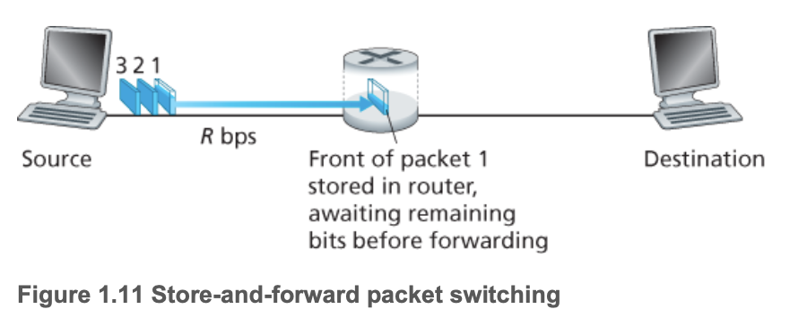
- 3개의 패킷(*각각 L bits*)을 Source에서 Destination으로 전송
- Source와 Destination 사이에는 하나의 라우터를 거침
- 라우터는 *R bits/sec* 의 속도로 패킷을 송신
1. L/R초 시간에 라우터가 Source로 부터 모든 패킷을 수신하고 저장
    - 모든 패킷을 수신하기 전까지 다음 링크로 패킷을 전송하지 않음
    - 패킷은 버퍼에 저장한다
2. 라우터에 저장된 모든 패킷을 Destination으로 전송하는데 L/R초 소요
3. Source 에서 Destination까지 전송된 시간: **2L/R**

- 결론
  - Source부터 Destination까지 N개의 링크(N-1개의 라우터)
  - R 전송속도를 갖는 경로
  - L bits
  - **종단간 지연 = N * L / R**

#### 큐잉 지연(queuing delay)과 패킷 손실(packet loss)
- 각 링크에 대해 패킷 스위치는 출력 버퍼를 가지고 있음
- **큐잉 지연**
  - 버퍼로 도착한 패킷이 출력 링크로 전달되지 않고 큐에 쌓이는 현상
- **패킷 손실**
  - 큐잉 지연 떄문에 버퍼가 꽉차면 새로 도착한 패킷을 저장하지 못하거나 존재하는 패킷을 drop하는 현상 발생

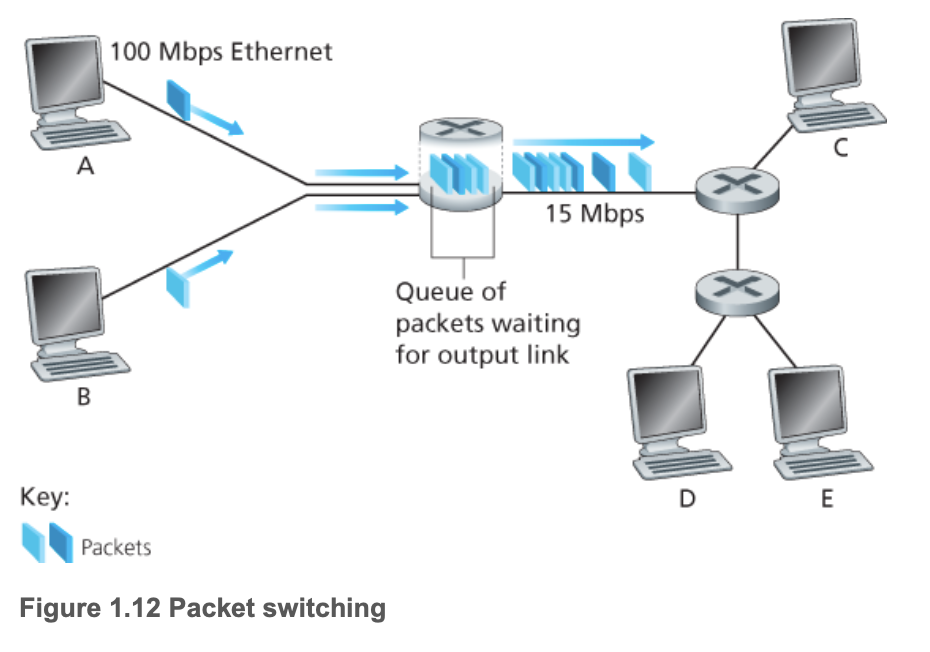

#### 전달 테이블(forward table)과 라우팅 프로토콜(routing protocol)
- 전달 테이블(forward table)
  - 인터넷의 모든 종단 시스템은 IP 주소를 가짐
  - Source에서 Destination으로 패킷을 보낼때, 패킷의 헤더에 Destination의 IP 주소를 포함
  - IP 주소는 계층적인 구조를 가짐
  - 패킷이 네트워크의 한 라우터에 도착하면, 라우터는 패킷의 목적지 주소의 일부를 조사하고 그 패킷을 이웃 라우터로 전달
    - 각 라우터는 목적지 주소를 라우터의 출력 링크로 매핑하는 전달 테이블을 가진다
    - 패킷이 라우터에 도착하면, 라우터는 올바른 출력 링크를 찾기 위해 주소를 조사하고 이 목적지 주소를 이용하여 전달 테이블을 검색한 후에 패킷을 출력 링크로 보낸다
- 라우팅 프로토콜(routing protocol)
  - 전달 테이블을 어떻게 설정할지?
  - 전달 테이블 설정을 위한 알고리즘

### 1.3.2 Circuit Switching

- 회선 교환 네트워크에서 경로 상의 필요한 자원(버퍼, 링크 전송률)을 통신 세션(session)동안에 예약(reserve)해서 사용
- 송신자는 수신자에게 **보장된(guaranteed)** 전송률로 데이터를 전달 가능

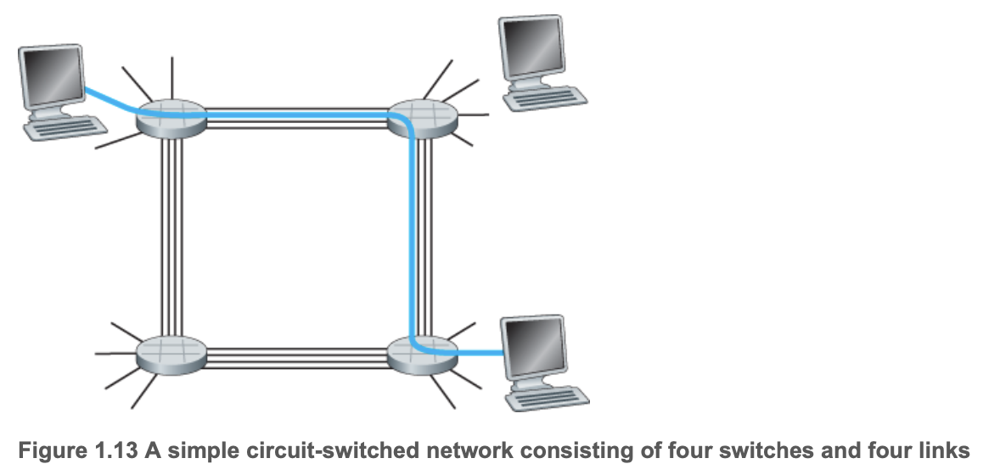

#### 회선 교환 네트워크에서의 다중화
- 주파수-분할 다중화(frequency-division multiplexing, FDM)
  - 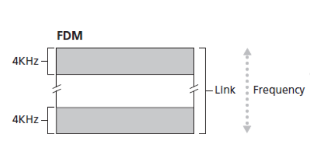
  - 주파수 대역폭(bandwidth)을 나눠서 각 회선들에 할당해서 사용
- 시-분할 다중화(time-division multiplexing, TDM)
  - 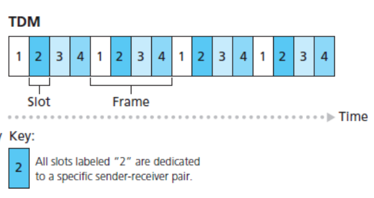
  - 전체 대역폭 사용
  - 각 회선에 전달하는 패킷을 슬롯 단위로 나누어서 전송
- 비활용 기간(slient period)에 일부 회선이 놀게되는 낭비 발생

#### 패킷 교환 vs 회선 교환

- 패킷 교환이 회선 교환보다 전송 용량의 공유에서 더 효율적이다
- 패킷 교환이 더 간단하고, 효율적이며, 회선 교환보다 구현 비용이 적다
- 왜?
  - 사용자가 1 Mbps 링크를 공유
  - 각 사용자는 활동 시간(100 kbps로 데이터를 생산)과 비활동 시간을 반복
  - 사용자는 전체 시간에서 10%만 활동
  - 회선 교환의의 경우
    - 100 kbps가 각각의 사용자에게 예약되어야 한다
    - 1초 프레임이 100 msec마다 10개 시간 슬롯으로 나뉜다면, 각 사용자는 한 프레임에 한번의 시간 슬롯이 할당
    - 이때 동시에 10명(1 Mbps/100 kbps)만 지원 가능
  - 패킷 교환의 경우
    - 특정 사용자가 동시에 활동하고 있을 확률은 0.1
    - 35명의 사용자가 있따면, 11명 이상의 사용자가 동시에 활동할 확률은 약 0.0004
    - 10명의 동시 사용자가 있다면(0.9996), 데이터의 통합 도착률은 1Mbps보다 작거나 같다
    - **따라서 아주 높은 확률(0.9996)로 유사한 지연 성능으로 3배 이상의 사용자수를 지원할 수 있다.**

### 1.3.3 네트워크의 네트워크
- 네트워크(ISP)의 네트워크
  - 종단 사용자와 글로벌 컨텐츠 제공자들(구글, 넷플릭스, ...)을 연결하기 위해서는 ISP들이 서로 연결되어야 한다
- 네트워크 구조 1
  - 모든 접속 ISP들을 하나의 글로벌 통과(trasit) ISP와 연결
  - (상상의) 글로벌 ISP는 전세계의 라우터와 수십만 개의 접속 ISP와 연결
  - 글로벌 ISP는 접속 ISP에게 사용량 만큼 과금
  - 접속 ISP은 Customer, 글로벌 ISP는 Provider
- 네트워크 구조 2
  - 다중의 글로벌 ISP, 수십만 개의 접속 ISP
  - 글로벌 ISP간의 가격 경쟁
  - 글로벌 ISP간의 연결 필수
- 네트워크 구조 3
  - 현실적으로, 전세계 모든 도시에 서비스를 제공할 ISP는 없다(네트워크 구조 1,2는 현실적으로 불가능)
  - 지역 ISP는 1티어 ISP와 연결
  - 1티어 ISP는 전세계적으로 12개 정도 존재, 공식적으로 1티어 지위를 부여하지는 않음
  - 한 지역에 여러 ISP가 경쟁할 수도 있음
- 네트워크 구조 4
  - PoP(points of presence)
    - 접속 ISP 계층을 제외한 모든 계층에 존재
    - 고객 ISP가 제공자 ISP에 연결되는 라우터 그룹
    - 고객 네트워크가 제공자의 PoP에 연결되기 위해, 고객 라우터 중 하나를 PoP에 있는 라우터에 직접 연결하도록 고속 링크를 3rd party 통신 서비스 제공자로부터 임대할 수 있다.
  - 멀티-홈(multi-homing)
    - 다수의 제공자 ISP에 연결할 수 있도록 선택이 가능
    - 멀티-홈에서는 ISP 중 하나가 연결되지 않더라도 패킷 송수신이 가능
  - 피어링(peering)
    - 고객 ISP가 서비스 제공 ISP에게 지불하는 요금을 줄이기 위해 같은 계층의 근접한 ISP와 트래픽을 교환
    - 이들 간의 송수신되는 모든 트래픽은 상위 계층의 ISP를 통하지 않고 직접 송수신 가능
    - 1계층 간의 피어링도 가능
  - IXP(internet exchanging point)
    - 제 3의 회사가 IXP를 구축하여 ISP간의 피어링 서비스를 제공
- 네트워크 구조 5
  - 콘텐츠 제공자 네트워크(content-provider network)
  - 구글
    - 북미, 유럽, 아시아 등 전 세계에 100여개의 데이터 센터를 가지고 있음
    - 이 네트워크는 전 세계를 연결하며 public 네트워크와는 분리되어 있음
    - 구글 사설 네트워크는 구글 서버로 오가는 트래픽만 전달
    - 하위 계층 ISP들과 피어링함으로써 인터넷의 상위 계층을 우회(bypass)하고 있음
    - 하지만 구글 네트워크도 대부분 접속 ISP드에 접근할 때에는 1티어 네트워크를 통하기 때문에 비용을 지불
    - 자신의 네트워크를 구축하면 상위 ISP에게 지불하는 요금을 줄일 수 있고, 사용자들에게 절달되는 네트워크에 대한 통제권을 가질 수 있다

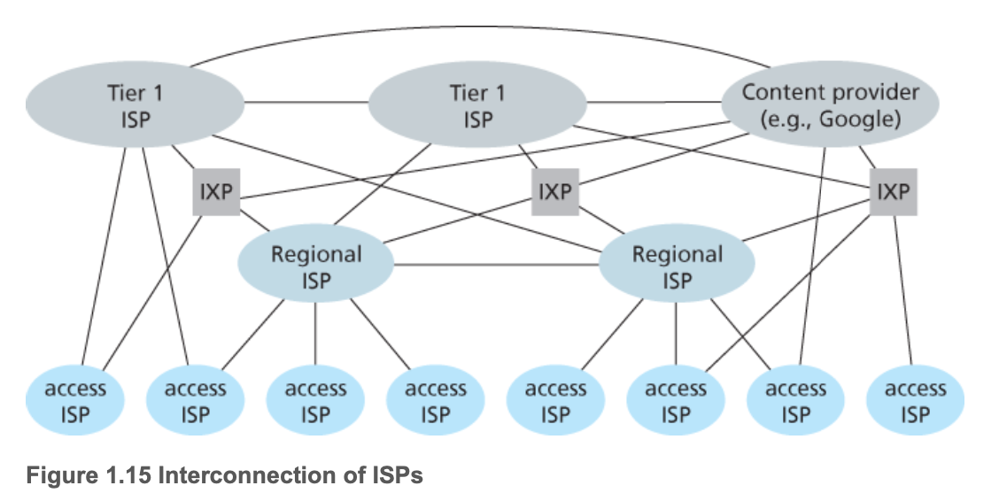

## 1.4 Delay, Loss and Throughput in Packet-Switched Networks

### 1.4.1 Overview of Delay
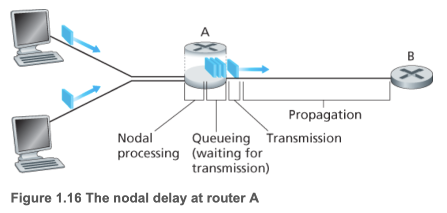

- 한 패킷이 업스트림 노드로부터 라우터 A를 통해 라우터 B로 보내진다
- 라우터 A에서의 노드 지연을 알아볼 것
- 라우터 A가 라우터 B에 연결되는 outgoing 링크를 가짐
- 패킷이 업스트림 노드로부터 라우터 A에 도착하면, 라우터 A는 그 패킷에 대한 적당한 outgoing 링크를 결정하기 위해 패킷 헤더를 조사하고 해당 링크에 패킷을 전송한다
- 패킷은 **링크에 현재 전송되는 다른 패킷**이 없고 **큐에 자신보다 앞선 다른 패킷**들이 없으면 링크로 전송된다
- 만약 링크가 이미 이용되고 있거나 그 링크를 이용하기 위한 패킷이 큐에 대기한다면 **새로 도착하는 패킷은 큐에 둘어간다**

#### 처리 지연(processing delay)
- 패킷 헤더를 조사하고 그 패킷을 어디로 보낼지 결정하는 시간
- 패킷의 비트 수준 오류를 조사하는 시간 포함
- 고속 라우터에서 보통의 처리 지연 시간은 millisec 단위로 걸린다
- 노드 처리 후에 라우터 A는 패킷을 라우터 B에 이르는 링크에 앞선 큐에 보낸다

#### 큐잉 지연(queuing delay)
- 큐에서 링크로 전송되기를 기다리는 시간
- 큐에 저장되어 링크로 전송되기 기다리는 다른 패킷의 수에 의해서 결정된다
- 큐가 비어있고 다른 패킷이 전송중인 상태가 아니라면, 큐잉 지연시간은 0
- 트래픽이 많고 패킷이 전송 대기 중이면, 큐잉 지연은 매우 길어진다
- 보통 큐잉 지연은 microsec ~ millisec 단위로 걸린다

#### 전송 지연(transmission delay)
- 패킷은 앞서 도착한 다른 모든 패킷들이 전송된 다음에 전송된다
- 패킷의 길이 L 비트, 라우터 A에서 B까지 전송률 R bps라고 가정
- R은 라우터 B로 가는 링크의 전송률에 의해 결정된다
  - 예) 10 Mbps 이더넷 링크의 경우 전송률 R은 10Mbps
- 전송 지연 = L/R
- 패킷의 모든 피트를 링크로 밀어내는 데 필요한 시간
- 보통 전송 지연은은 microsec ~ millisec 단위로 걸린다

#### 전파 지연(propagation delay)
- 비트가 링크의 처음부터 라우터 B까지 전파에 필요한 시간
- 전파 속도는 링크의 물리매체(광섬유, 꼬임쌍선 등)에 따라 다르다
  - 범위: 2⋅10^8 meters/sec to 3⋅10^8 meters/sec
  - 빛의 속도와 같거나 약간 작다
- 두 라우터 사이의 거리를 전파 속도로 나눈 것
  - d/s (라우터 A,B 사이의 거리 d, 링크의 전파속도 s)
- 광역 네트워크에서 전파 지연은 일반적으로 sec 단위로 걸린다.

#### 전송 지연과 전파 지연 비교
- 전송 지연
  - 라우터가 패킷을 내보내는데 필요한 시간
  - 패킷 길이와 링크 전송룔의 함수, 라우터 사이의 거리와는 관계 없음
- 전파 지연
  - 비트가 한 라우터에서 다음 라우터로 전파되는데 걸리는 시간
  - 두 라우터 사이의 거리에 대한 함수, 패킷의 길이나 링크 전송률과는 관계 없다
- 예시
  - 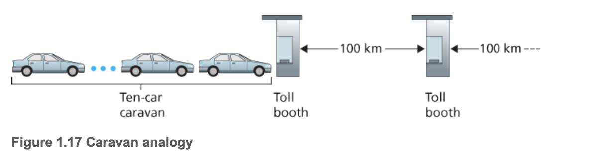
  - 전송 지연
    - 1비트 = 차 1대, 패킷 = 트레일러(차 10대 묶음)
    - 요금 계산소는 12초마다 1대의 차를 전송 -> 5대/60초
    - 요금 계산소가 10대의 차(패킷)를 밀어내는데 걸리는 시간은 2분(10대/5)
  - 전파 지연
    - 다음 요금 계산소 까지 거리 100km
    - 차의 이동속도 100km/h
    - 다음 요금 계산소까지 걸린 시간은 1시간(60분)
  - 따라서 자동차 10대가 요금 계산소를 이동하는 시간은 60분(전파지연) + 2분(전송지연)
- **전체 노드 지연 = 처리 지연 + 큐잉 지연 + 전송 지연 + 전파 지연**

### 1.4.2 Queuing Delay and Packet Loss
- 노드 지연중 가장 흥미로운 요소가 많은 지연
- 다른 지연과는 다르게 패킷마다 다르다
  - 10개의 패킷이 동시에 비어있는 큐에 도착한다면, 첫패킷은 큐잉 지연을 겪지 않지만 마지막 패킷은 상당량의 큐잉 지연을 겪는다
- 트래픽 강도(traffic intensity)
  - 전송률 R, 패킷의 크기 L 비트
  - 패킷이 큐에 도착하는 평균율 a 패킷/초
  - 비트가 큐에 도착하는 평균율 La 비트/초
  - 큐가 무한해서 모든 패킷을 저장할 수 있다고 가정
  - **La/R**은 큐잉 지연의 정도를 측정하는데 매우 중요
  - La/R > 1
    - 비트가 큐에 도착하는 평균율이 비트가 큐에서 전송되는 비율을 초과
    - 큐는 끝 없이 증가, 큐잉 지연은 무한대에 도달
    - **트래픽 강도가 1보다 크지 않게 시스템을 설계하라**
  - La/R <= 1
    - 도착 트래픽의 특성이 큐잉 지연에 영향을 미침
    - 하나의 패킷이 L/R초마다 도착한다면 모든 패킷은 빈큐에 도착하고 큐잉 지연은 없을 것
    - 패킷이 몰려서(burst) 도착한다면 상당한 평균 큐잉 지연이 발생
  - 일반적으로 큐에 도착하는 프로세스는 랜덤하다
    - 패킷의 도착에 고정된 패턴이 없고, 임의의 시간만큼 떨어져서 도착

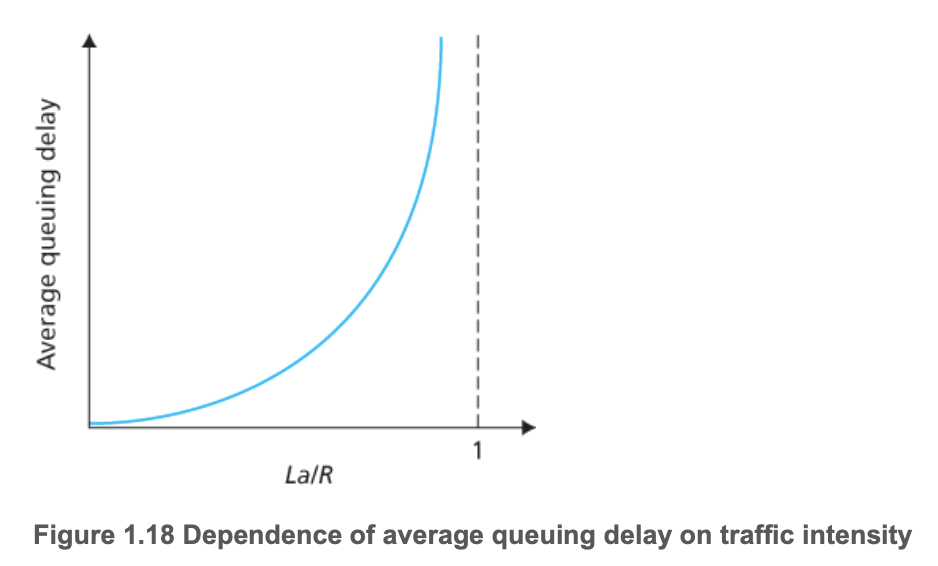
- 트래픽 강도가 1에 접근할수록 평균 큐잉 지연이 급속히 증가

#### 패킷 손실
- 앞 선 내용에서는 큐가 무한대라고 가정했지만 현실에서는 유한하며 스위치의 설계와 비용에 크게 의존
- 패킷이 도착해서 큐가 꽉차면 패킷을 버린다(drop). 패킷을 잃어버린다(lost)라고도 표현

### 1.4.3 End-to-End Delay
- 출발~목적지 사이에 N-1 개의 라우터
- 네트워크가 혼잡하지 않은 상태(큐잉 지연 없음)
- 호스트에서의 전송률 R bit/sec
- 종단간 지연
  - d_end-end = N(d_proc + d_trans + d_prop)
  - d_trans = L/R
- Traceroute
  -

### 1.4.4 Throughput
- 파일이 F비트, 호스트 B가 모든 F비트를 수신하는데 T초
  - 평균 처리율(average throughput)은 F/T bit/sec
- 병목 링크(bottleneck link)
  - 전송률이 제일 낮은 가장 낮은 링크가 전체 경로의 처리율이 된다

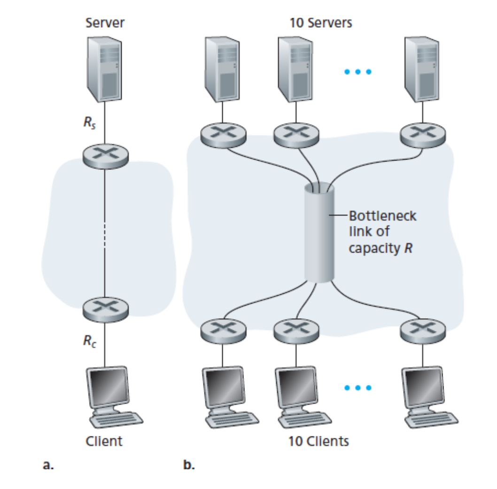

## 1.5 프로토콜 계층과 서비스 모델

### 1.5.1 Layered Architecture

#### 프로토콜의 계층화
- 계층이 제공하는 서비스 구현 변경이 쉽다
- 특정 계층의 변경이 다른 계층에 영향을 끼치지 않는다
- 서비스 모델(service model)
  1. 그 계층 내부에서 어떤 동작을 수행
  2. 직접 하위 계층의 서비스를 사용
- 단점
  - 하위 계층의 기능과 중복
    - 예) 오류복구
  - 어느 한 계층에서의 기능이 다른 계층에만 존재하는 정보를 필요로할 수 있다
- 프로토콜 스택(protocol stack)

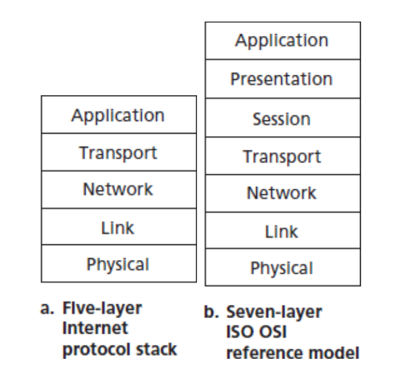

#### 애플리케이션 계층
- 네트워크 애플리케이션과 애플리케이션 계층 프로토콜이 있음
- HTTP, SMTP, FTP
- DNS
- 여러 end 시스템에 분산되어 있고 다른 end 시스템에 애플리케이션과 정보 패킷을 교환
- 패킷 = 메세지(message)

#### 트랜스포트 계층
- 클라이언트와 서버 간에 애플리케이션 계층 메세지를 전송하는 서비스 제공
- TCP
  - 연결 지향형 서비스 제공
  - 전달 보장과 흐름제어
  - 긴 메세지를 짧은 메세지로 나누고 혼잡제어 기능 제공
  - 네트워크가 혼잡할 때 출발지의 전송속도를 줄이도록 함
- UDP
  - 비연결형 서비스 제공
  - 신뢰성, 흐름제어, 혼잡제어를 제공하지 않는 간단한 서비스
- 패킷 = 세그먼트(segment)

#### 네트워크 계층
- 한 호스트에서 다른 호스트로 데이터그램을 라우팅
- 패킷 = 데이터그램(datagram)
- 네트워크 계층의 주요 요소
  1. IP 프로토콜
    - 데이터그램의 필드를 정의
    - 종단 시스템과 라우터가 이필드에 어떻게 동작하는지 정의
    - IP 프로토콜은 하나이며 모든 네트워크 계층은 IP 프로토콜을 수행한다
  2. 라우팅 프로토콜
    - 출발지와 목적지 사이에서 데이터그램이 이동하는 경로를 결정하는 프로토콜
- IP 계층이라고도 불림

#### 링크 계층
- 네트워크 계층에서 다른 노드로 패키을 이동할때 링크 계층 서비스에 의존
- 링크 계층에서 제공하는 서비스는 특정 링크 계층 프로토콜에 의해 결정
  - 예) 한 링크에서 신뢰적 전송을 제공(TCP의 신뢰성과 다름)
  - DOCSIS 프로토콜
    - 이더넷, 와이파이, 케이블 접속 네트워크
- 패킷 = 프레임(frame)

#### 물리 계층
- 각 비트를 한 노드에서 다른 노드로 이동
- 전송 매체에 의존
  - 꼬임쌍선, 광케이블, ...

#### OSI 모델
- Open System Interconnection
- 1970년대 후반에 ISO에서 제안한 모델
- 컴퓨터 네트워크는 7계층으로 이루어져야 한다
- 프레젠테이션과 세션 계층은 개발자의 의도에 따라서 추가/생략 가능

### 1.5.2 Encapsulation
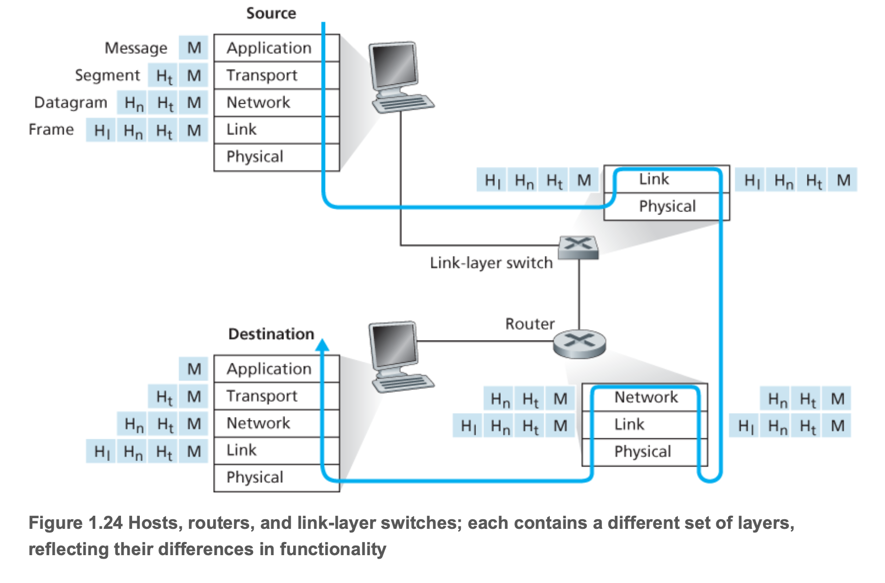
- 각 하위 계층에서 필요한 헤더를 추가해서 그 계층의 하위 계층으로 패킷을 전달한다
- 각 계층에서 패킷은 헤더 필드(header field)와 페이로드 필드(payload field)를 갖는다

## 1.6 공격 받는 네트워크

### 멜웨어(malware)
- 인터넷에서 송신 받은 파일 혹은 데이터가 우리 컴퓨터 장비에 해를 끼치는 것
- 파일 삭제, 주민번호, 비밀번호, 키보드 타이핑등의 사적인 정보 수집
- 자기 복제(self-replicating)
  - 한 호스트에 영향을 끼치면, 그 호스트를 통해 다른 호스트로 복제
- 바이러스(virus)
  - 사용자의 어떤 행동으로 장치에 영향
- 웜(worm)
  - 사용자의 행동이 없어도 장치에 영향

### DoS(denial-of-service) 공격
- 네트워크, 호스트들을 정상적인 사용자들이 사용할 수 없도록 하는 것
- 웹서버, 메일서버, DNS서버, 기관 네트워크들이 주요 타겟
- 3가지 분류
  1. 취약성 공격(vulnerability attack)
    - 앱과 운영체제의 취약점을 찾아서 공격
    - 서비스 중단 혹은 장애를 유발
  2. 대역폭 플러딩(bandwidth flooding)
    - 목표 호스트로 수 많은 패킷을 보낸다
    - 목표 호스트의 접속 링크가 동작하지 못하게해서 정상적인 패킷이 그 서버에 도달하지 못하도록함
  3. 연결 플러딩(connection flooding)
    - half-open 혹은 fully-open TCP 연결을 설정
    - 호스트가 가짜 연결을 처리하는데 바빠서 정상적인 연결을 처리하지 못하게함
- 분산 Dos(DDos) 공격

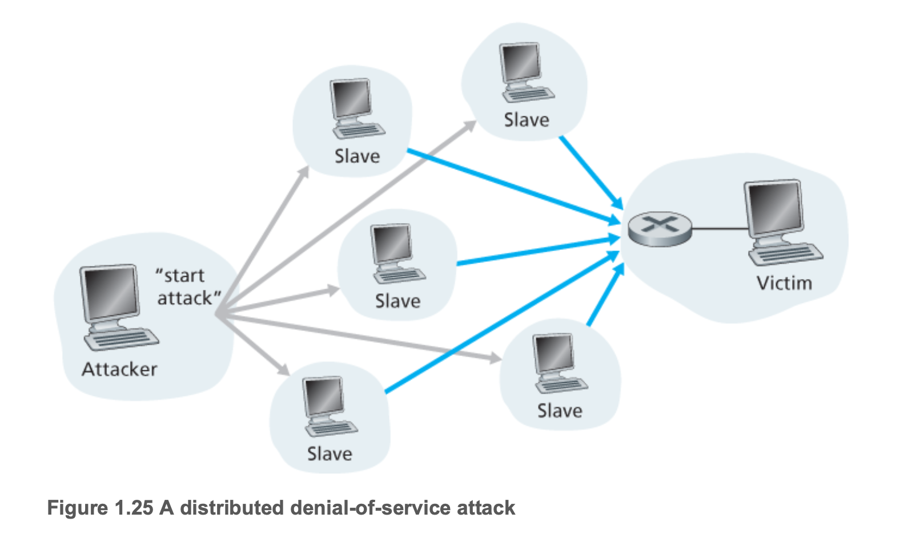

### 패킷 스니퍼(packet sniffer)

### IP 스푸핑(spoofing)

## 1.7 컴퓨터 네트워킹과 인터넷의 역사(skip)
