- 네트워크 애플리케이션은 서로 다른 종단 시스템에서 동작하고 네트워크를 통해 서로 통시하는 프로그램
- 새로운 애플리케이션을 개발할 때는 여러 종단 시스템에서 실행되는 소프트웨어를 작성해야 한다

### 2.1.1 네트워크 애플리케이션 구조
- 애플리케이션 구조(application architecture)
  - 애플리케이션 개발자에 의해 설계
  - 애플리케이션이 다양한 종단 시스템에서 어떻게 조직되어야 하는지를 지시
- 클라이언트-서버 구조(client-server architecture)
  - 서버
    - 항상 켜져 있는 호스트
    - 클라이언트라느 다른 호스트에 의해 요청을 받는다
  - 클라이언트
    - 가끔 혹은 항상 켜져 있는 호스트
    - 예) 브라우저, 모바일 앱, 서버
  - 클라이언트끼리 직접 통신하지 않는다
    - 서버를 통해서 통신한다
    - 예) 채팅
  - 하나의 서버 호스트가 모든 클라이언트의 요청에 응답하는 것이 불가능할 수 있음
    - 많은 호스트를 가진 데이터 센터(data center)에서 강력한 가상 서버를 제공
    - AWS, Azure, GCP, NCP, 알리바바 클라우드, ...
- P2P 구조
  - 항상 켜져 있는 서버에 최소로 의존(혹은 존재x)
  - 애플리케이션은 피어(peer)라는 간헐적으로 연결된 호스트트 쌍이 직접 통신
  - 피어는 서비스 제공자가 아닌 사용자들이 사용하는 데스크토, 랩톱, 모바일 기기
  - 비트 토렌트, 스카이프, ...

### 2.1.2 프로세스 간 통신
- 운영체제에서 실제로 네트워크 통신을 담당하는 것은 **프로세스(process)**
- 프로세스는 종단 시스템에서 실행되는 프로그램
- 같은 호스트내에서 프로세스 통신도 가능하지만 다른 종단 시스템간의 프로세스 통신이 네트워크에서 중요
- **메세지(message)** 교환으로 통신

#### 클라이언트와 서버 프로세스
- 네트워크 애플리케이션은 서로 메세지를 보내는 두 프로세스로 구성된다
- 두 프로세스 간의 통신 세션에서 통신을 초기화하는 프로세스를 클라이언트라 하고, 세션을 시작하기 위해 접속을 기다리는 프로세스를 서버라고한다

#### 프로세스와 컴퓨터 네트워크 사이의 인터페이스
- 프로세스는 **소켓(socket)**을 통해 네트워크로 메세지를 보내고 받는다.

- 소켓은 애플리케이션과 네트워크 사이의 **API(Application Programming Interface)**
- 애플리케이션 개발자는 소켓의 애플리케이션 계층에 대한 모든 통제권을 갖지만 트랜스포트 계층에 대한 통제권은 거의 갖지 못함
  - 트랜스포트 프로토콜 선택
  - 최대 버퍼와 최대 세그먼트 크기

#### 프로세스 주소 배정
- **IP 주소**로 호스트 식별
- **Port 번호**로 프로세스 식별

### 2.1.3 애플리케이션이 이용 가능한 트랜스포트 서비스
- 애플리케이션 개발시, 하나 이상의 트랜스포트 프로토콜을 사용

#### 신뢰적 데이터 전송
- 패킷은 네트워크에서 손실될 수 있음
  - 라우터 버퍼에서 오버플로우
  - 잘못된 패킷의 비트는 라우터에서 버려짐
- 애플리케이션이 보낸 데이터가 올바르고 잘 전송되었는지 보장하는 기능이 필요
- 손실 허용 애플리케이션(loss-tolerant application)
  - 비디오/오디오 전송 같은 경우 어느정도 데이터 손실이 허용

#### 처리량
- 두 프로세스 간의 통신 세션에서 송신 프로세스가 수신 프로세스로 비트를 전달할 수 있는 비율
- 여러 세션들이 네트워크 경로를 따라 대역폭을 공유하고, 이 세션들이 생겨났다 없어졌다 하기 때문에 시간에 따라 처리율이 변동
- 트랜스포트 프로토콜 레벨에서 r bits/sec의 처리율을 보장
- 대역폭 민감 애플리케이션(bandwidth-sensitive application)
  - 최소한의 처리량이 보장되어야하는 앱들
  - 멀티미디어 앱
- 탄력적 애플리케이션(elastic application)
  - 처리량이 일정치 않아도 되는 앱들
  - 메일, 파일 전송, 웹

#### 시간
- 송신자가 소켓으로 내보내는 모든 비트가 수신자의 소켓에 n sec 내에 도착하도록 보장
- 인터넷 전화, 원격회의, 게임, ...

#### 보안
- 트랜스포트 레벨에서 보안 서비스 제공
- TLS

### 2.1.4 인터넷 전송 프로토콜이 제공하는 서비스
#### TCP
- 연결 지향형 서비스
  - 클라이언트와 서버가 데이터 교환전에 연결
  - 3-way handshake, - 4-way handshake
- 신뢰적인 데이터 전송 서비스
  - 모든 데이터를 오류 없이 올바른 순서로 전달
- 혼잡 제어 방식
  - 인터넷 전체 성능 향상을 위한 서비스
  - 네트워크가 혼잡하면 프로세스(클라이언트 or 서버)의 속도를 낮춘다
- 보안 TCP
  - 기존에는 프로세스간의 메세지 전달이 암호화 되어 있지 않아서 보안에 취약
  - SSL(Secure Sockets Layer)을 개발하여 TCP에 보안 기능을 추가
  - 암호화, 데이터 무결성, 종단 인증 제공

#### UDP
- 최소한의 서비스 모델을 가진 간단한 전송 프로토콜
- 비연결형, 비신뢰성(메세지 도착을 보장하지 않음)
- 혼잡제어 방식을 사용하지 않는다
  - **네트워크 혼잡시에는 TCP보다 느릴수도 있다**

### 2.1.5 애플리케이션 계층 프로토콜
- 애플리케이션 프로토콜
  - 교환 메세지 타입(예: 요청 메세지와 응답 메세지)
  - 여러 메세지 타입의 문법(예: 메세지 내부의 필드와 필드 간의 구별 방법)
  - 필드의 의미, 즉 필드에 있는 정보의 의미
  - 언제, 어떻게 프로세스가 메세지를 전송하고 메세지에 응답하는지 결정하는 규칙
- 네트워크 애플리케이션과 애플리케이션 계층 프로토콜 구분
  - 애플리케이션 계층 프로토콜은 네트워크 애플리케이션의 한 요소
  - 웹 = 애플리케이션
  - HTTP = 프로토콜
    - 브라우저와 서버 사이에서 교환되는 메세지의 포맷과 순서를 정의

## 2.2 웹과 HTTP

### 2.2.1 HTTP 개요
- HTTP(HyperText Transfer Protocol)
- 웹페이지는 객체들로 구성
- 객체는 단일 URL로 저장할 수 있는 하나의 파일(HTML 파일, JPEG 이미지, ...)
- 대부분 웹 페이지는 기본 HTML 파일과 여러 참조 객체로 구성
- URL 분석
  - `http://www.someSchool.edu/someDepartment/picture.gif`
  - `http`: 스키마
  - `www.someSchool.edu`: 호스트 네임(도메인 형식)
  - `someDepartment/picture.gif`: 파일 경로
- 웹 서버(Web server)
  - HTTP의 서버 구현체
  - 아파치, nginx
- TCP 프로토콜 사용
  - 클라이언트 프로세스가 전송한 모든 HTTP 메세지가 서버에 도착함을 보장(신뢰적 데이터 전송)
  - HTTP에서는 데이터 손실과 복구에 대해서 걱정할 필요가 없음(계층화의 장점)
- 비상태 프로토콜(stateless protocol)
  - 서버는 클라이언트에 관한 어떠한 상태 정보도 저장하지 않음
  - 같은 객체를 두번 요청하면, 서버는 같은 객체를 두번 응답한다

### 2.2.2 비지속 연결과 지속 연결

#### 비지속 연결 HTTP
- `http://www.someSchool.edu/someDepartment/home.index` 연결 과정
  1. HTTP 클라이언트는 HTTP의 기본 포트 80을 통해 `www.someSchool.edu` 서버로 TCP 연결 시도. TCP 연결을 위한 클라이언트와 서버에 각각 소켓 생성
  2. HTTP 클라이언트는 1단계에서 설정된 TCP 연결 소켓을 통해 서버로 HTTP 요청을 보낸다. 이 요청에 `someDepartment/home.index` 경로를 포함
  3. HTTP 서버는 1단계에서 설정된 연결 소켓을 통해 요청 메세지를 받는다. 저장장치로부터 `/someDepartment/home.index` 객체를 추출하여 응답 메세지에 그 객체를 캡슐화 한다. 응답 메세지를 소켓을 통해 클라이언트로 전송
  4. HTTP 서버는 TCP에게 연결 종료 요청(실제로 연결을 끊는 과정은 TCP에서 진행)
  5. HTTP 클라이언트가 응답 메세지를 받으면, TCP 연결 중단. 메세지는 캡슐화된 객체가 HTML 파일인 것을 나타냄. 클라이언트는 응답 메세지로부터 파일을 추출하고 HTML 파일 조사하며 참조하는 객체들의 정보를 찾는다
  6. 그 이후에 참조되는 객체들에 대하여 1~4단계를 반복한다.
- 브라우저는 웹 페이지를 수신하면서 사용자에게 페이지를 보여줌
- HTTP는 클라이언트가 웹페이지의 해석 방식에는 관심이 없고 클라이언트와 서버간의 통신 프로토콜만 정의한다
- 서버가 객체를 보낸 후에 TCP 연결이 끊어짐으로 비지속 연결을 사용
  - 10개의 객체를 요청하면 10개의 TCP 연결이 생성된다(단점)

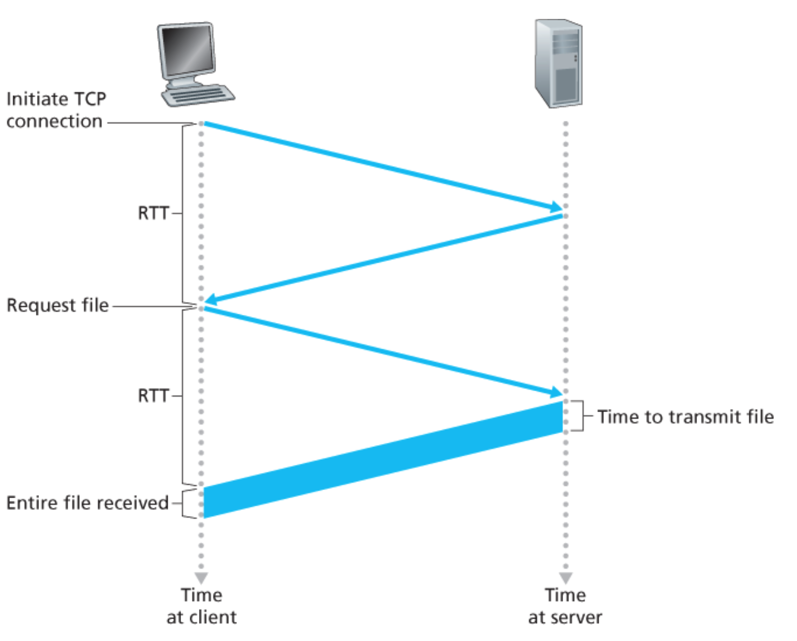
- **RTT(round trip time)**
  - 패킷이 클라이언트로부터 서버까지 가고, 다시 클라이언트로 돌아오는 시간
  - 패킷의 전파 지연, 큐잉 지연, 처리 지연 등을 포함
- HTTP 총 응답 시간 = 2RTT(연결,요청) + 서버의 파일 전송 시간

#### 지속 연결 HTTP
- 같은 요청에 대해서 연결과 요청 과정을 1번만 할 수 있음
- HTTP/1.1에서는 일정 기간(타임아웃) 동안 TCP 연결을 맺은 후에 요청이 없으면 연결은 종료한다. 타임아웃 내에 요청이 반복되면 기존 TCP 연결을 재사용한다
- HTTP/2에서는 같은 연결에서 다중 요청과 응답이 가능

> TODO HTTP2에 관해서 조사해보자

### 2.2.3 HTTP 메세지 포맷
#### HTTP 요청 메세지
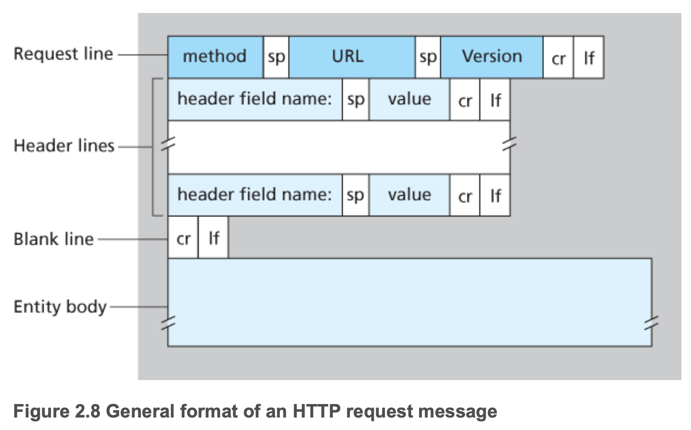

> GET /somedir/page.html HTTP/1.1  
Host: www.someschool.edu  
Connection: close  
User-agent: Mozilla/5.0  
Accept-language: fr  

- 요청 라인(request line)
  - 첫 줄
  - method(GET, POST, HEAD, PUT, DELETE, ...), URL, http version 명시
- 헤더 라인(header line)
  - 두번째 줄부터
  - 메타 데이터
  - 애플리케이션에서 활용 가능(쿠키, 캐싱)
- 바디(body)

#### HTTP 응답 메세지

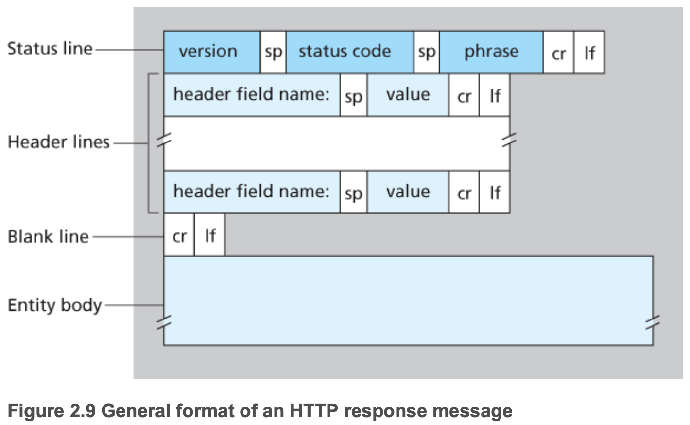

> HTTP/1.1 200 OK  
> Connection: close  
> Date: Tue, 18 Aug 2015 15:44:04 GMT  
> Server: Apache/2.2.3 (CentOS)  
> Last-Modified: Tue, 18 Aug 2015 15:11:03 GMT  
> Content-Length: 6821  
> Content-Type: text/html  
>  
> (data data data data data ...)

- status line
  - version, [status code](https://ko.wikipedia.org/wiki/HTTP_%EC%83%81%ED%83%9C_%EC%BD%94%EB%93%9C), status message
- header line
  - `Connection: close`: 메세지 응답 후 TCP 연결을 닫으려고 시도
  - `Date: Tue, 18 Aug 2015 15:44:04 GMT`: 응답 메세지가 생성된 시간, 객체가 생성거나 수정된 시간x
  - `Server: Apache/2.2.3 (CentOS)`: HTTP 서버 종류
  - `Last-Modified`: 객체가 생성되거나 수정된 시간
  - `Content-Length: 6821`: 송신되는 객체(body)의 바이트 수
  - `Content-Type: text/html`: 송신되는 객체(body)의 형식
- entity body

### 2.2.4 사용자와 서버 간의 상호 작용: 쿠키
- HTTP 서버에서는 사용자의 상태를 유지하지 않음
  - 서버의 설계를 간편하게하고 동시의 수천개의 TCP 연결을 다룰 수 있음
  - 서버가 사용자의 접속을 제한하거나 사용자에 따라 다른 콘텐츠를 보여주고 싶다면?
  - 쿠키(cookie)를 사용하여 해결
- 쿠키
  1. HTTP 응답 메세지 쿠키 헤더 라인
  2. HTTP 요청 메세지 쿠키 헤더라인
  3. 사용자의 브라우저에 사용자 종단 시스템과 관리를 지속시키는 쿠키 파일
  4. 웹 사이트의 백엔드 데이터 베이스

### 2.2.5 웹 캐싱(프록시 서버)
- 웹 서버를 대신하여 HTTP 요구를 충족시키는 네트워크 개체

- 캐시는 서버이면서 클라이언트
- 일반적으로 ISP가 구입하고 설치
- 사용 이유
  - 클라이언트의 요구에 대한 응답 시간을 줄일 수 있다.
    - 캐시-서버간의 대역폭이 클라이언트-캐시간의 대역폭보다 매우 작으면 효율적
  - 한 기관에서 인터넷으로 접속하는 링크상의 웹트래픽을 대폭으로 줄일 수 있다
- 기관 네트워크와 인터넷 간의 병목 현상
  - 
  - 평균 객체의 크기가 1Mbit, 클라이언트의 평균 요청 15 rps
  - LAN의 트래픽 강도 = **15 rps * 1 Mbit/요청 / 100 Mbps = 0.15**
  - 접속 회선(인터넷 라우터와 기관 라우터 사이)의 트래픽 강도 = **15 rps * 1 Mbit/요청 / 15 Mbps = 1**
- 기관 네트워크에 캐시 추가
  - 
  - 캐시 적중률이 0.4라고 가정
  - 요청의 40%는 캐시에 의해 10 msec 이내로 처리
  - 요청의 60%?
    - 요청의 60% 이므로 트래픽 강도가 1 -> 0.6
  - 평균 지연시간 = **0.4 * 0.01초 + 0.6 * 2.01초 = 1.2초**
  - 회선을 증설할 필요가 없고 저렴한 캐시 서버만 추가하면됨
- 콘텐츠 전송 네트워크(CDN, Content Distribution Network)
  - 비디오, 오디오, 사진 등의 콘텐츠 파일을 서버에 캐싱하여 제공
  - 전세계에 분산된 캐시 서버를 설치하여 많은 트래픽 제공

### 조건부 GET
- 캐시의 정보가 최신 정보가 아닐 수도 있음
- `GET`메소드, `If-Modified-Since` 헤더를 가지고 있으면 조건부 GET(conditional GET)
- 첫 요청
> GET /fruit/kiwi.gif  
> HTTP/1.1 Host: www.exotiquecuisine.com

- 첫 응답
  - 응답에 `Last-Modified` 시간을 포함하여 다음 요청에 사용하도록함
> HTTP/1.1 200 OK  
> Date: Sat, 3 Oct 2015 15:39:29  
> Server: Apache/1.3.0 (Unix)  
> Last-Modified: Wed, 9 Sep 2015 09:23:24  
> Content-Type: image/gif
>  
> (data data data data data ...)

- 다음 요청
  - `If-modified-since: Wed, 9 Sep 2015 09:23:24` 값이 첫 응답 값과 같으면 캐싱된 데이터 응답
> GET /fruit/kiwi.gif HTTP/1.1  
> Host: www.exotiquecuisine.com  
> If-modified-since: Wed, 9 Sep 2015 09:23:24

- 다음 응답
  - `If-modified-since` 이후에 저장된 객체만 응답
  - 만약에 없다면? 빈 body를 응답
> HTTP/1.1 304 Not Modified  
> Date: Sat, 10 Oct 2015 15:39:29  
> Server: Apache/1.3.0 (Unix)
>  
> (empty entity body)

## 2.3 인터넷 전자 메일

- 가장 많이 쓰이고 중요한 애플리케이션 중하나
- 전자 메일은 비동기적인 통신 매체

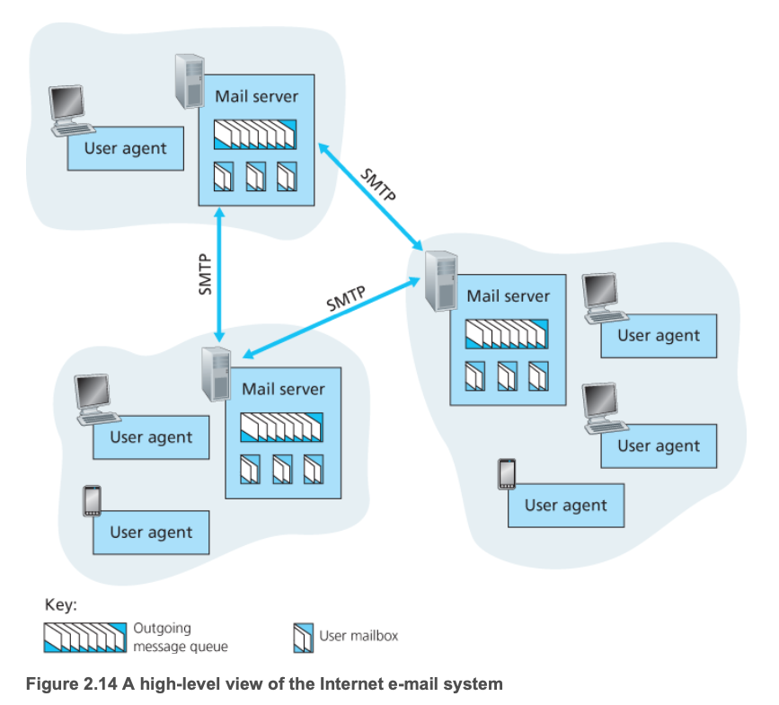

- 사용자 에이전트
  - MS 아웃룩, 애플 메일, 네이버 메일, 다음 메일, ...
  - 메세지를 전송하면 에이전트는 메일서버에 메세지를 전송
  - 메세지를 읽고 싶을때 메일 서버에 있는 메일 박스에서 메세지를 가져옴
- 메일 서버
  - 전자메일 기반구조의 중심
  - 사용자마자 메일박스가 존재
  - 메일 박스에서 사용자의 메세지를 유지하고 관리
  - A 메일 서버가 B 메일 서버에게 메세지를 전송할 수 없다면?
    - A 서버의 메세지 큐에 보관하고 B 메일 서버로 전송 재시도
    - 여러 번의 재시도에도 성고하지 못하면, 메세지를 제거하고 송신자(A)에게 전자메일로 통보
- SMTP(Simple Mail Transfer Protocol)
  - 인터넷 전자메일을 위한 애플리케이션 계층 프로토콜
  - TCP 사용
  - 클라이언트-서버 구조
  - 메일서버 간에 메세지를 주고받을 때 사용

### 2.3.1 SMTP
- 인터넷 전자메일의 중심
- HTTP 보다 오래
- 모든 메세지의 body가 7비트 ASCII이어야함
  - 전송 용량이 제한
  - 커다란 첨부파일, 이미지, 오디오, 비디오 전송시 문제가 발생
  - 모든 바이너리 파일을 ASCII 포맷으로 변환해야함

#### 메세지 전송 과정
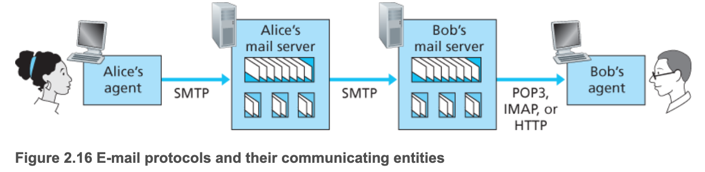
- 메일 서버가 먼거리에 있더라도 중간 서버를 거치지 않는다
  - 서울, 센프란시스코 간에 통신에도 중간 서버를 거치지 않고 직접 통신한다
  - 밥의 메일서버가 죽어있으면 중간 서버를 거치지 않고 엘리스 서버에서 재시도한다
- TCP를 사용
  - 메세지 전송 전에 연결을 시도한다
  - 메세지 전송에 TCP 신뢰적 데이터 서비스에 의존
- SMTP 클라이언트 서버 사이의 메시지 전달 과정

### 2.3.2 HTTP와 비교
- 공통점
  - 한 호스트에서 다른 호스트로 파일을 전송
  - TCP 프로토콜 사용: 지속 연결
- HTTP
  - Pull 프로토콜
  - 응답 메세지에 각 객체를 캡슐화
- SMTP
  - Push 프로토콜
  - 메세지의 Body가 7비트 ASCII 포맷
    - 이진 데이터나 ASCII가 아닌 문자가 있으면 ASCII로 인코딩 되어야함
  - 모든 메세지의 객체를 한 메세지로 만든다

### 2.3.4 메일 메세지 포맷
- Header와 Body로 구성
- Header
  - [RFC 5322](https://tools.ietf.org/html/rfc5322): 헤더 라인 정의
  - 메세지 헤더 예시
  - 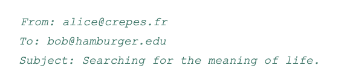
- Body
  - 헤더 뒤에 빈 줄(CRLF) 다음에 body
  - ASCII 포맷

### 2.3.4 메일 접속 프로토콜
- 에이전트에서 메일서버에 있는 자신의 메세지를 읽는 방법?

#### POP3
- 간단한 메일 접속 프로토콜
- 인증, 트랜잭션, 갱신 3단계로 진행

#### IMAP
- 폴더를 생성하거나 메세지를 폴더로 이동시키는건 POP3에서 불가능
- [rfc 3501](https://tools.ietf.org/html/rfc3501)에 정의
- Internet Mail Access Protocol
- POP3보다 기능이 다양하지만 복잡

#### 웹 기반(HTTP)
- 대학, 회사, 구글, 야후, 네이버, 다음 등등에서 웹 기반 전자메일 제공
- HTTP로 메일서버에 접근
- 메일 서버끼리는 여전히 SMTP 사용

## 2.4 DNS - 인터넷의 디렉터리 서비스
- 인터넷 호스트 식별
  - 호스트 네임(hostname)
    - `www.naver.com`, `www.google.com`
  - IP 주소로도 식별됨

### 2.4.1 DNS가 제공하는 서비스
- DNS(domain name system)
  - 호스트 네임을 IP로 주소로 변환해 주는 디렉터리 서비스
  - 계층 구조로 이루어진 분산 데이터베이스
  - 호스트가 분산 데이터베이스로 질의하도록 허락하는 애플리케이션 프로토콜
- DNS 서버는 주로 BIND 소프트웨어를 수행하는 유닉스 컴퓨터
- UDP 사용, 53 포트 사용
- 호스트네임으로 IP를 얻는 과정
  1. 같은 사용자 컴퓨터는 DNS 앱의 클라이언트측을 수행
  2. 브라우저는 URL로부터 호스트네임 `www.naver.com`을 추출하고 호스트 네임을 DNS 앱의 클라이언트에 넘긴다
  3. DNS 클라이언트는 DNS 서버로 호스트 네임을 포함하는 질의를 보낸다
  4. DNS 클라이언트는 결국 호스트 네임에 대한 IP 주소를 가진 응답을 받게 된다.
  5. 브라우저가 DNS로부터 IP주소를 받으면, 브라우저는 그 IP 주소와 그 주소의 80번 포트에 위치하는 HTTP 서버 프로세스로 TCP 연결을 초기화 한다

#### Host Aliasing
- 호스트는 하나 이상의 별명을 가질 수 있다
- 예) `seoul.naver.com`는 `naver.com`, `www.naver.com`같은 2개의 별칭을 가질 수 있다
- `npay.naver.com`는 정식 호스트 네임(canonical hostname)

#### Mail Server Aliasing
- 전자 메일 주소는 기억하기 쉬운 것이 좋음
- `geonhee@naver.com`

#### Load Distribution
- DNS는 복제된 웹 서버 사이에서 부하 분산을 위해 사용된다
- `google.com`과 같은 인기 있는 사이트는 여러 서버에 복제되어 있음
- DNS에 여러 개의 IP를 연결하여 클라이언트로 하여금 여러 IP로 접근하게 하여 부하를 분산시킨다

### 2.4.2 DNS 동작 원리 개요
- 모든 매핑을 포함하는 하나의 네임서버를 사용할 때 문제점
  - 서버의 고장: 네임 서버가 고장 나면, 전체 인터넷이 작동하지 않음
  - 트래픽의 양: 단일 DNS 서버가 모든 DNS 질의를 처리해야한다
  - 먼거리의 중앙 집중 데이터베이스: 단일 DNS 서버에서 물리적으로 먼 서버는 지연이 발생
  - 유지 관리
    - 모든 인터넷 호스트에 대한 레코드를 유지해야 한다
    - 새로 등록되거나 변경된 호스트를 자주 갱신해야 한다
    - 누구에게 호스트 변경 권한을 줘야할지에 대한 문제

#### 분산 계층 데이터베이스
- 서버들을 계층 형태로 전세계에 분산
  - Root DNS server
  - TLD(Top-level domain) DNS server
  - Authoritative DNS server
- 서버들에서 IP를 얻는 과정
  1. 어떤 DNS 클라이언트가 호스트 네임 `www.amazon.com`의 IP 주소를 결정하기 원함
  2. 루트 서버 중 하나에 접속. 루트 서버에서는 TLD 서버 IP 주소를 보낸다
  3. 클라이언트는 TLD 서버 중 하나에 접속해서 도메인 `amazon.com`을 가진 Authoritative 서버의 IP 주소를 보낸다
  4. 클라이언트는 `amazon.com`의 책임 서버중 하나로 접속. 책임 서버에서 `www.amazon.com`의 IP주소를 보낸다.

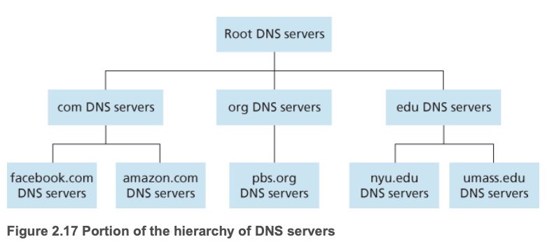

- 루트 DNS 서버
  - 400개 이상의 루트 DNS 서버 존재(대부분 북미 지역)
  - 아래 그림은 루트 DNS 가진 국가들을 표시
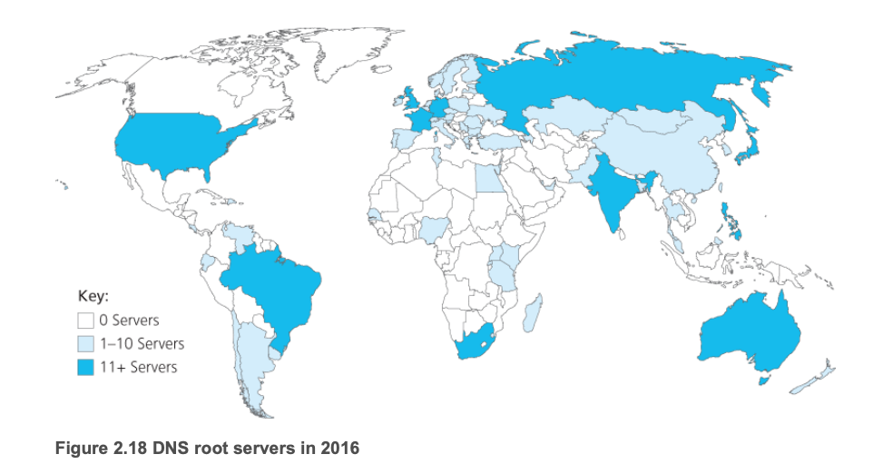

- 최상위 레벨 도메인(TLD) 서버
  - com, org, net, edu 같은 상위 레벨 도메인과 kr, uk, fr, ca, jp 같은 국가 상위 레벨 도메인에 대한 TLD 서버
  - TLD를 제원하는 네트워크 인프라는 크고 복잡하다
- 책임 DNS 서버
  - 인터넷에서 접근하기 쉬운 호스트를 가진 모든 기관은 호스트 네임을 IP 주소로 매핑하는 공개적인 DNS 레코드를 제공해야 한다
  - 기관의 책임 DNS 서버는 이 DNS 레코드를 가지고 있다
  - 기관은 자신의 책임 DNS 서버의 구현을 선택할 수 있고, 서비스 제공자의 책임 DNS에 레코드를 저장하도록 비용을 지불하기도 함ㅁ

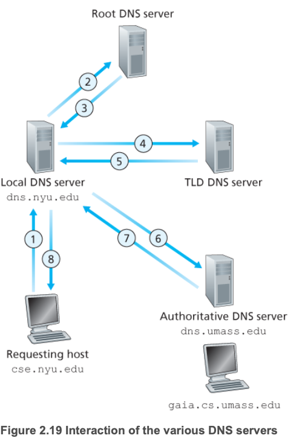

- 재귀적 질의(recursive query)  
- 반복적 질의(iterative query)  

#### DNS 캐싱
- DNS를 위한 통신량을 줄이기 위해서 요청에 대한 IP를 로컬에 캐싱한다
- 예시
  - `apricot.nyu.edu`가 `cnn.com`에 대한 IP 주소를 `dns.nyu.edu`에 질의
  - 몇시간 후에 `kiwi.nyu.edu`가 `dns.nyu.edu`에 게 같은 호스트네임 질의
  - 캐싱으로 인해 로컬 DNS 서버는 두번째 질의한 호스트에게 다른 DNS 서버로 질의 없이 즉시 `cnn.com`의 IP 주소를 보냄
  - TLD 서버의 IP를 저장할 수도 있어서 대부분의 질의에서 루트 DNS 질의는 피해감

### 2.4.3 DNS 레코드와 메세지
- 자원 레코드(resource rescord, RR)
  - DNS 분산 데이터베이스를 구현한 DNS 서버들이 호스트 네임을 IP 주소로 매핑하기 위해 저장하는 자원들
  - (Name, Value, Type, TTL)
- TTL은 자원 레코드이 생존 기간(캐시에서 제거되는 시간)
- Type별 구분
  - Type = A
    - Name은 호스트 네임
    - Value는 IP
    - (relay1.bar.foo.com, 145.37.56.24, A)
  - Type = NS
    - Name은 도메인
    - Value는 책임 DNS 서버의 호스트 네임
    - (foo.com, dns.foo.com, NS)
  - Type = CNAME
    - Value는 별칭 호스트 네임 Name에 대한 정식 호스트 네임
    - 질의 호스트에게 호스트 네임에 대한 정식 이름을 제공
    - (foo.com, relay1.bar.foo.com, CNAME)
  - Type = MX
    - Value는 별칭 호스트 네임 Name을 갖는 메일 서버의 정식 이름
    - (foo.com, mail.bar.foo.com, MX)

#### DNS 메세지
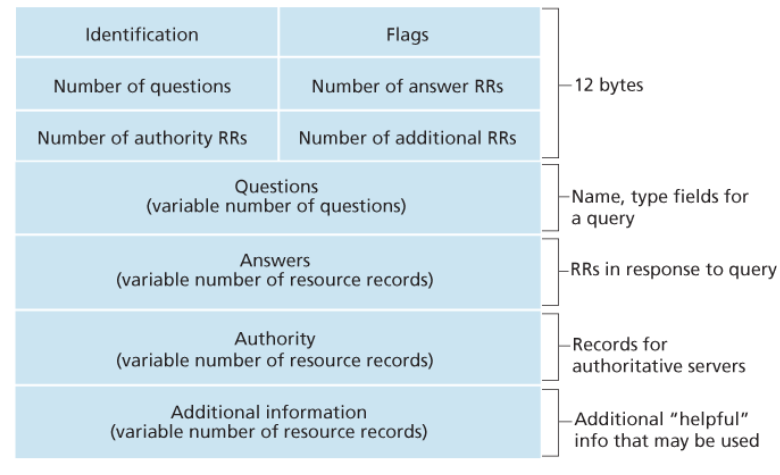
- 헤더 영역
  - 12바이트
  - 식별자
    - 16 비트
    - 응답 메세지에 복사되어 클라이언트에서 요청,응답을 식별할 수 있도록함
  - 플래그
    - 각 1비트
    - 질의 플래그: 질의(0), 응답(1)
    - 책임 플래그: 질의 이름에 대하여 책임 서버일떄 1
    - 재귀 요구 플래그: DNS 서버 레코드를 갖지 않을 때, 재귀적 질의를 클라이언트가 원하면 1
    - 재귀-가능 플래그: DNS 서버가 재귀 질의를 지원하면 응답에 1
  - 4개의 "개수" 필드
    - 헤더 다음에 오는 데이터 평면의 네가지 타입의 발생 횟수
- 질문 영역
  - 가변 질문 수
  - 현재 질의에 대한 정보
    - 질의되는 이름을 포함하는 이름필드
    - 이름에 대해 문의되는 질문 타입을 나타내는 타임 필드 호팜
- 답변 영역
  - 가변 RR 수
  - 질의된 이름에 대한 자원 레코드
  - 응답으로 여러 개의 RR를 보낼 수 있음(호스트 네임은 여러 개의 IP주소를 가질 수 있기 때문)
- 책임 영역
  - 가변 RR 수
  - 다른 책임 서버의 레코드
- 추가 정보
  - 가변 RR 수
  - 다른 도움이 되는 레코드 포함
- nslookup 프로그램으로 직접 질의 가능

#### DNS 데이터베이스에 레코드 삽입
- DNS 데이터베이스에 레코드를 삽입하는 방법?
- 등록 기관에 도메인을 등록
  - 도메인 네임의 유일성 확인
  - 도메인을 DNS 데이터베이스에 추가
  - 돈을 받는 상업 기관
- 도메인을 등록할 때 주책임 서버와 부 책임 서버의 이름과 IP를 등록해야함
  - Type NS와 Type A 레코드를 TLD com 서버에 등록
  - (landvibe.com, dns1.hellodns.com, NS)
  - (dns1.hellodns.com, 212.212.212.1, A)

## 2.5 P2P 파일 분배
- 웹, 전자메일, DNS 등은 서버-클라이언트 구조
- P2P는 서버에 최소한(혹은 전혀 안함)으로만 의존한다
- 간헐적으로 연결되는 호스트 쌍들(peer)이 서로 직접 통신
- peer는 서비스 제공자가 아니라 사용자가 제어하는 데스크톱, 랩톱이 소유

### P2P 구조의 확장성
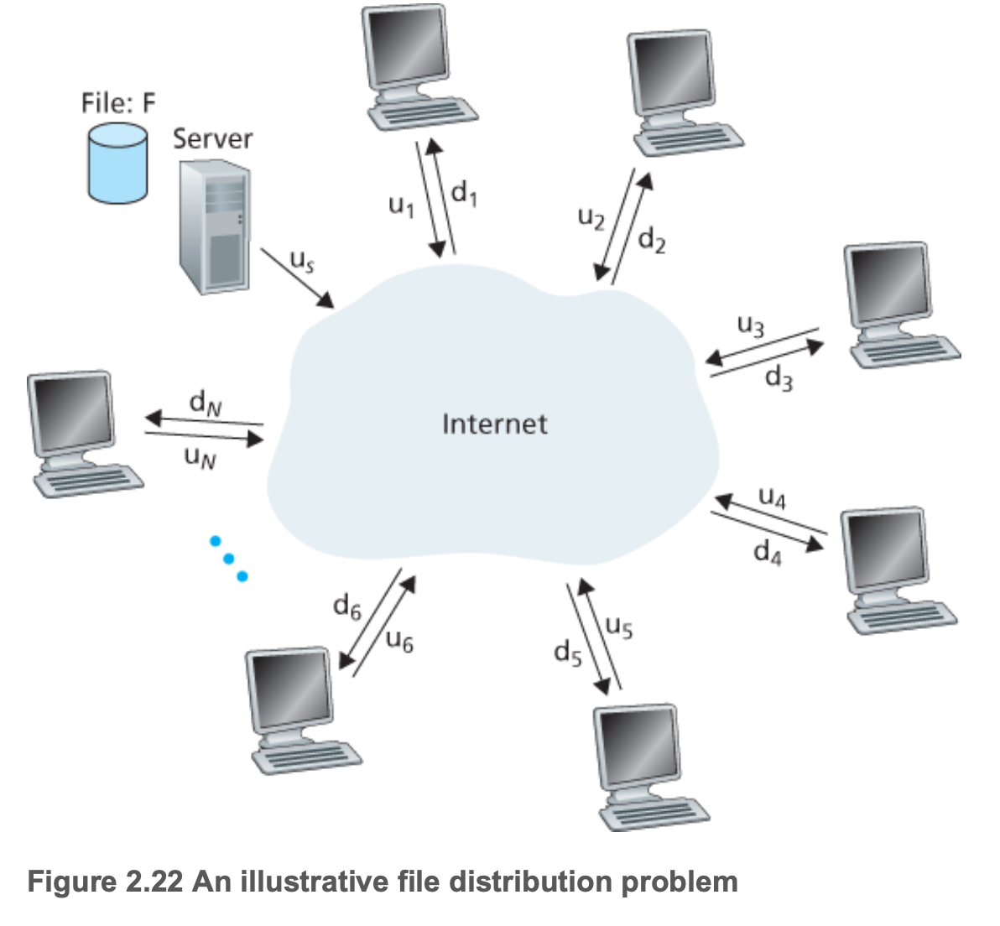
- 모든 피어들은 접속 링크를 통해서 연결됨
- 서버의 접속 링크 속도 us
- i번째 peer의 접속 링크 속도 ui
- 파일 크기 F bit
- peer의 수 N
- **파일을 모든 peer에게 전송하는데 걸리는 시간은?**

#### 클라이언트-서버 구조에서 파일 분배

- Dcs≥max{N/Fus,F/dmin}
  - NF/us
    - 서버는 모든 파일은 N개의 peer에게 각각 전송
    - NF 비트 전송
    - 서버의 업로드 속도는 us
    - 최소 파일 분배 시간은 NF/us
  - F/dmin
    - dmin 가장 낮은 속도를 가진 peer의 다운로드 속도
    - dmin = min{d1,d2, ..., dN}
    - 가장 낮은 속도를 가진 피어는 F/dmin초보다 적은 시간에 파일의 모든 F비트를 얻을 수 없다
    - 최소 분배 시간은 F/dmin
- Dcs=max{N/Fus,F/dmin}
  - 최소 시간
  - peer의 개수 N에 따라서 선형적으로 증가

#### P2P 구조에서 파일 분배
- DP2P≥max{F/us,F/dmin,NF/us+∑i=1Nui}
  - F/us
    - 처음에는 파일을 서버에만 가지고 있기 때문에 최소 분배시간은 최소 F/us
  - F/dmin
    - 가장 낮은 다운로드 속도를 가진 피어는 F/dmin 시간이 걸린다
  - NF/us+∑i=1Nui
    - 시스템 전체의 업로드 용량은 전체 서버의 업로드 속도와 각 피어들의 업로드 속도를 더한 것
    - utotal = us + u1 + ... + uN
    - N개 피어들에게 각각 F비트를 전달
    - 따라서 최소 분배시간은 NF/us+∑i=1Nui
- DP2P=max{F/us,F/dmin,N/Fus+∑i=1Nui}
  - P2P 구조는 최소 분배시간에 대한 하한값을 제공

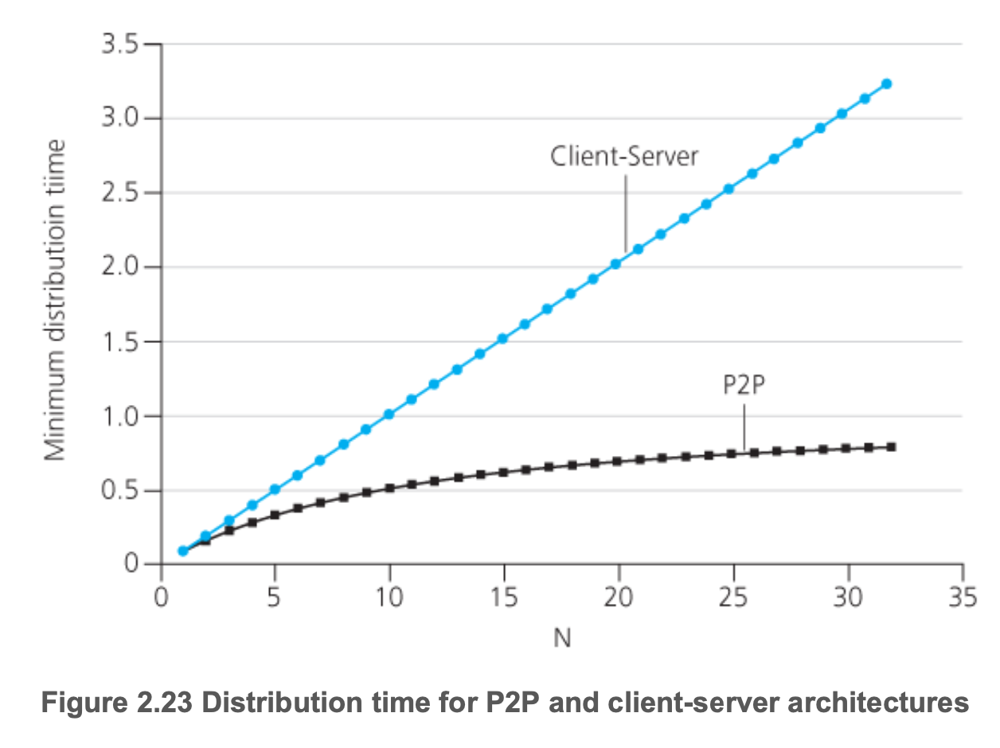

### 비트토렌트
- 파일 분배를 위한 인기 있는 P2P 프로토콜
 - 토렌트(torrent): 모든 피어들의 모임
 - 피어는 서로에게 같은 크기의 청크(chunk)를 다운로드
 - 청크는 일반적으로 256kb
 - 한 피어가 전체 파일을 얻으면, 토렌트를 끄거나, 다른 피어에게 업로드 가능
- 트랙커(tracker): 피어를 등록하고 주기적으로 피어의 연결 여부를 저장하는곳

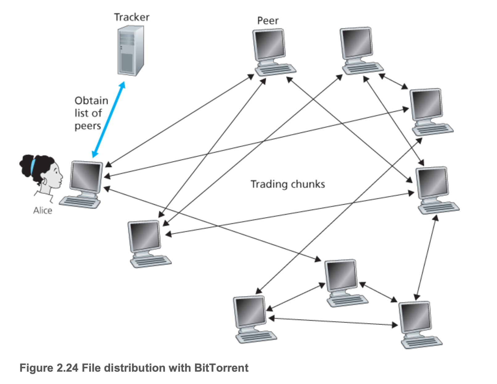
- 엘리스가 토렌트에 가입하면 50여개의 피어들의 IP를 엘리스에게 전달
- 엘리스는 이 피어들과 동시에 TCP 연결 설정
- TCP 연결된 피어들을 "이웃 피어"라고함
- 시간에 지남에 따라 연결이 끊어지는 피어들이 생기면 새로운 피어들이 엘리스와 연결 시도
- 각 피어들은 파일 청크들의 일부를 가지고 있으며, 서로 다른 피어들은 다른 부분을 갖고 있음
- 주기적으로 엘리스는 이웃 피어들에 가각에게 그들이 갖고 있는 청크 리스트를 요구
  - L개의 이웃 피어가 있다면 L개의 청크 리스트
  - 이 리스트를 기반으로 갖고 있지 않은 청크에 대해 요구
- 특정 시간이 되면 엘리스는 청크의 일부를 가지게 되고 이웃들이 어느 청크를 갖고 있는지 알게됨
  1. 이웃으로부터 어떤 청크를 요구할 것인가?
      - 가장 드문 것 먼저(rarest first): 이웃들 중에 가장 적은 복사본을 가진 청크를 먼저 요청
      - 가장 드믄 청크들은 빨리 재분되어서 모든 청크의 복사본 수가 대략적으로 동일하게 됨다
  2. 이웃들 중 어느 피어에게 청크를 요청할 것인가?
      - 교역 알고리즘
      - 가장 빠른속도로 엘리스에게 데이터를 제공하는 이웃에게 우선순위: 활성화(unchocked)된 피어
      - 30초에 한번마다 임의로 하나의 피어를 추가로 선택하여 청크를 전송: 낙관적으로 활성화(optimistically unchoked)된 피어
      - 서로 속도가 빠른 피어끼리만 데이터를 전송하는 경향을 막기 위해서
  
## 2.6 비디오 스트리밍과 컨텐츠 분배 네트워크

### 2.6.1 인터넷 비디오
- TV 프로그램, 스포츠 경기, 유투브와 같은 미리 녹화된 비디오 제공
- 사용자가 on-demand로 요청
- 넷플릭스, 유투브, 아마존, 유쿠, ...
- 비디오?
  - 초당 30, 60개의 이미지가 일정한 속도로 표시되는 파일
  - 압축되지 않은 디지털 인코딩된 이미지는 픽셀 단위로 구성
  - 각 픽셀은 휘도와 색상을 나타내는 여러 비트들로 인코딩 되어있음
  - 압축될 수 있음
  - 비디오 품질과 비트 전송률은 반비례(trade off)
  - 상용 압축 알고리즘은 근복적으로 원하는 모든 비트 전송률로 비디오를 압축할 수 있다
- 비트 전송률
  - 고화질 스트리밍은 100 kbps ~ 3Mbps 이상이어야함
  - 4K 스트리밍은 10Mbps 이상
  - 67분짜리 2Mbps 비디오는 1GB의 스토리지 및 트래픽을 소비
  - 평균 종단 간 처리량이 스트리밍 비디오에서 중요하다
  - 네트워크는 압축된 비디오의 전송률 이상의 평균 처리량을 제공해야한다
- 압축
  - 압축을 사용하여 동일한 비디오를 여러 버전의 품질로 만들 수 있다

### 2.6.2 HTTP 스트리밍 및 대쉬(DASH)
- HTTP 스트리밍에서 비디오는 HTTP 서버 내의 특정 URL을 갖는 일반적인 파일로 저장됨
- 사용자가 비디오 시청을 원하면 서버에 TCP 연결을 설립하고 해당 URL에 대한 HTTP GET 요청을 함
- 서버가 HTTP 응답메세지 내에서 비디오 파일을 전송
- 파일이 버퍼에 쌓이고 미리 정해진 임계값(Threshold)을 넘으면 클라이언트에서 비디오를 재생
- 스트리밍인 경우에 버퍼에서 주기적으로 비디오 프레임을 가져와서 프레임을 압축해제한 다음 사용자 화면에 표시
- 비디오 스트리밍 앱은 비디오의 후반 부분에 해당하는 프레임을 수신하고 버퍼링할 때 비디오를 표시
- 문제점
  - 클라이언트-서버간의 대역폭에 상관없으 똑같이 인코딩된 파일을 전송 받음
  - 가용 대역폭의 차이는 클라이언트 뿐만 아니라 동일엔 클라이언트 내에서도 시간에 따른 차이가 발생
  - 이 문제 해결을 위해 DASH(Dynamic Adaptive Streaming over HTTP) 등장
- DASH
  - 비디오는 서로 다른 버전으로 인코딩
  - 각 버전은 서로 다른 비트율과 품질 수준을 가지고 있음
  - 클라이언트는 비디오 청크 단위로 요청
  - 대역폭이 충분하면 높은 비트율의 청크를 요청, 충분하지 않으면 낮은 비트율의 청크를 요청
  - GET 요청에 따라 다른 비트율의 청크를 요청
  - 서버는 비트율에 따른 URL을 제공하는 메니패스트(manifest) 파일을 가지고 있음

### 2.6.3 콘텐츠 분배 네트워크(CDN)
- 전 세계의 수 억명의 사용자들에게 용량이 큰 비디오, 이미지들을 안정적으로 제공하기 위한 방법
- 데이터 센터에 자료를 저장해서 제공하는 방법?
  - 클라이언트가 데이터 센터에서 물리적으로 멀면?
  - 인기 있는 비디오나 이미지는 데이터 링크로 반복적으로 전송
  - 단일 데이터 센터가 장애가 난다면?
- 콘텐츠 분배 네트워크(Contents Distribution Network, CDN)
  - 다수의 지점에 분산된 서버들을 운영
  - 비디오, 이미지와 같은 파일 데이터의 복사본들을 저장
  - 사용자는 가장 최선의 응답을 받을 수 있는 CDN 서버로 연결
  - 사설 CDN
- CDN을 어느 위치에 운영할 것인가?
  - Enter Deep
    - Akamai
    - 서버 클러스터를 세계 곳곳의 접속 네트워크에 구축
    - 서버를 최대한 사용자 가까이에 위치 시켜 클라이언트와 CDN 사이의 링크 및 라우터 수를 줄인다
    - 사용자가 체감하는 지연시간 및 처리율을 향상시킬 수 있음
    - 고도로 분산된 설계로 유지 비용이 많이 듬
  - Bring Home
    - Limelight
    - 핵심 지점에 큰 규모의 서버 클러스터를 구축하여 ISP를 Home으로 가져오는 개념
    - 접속 ISP에 연결하는 대신, CDN들을 IXPs에 배치
    - 관리비용이 상대적으로 낮음
    - 사용자가 체감하는 지연시간 및 처리율이 상대적으로 나쁨
- CDN은 콘텐츠의 복사본을 클러스터에 저장
  - Pull 방식 사용
  - 지역에 따라서 자주 요청하는 컨텐츠가 다르기 떄문
  - 공간이 가득차면 자주 사용되지 않는 파일은 삭제

#### CDN 동작

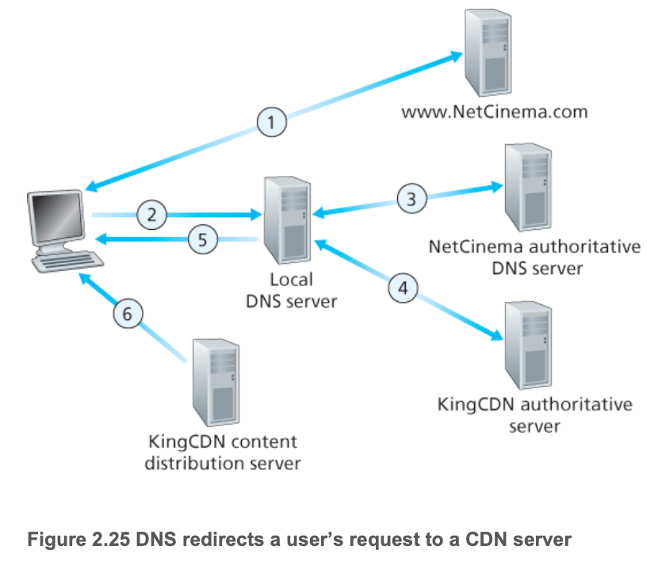

1. 사용자가 NetCinema에 접속
2. 사용자가 `http://video.netcinema.com/6Y7B23V`에 접속하면, 사용자의 호스트는 `video.netcinema.com`에 대한 DNS query를 보낸다
3. 사용자의 지역 DNS 서버(LDNS)는 호스트 이름의 "video" 문자열을 인지하고 해당 쿼리를 NetCinema의 책임 DNS 서버로 전달한다. NetCinema 책임 DNS 서버는 해당 DNS 쿼리를 KingCDN으로 연결하기 위해 IP주소 대신에 KingCDN의 호스트 이름을 LDNS에게 알려준다
4. 이 시점부터 DNS 쿼리는 KingCDN의 사설 DNS 구조로 들어간다. 사용자의 LDNS는 `a1105.kingcdn.com`에 대한 두 번째 쿼리를 보내고 이는 KingCDN의 DNS에 의해 KingCDN 콘텐츠 서버의 IP 주소로 변환되어 LDNS에게 응답한다. 이때 클라이언트가 콘텐츠를 전송 받게될 서버가 결정된다.
5. LDNS는 콘텐츠를 제공할 CDN 서버의 IP주소를 사용자 호스트에게 알려준다.
6. 클라이언트틑 KingCDN 서버의 IP주소를 얻고나면, 해당 IP주소로 직접 TCP 연결을 설정하고 비디오에 대한 HTTP Get 요청을 전송한다.

#### 클러스터 선택 정책
- CDN 구축의 핵심
- 클라이언트를 동적으로 특정 서버 또는 CDN 데이터 센터로 연결하는 방식
  - 지리적으로 가장 가까운 클러스터 할당
  - 실시간으로 서버와의 연결 상태를 측정
    - ping으로 LDNS와의 연결 상태를 확인
    - LDNS들이 이 api를 지원하지 않으면 사용할 수 없음

### 2.6.4 사례 연구: 넷플릭스, 유투브, Kankan

#### 넷플릭스
- 미국의 온라인 영화 및 TV 시리즈 스트리밍 업체
- 아마존 클라우트와 자체 CDN 인프라 사용
- 회원 가입, 로그인, 결제, 장르 검색, 추천서비스, ...

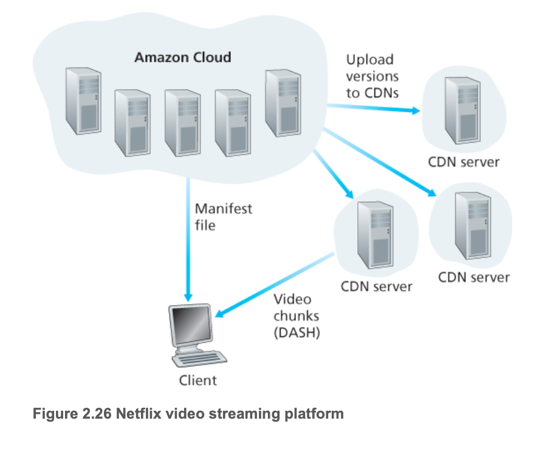

- 컨텐츠 수집(Contents Ingestion)
  - 아마존 클라우드 시스템의 호스트에 영화를 업로드
- 컨텐츠 처리(Contents Procssing)
  - 데스크톱, 스마트폰, TV, 콘솔 등 고객들의 다영한 기기 사양에 적합하도록 각 형식의 비디오를 생성
  - DASH를 이용한 HTTP 스트리밍 서비스를 위해 각 형식별로 다양한 비트율의 버전을 생성
- CDN으로 버전 업로드
  - 영화에 대한 다양한 버전이 생성되면 아마존 클라우드 시스템의 호스트는 이들 버전을 CDN으로 업로드

#### 유투브
- 구글/유튜브의 디자인 및 프로토콜은 오픈x
- CDN을 적극적으로 활용
- 서버와 클라이언트를 연결하는데 DNS 사용
- 자체 비공개 CDN을 사용하여 유투브 동영상을 배포
- IXP및 ISP에 수백개의 클러스터 설치
- **클라이언트와 서버사이에 RTT가 가장 적은 곳을 연결**
- HTTP 스트리밍 사용
- 비디오에 대해서 서로다른 비트율과 품질을 가지는 여러 단계의 버전을 생성하여 제공
- 사용자가 스스로 버전을 선택할 수 있음(DASH와 다른점)

#### Kankan
- 글로벌한 CDN 운영에는 비용이 많이 든다
- P2P 방식을 통한 멀티미디어 전송(CDN x)
- 피어들이 비디오를 전송
- 최근 하이브리드 CDN-P2P 전송 방식 채택
  - CDN에서 스트리밍을 시작
  - P2P로만 비디오 재생이 충분해지면 CDN과의 연결을 종료
- 사용자의 네트워크 대역폭으로 서비스를 제공하는 것이 맞는가? 가히 중국스러운 해법...

## 2.7 소켓 프로그래밍 (SKIP)

