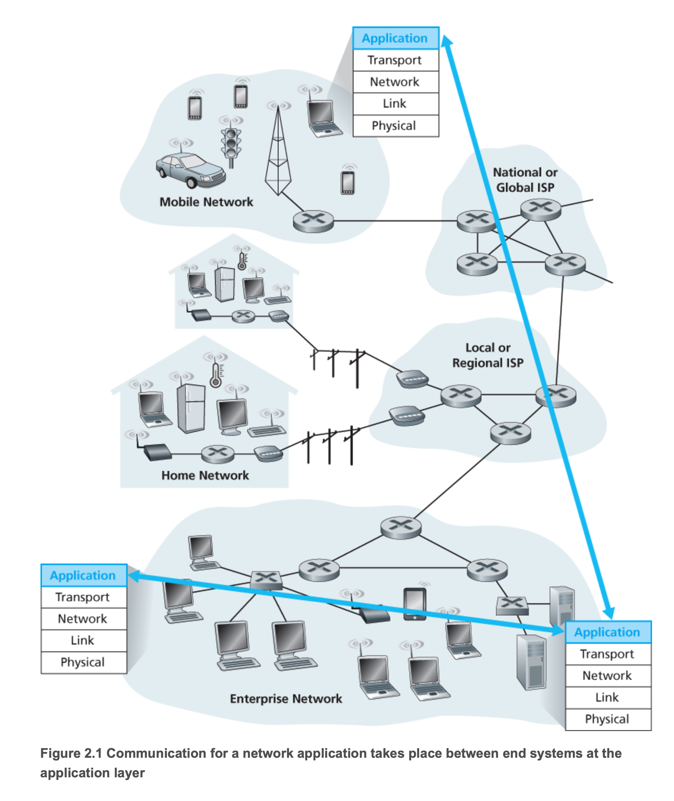
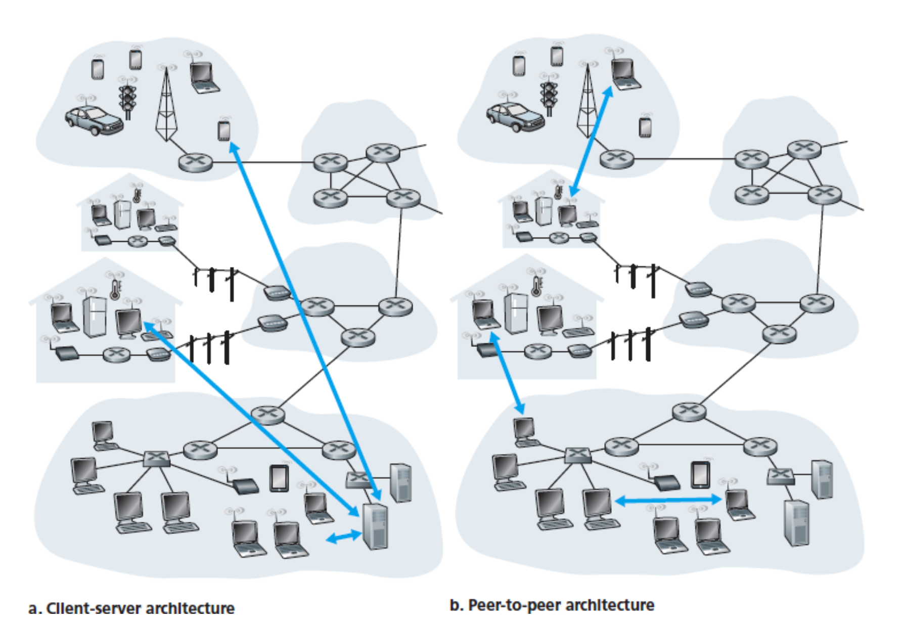
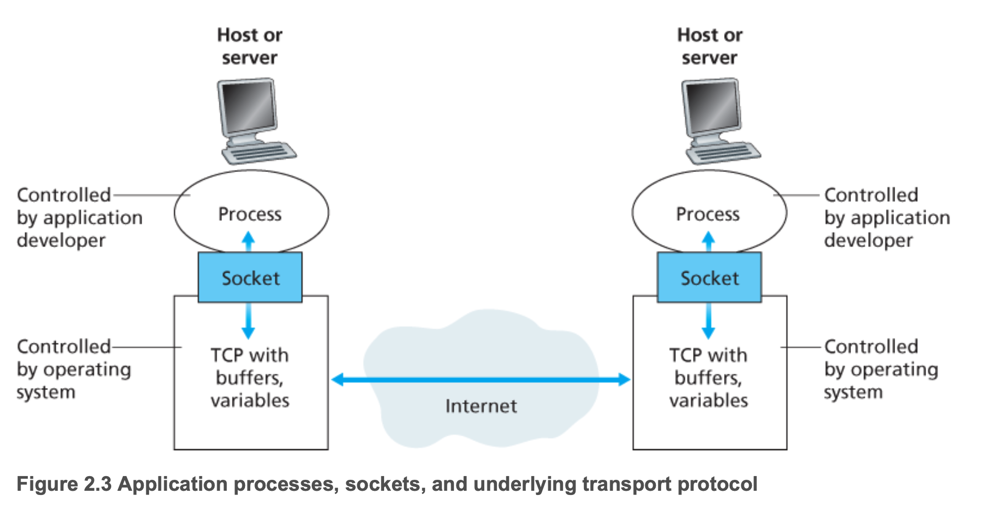
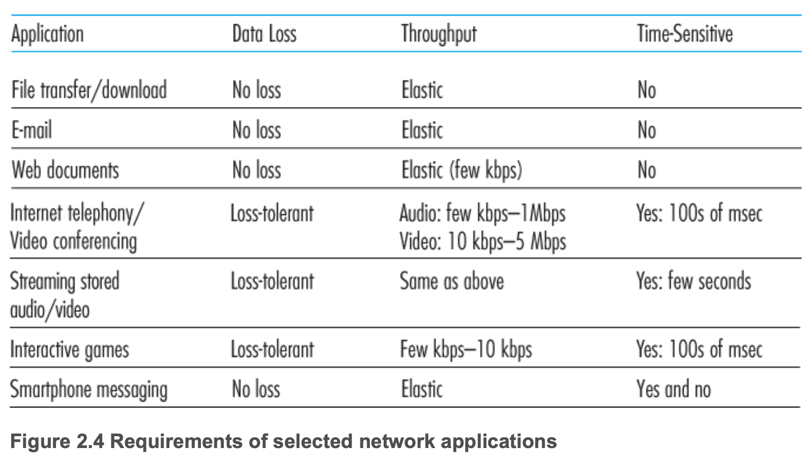
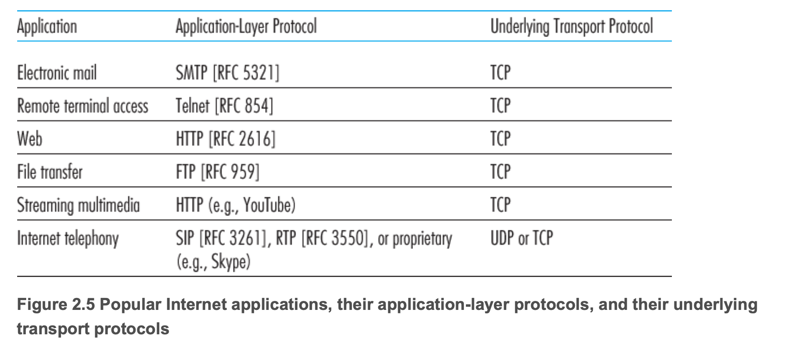
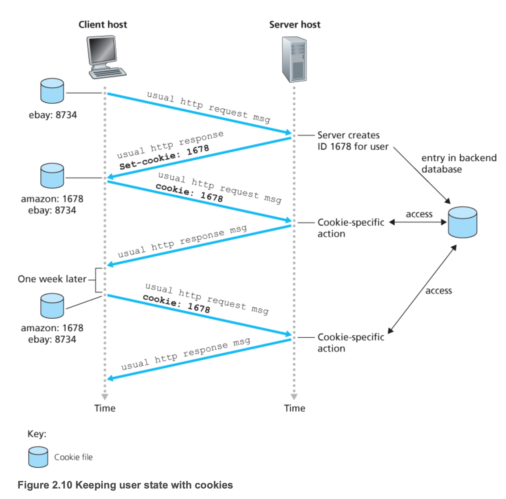
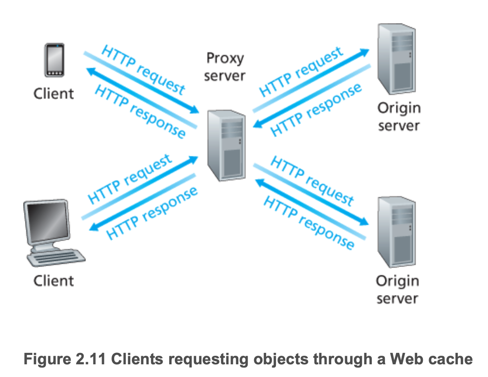
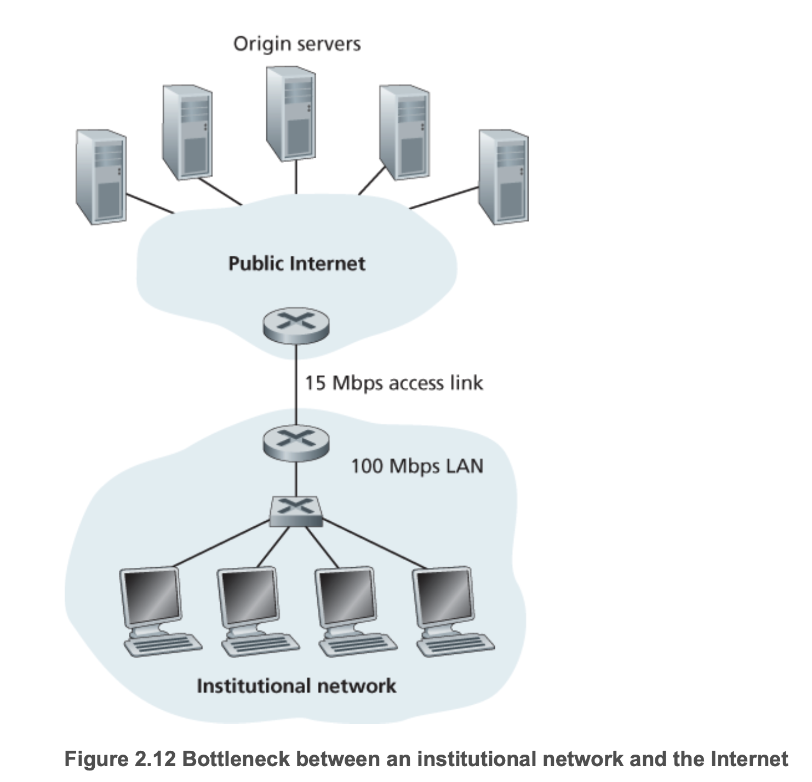
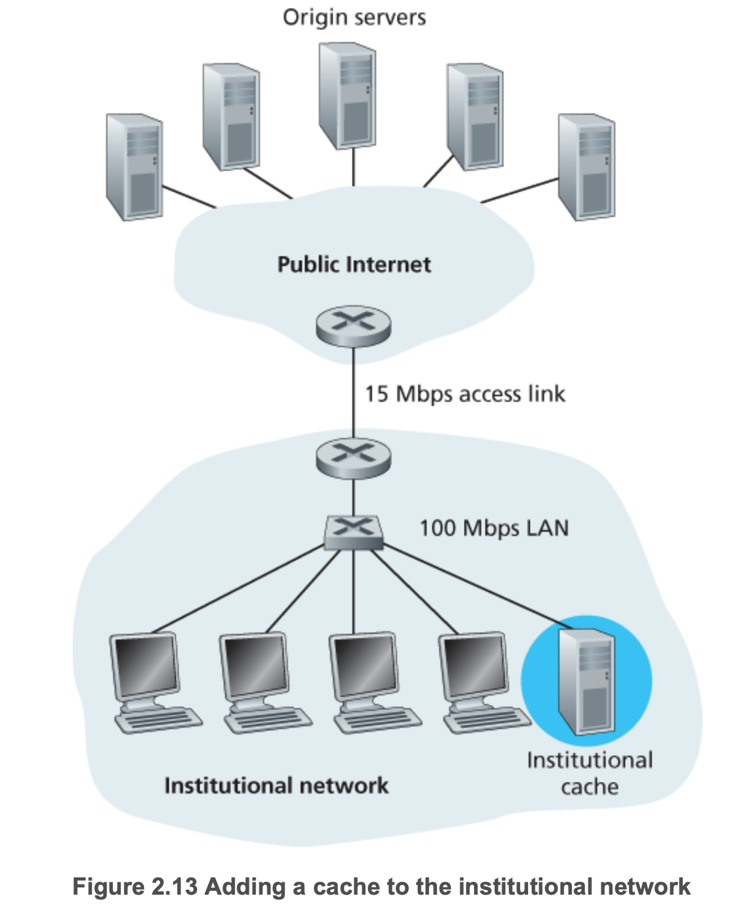

# CH.02 애플리케이션 계층

## 2.1 네트워크 애플리케이션의 원리

- 네트워크 애플리케이션은 서로 다른 종단 시스템에서 동작하고 네트워크를 통해 서로 통시하는 프로그램
- 새로운 애플리케이션을 개발할 때는 여러 종단 시스템에서 실행되는 소프트웨어를 작성해야 한다

### 2.1.1 네트워크 애플리케이션 구조
- 애플리케이션 구조(application architecture)
  - 애플리케이션 개발자에 의해 설계
  - 애플리케이션이 다양한 종단 시스템에서 어떻게 조직되어야 하는지를 지시
- 클라이언트-서버 구조(client-server architecture)
  - 서버
    - 항상 켜져 있는 호스트
    - 클라이언트라느 다른 호스트에 의해 요청을 받는다
  - 클라이언트
    - 가끔 혹은 항상 켜져 있는 호스트
    - 예) 브라우저, 모바일 앱, 서버
  - 클라이언트끼리 직접 통신하지 않는다
    - 서버를 통해서 통신한다
    - 예) 채팅
  - 하나의 서버 호스트가 모든 클라이언트의 요청에 응답하는 것이 불가능할 수 있음
    - 많은 호스트를 가진 데이터 센터(data center)에서 강력한 가상 서버를 제공
    - AWS, Azure, GCP, NCP, 알리바바 클라우드, ...
- P2P 구조
  - 항상 켜져 있는 서버에 최소로 의존(혹은 존재x)
  - 애플리케이션은 피어(peer)라는 간헐적으로 연결된 호스트트 쌍이 직접 통신
  - 피어는 서비스 제공자가 아닌 사용자들이 사용하는 데스크토, 랩톱, 모바일 기기
  - 비트 토렌트, 스카이프, ...

### 2.1.2 프로세스 간 통신
- 운영체제에서 실제로 네트워크 통신을 담당하는 것은 **프로세스(process)**
- 프로세스는 종단 시스템에서 실행되는 프로그램
- 같은 호스트내에서 프로세스 통신도 가능하지만 다른 종단 시스템간의 프로세스 통신이 네트워크에서 중요
- **메세지(message)** 교환으로 통신

#### 클라이언트와 서버 프로세스
- 네트워크 애플리케이션은 서로 메세지를 보내는 두 프로세스로 구성된다
- 두 프로세스 간의 통신 세션에서 통신을 초기화하는 프로세스를 클라이언트라 하고, 세션을 시작하기 위해 접속을 기다리는 프로세스를 서버라고한다

#### 프로세스와 컴퓨터 네트워크 사이의 인터페이스
- 프로세스는 **소켓(socket)**을 통해 네트워크로 메세지를 보내고 받는다.

- 소켓은 애플리케이션과 네트워크 사이의 **API(Application Programming Interface)**
- 애플리케이션 개발자는 소켓의 애플리케이션 계층에 대한 모든 통제권을 갖지만 트랜스포트 계층에 대한 통제권은 거의 갖지 못함
  - 트랜스포트 프로토콜 선택
  - 최대 버퍼와 최대 세그먼트 크기

#### 프로세스 주소 배정
- **IP 주소**로 호스트 식별
- **Port 번호**로 프로세스 식별

### 2.1.3 애플리케이션이 이용 가능한 트랜스포트 서비스
- 애플리케이션 개발시, 하나 이상의 트랜스포트 프로토콜을 사용

#### 신뢰적 데이터 전송
- 패킷은 네트워크에서 손실될 수 있음
  - 라우터 버퍼에서 오버플로우
  - 잘못된 패킷의 비트는 라우터에서 버려짐
- 애플리케이션이 보낸 데이터가 올바르고 잘 전송되었는지 보장하는 기능이 필요
- 손실 허용 애플리케이션(loss-tolerant application)
  - 비디오/오디오 전송 같은 경우 어느정도 데이터 손실이 허용

#### 처리량
- 두 프로세스 간의 통신 세션에서 송신 프로세스가 수신 프로세스로 비트를 전달할 수 있는 비율
- 여러 세션들이 네트워크 경로를 따라 대역폭을 공유하고, 이 세션들이 생겨났다 없어졌다 하기 때문에 시간에 따라 처리율이 변동
- 트랜스포트 프로토콜 레벨에서 r bits/sec의 처리율을 보장
- 대역폭 민감 애플리케이션(bandwidth-sensitive application)
  - 최소한의 처리량이 보장되어야하는 앱들
  - 멀티미디어 앱
- 탄력적 애플리케이션(elastic application)
  - 처리량이 일정치 않아도 되는 앱들
  - 메일, 파일 전송, 웹

#### 시간
- 송신자가 소켓으로 내보내는 모든 비트가 수신자의 소켓에 n sec 내에 도착하도록 보장
- 인터넷 전화, 원격회의, 게임, ...

#### 보안
- 트랜스포트 레벨에서 보안 서비스 제공
- TLS

### 2.1.4 인터넷 전송 프로토콜이 제공하는 서비스
#### TCP
- 연결 지향형 서비스
  - 클라이언트와 서버가 데이터 교환전에 연결
  - 3-way handshake, - 4-way handshake
- 신뢰적인 데이터 전송 서비스
  - 모든 데이터를 오류 없이 올바른 순서로 전달
- 혼잡 제어 방식
  - 인터넷 전체 성능 향상을 위한 서비스
  - 네트워크가 혼잡하면 프로세스(클라이언트 or 서버)의 속도를 낮춘다
- 보안 TCP
  - 기존에는 프로세스간의 메세지 전달이 암호화 되어 있지 않아서 보안에 취약
  - SSL(Secure Sockets Layer)을 개발하여 TCP에 보안 기능을 추가
  - 암호화, 데이터 무결성, 종단 인증 제공

#### UDP
- 최소한의 서비스 모델을 가진 간단한 전송 프로토콜
- 비연결형, 비신뢰성(메세지 도착을 보장하지 않음)
- 혼잡제어 방식을 사용하지 않는다
  - **네트워크 혼잡시에는 TCP보다 느릴수도 있다**

### 2.1.5 애플리케이션 계층 프로토콜
- 애플리케이션 프로토콜
  - 교환 메세지 타입(예: 요청 메세지와 응답 메세지)
  - 여러 메세지 타입의 문법(예: 메세지 내부의 필드와 필드 간의 구별 방법)
  - 필드의 의미, 즉 필드에 있는 정보의 의미
  - 언제, 어떻게 프로세스가 메세지를 전송하고 메세지에 응답하는지 결정하는 규칙
- 네트워크 애플리케이션과 애플리케이션 계층 프로토콜 구분
  - 애플리케이션 계층 프로토콜은 네트워크 애플리케이션의 한 요소
  - 웹 = 애플리케이션
  - HTTP = 프로토콜
    - 브라우저와 서버 사이에서 교환되는 메세지의 포맷과 순서를 정의

## 2.2 웹과 HTTP

### 2.2.1 HTTP 개요
- HTTP(HyperText Transfer Protocol)
- 웹페이지는 객체들로 구성
- 객체는 단일 URL로 저장할 수 있는 하나의 파일(HTML 파일, JPEG 이미지, ...)
- 대부분 웹 페이지는 기본 HTML 파일과 여러 참조 객체로 구성
- URL 분석
  - `http://www.someSchool.edu/someDepartment/picture.gif`
  - `http`: 스키마
  - `www.someSchool.edu`: 호스트 네임(도메인 형식)
  - `someDepartment/picture.gif`: 파일 경로
- 웹 서버(Web server)
  - HTTP의 서버 구현체
  - 아파치, nginx
- TCP 프로토콜 사용
  - 클라이언트 프로세스가 전송한 모든 HTTP 메세지가 서버에 도착함을 보장(신뢰적 데이터 전송)
  - HTTP에서는 데이터 손실과 복구에 대해서 걱정할 필요가 없음(계층화의 장점)
- 비상태 프로토콜(stateless protocol)
  - 서버는 클라이언트에 관한 어떠한 상태 정보도 저장하지 않음
  - 같은 객체를 두번 요청하면, 서버는 같은 객체를 두번 응답한다

### 2.2.2 비지속 연결과 지속 연결

#### 비지속 연결 HTTP
- `http://www.someSchool.edu/someDepartment/home.index` 연결 과정
  1. HTTP 클라이언트는 HTTP의 기본 포트 80을 통해 `www.someSchool.edu` 서버로 TCP 연결 시도. TCP 연결을 위한 클라이언트와 서버에 각각 소켓 생성
  2. HTTP 클라이언트는 1단계에서 설정된 TCP 연결 소켓을 통해 서버로 HTTP 요청을 보낸다. 이 요청에 `someDepartment/home.index` 경로를 포함
  3. HTTP 서버는 1단계에서 설정된 연결 소켓을 통해 요청 메세지를 받는다. 저장장치로부터 `/someDepartment/home.index` 객체를 추출하여 응답 메세지에 그 객체를 캡슐화 한다. 응답 메세지를 소켓을 통해 클라이언트로 전송
  4. HTTP 서버는 TCP에게 연결 종료 요청(실제로 연결을 끊는 과정은 TCP에서 진행)
  5. HTTP 클라이언트가 응답 메세지를 받으면, TCP 연결 중단. 메세지는 캡슐화된 객체가 HTML 파일인 것을 나타냄. 클라이언트는 응답 메세지로부터 파일을 추출하고 HTML 파일 조사하며 참조하는 객체들의 정보를 찾는다
  6. 그 이후에 참조되는 객체들에 대하여 1~4단계를 반복한다.
- 브라우저는 웹 페이지를 수신하면서 사용자에게 페이지를 보여줌
- HTTP는 클라이언트가 웹페이지의 해석 방식에는 관심이 없고 클라이언트와 서버간의 통신 프로토콜만 정의한다
- 서버가 객체를 보낸 후에 TCP 연결이 끊어짐으로 비지속 연결을 사용
  - 10개의 객체를 요청하면 10개의 TCP 연결이 생성된다(단점)

- **RTT(round trip time)**
  - 패킷이 클라이언트로부터 서버까지 가고, 다시 클라이언트로 돌아오는 시간
  - 패킷의 전파 지연, 큐잉 지연, 처리 지연 등을 포함
- HTTP 총 응답 시간 = 2RTT(연결,요청) + 서버의 파일 전송 시간

#### 지속 연결 HTTP
- 같은 요청에 대해서 연결과 요청 과정을 1번만 할 수 있음
- HTTP/1.1에서는 일정 기간(타임아웃) 동안 TCP 연결을 맺은 후에 요청이 없으면 연결은 종료한다. 타임아웃 내에 요청이 반복되면 기존 TCP 연결을 재사용한다
- HTTP/2에서는 같은 연결에서 다중 요청과 응답이 가능

> TODO HTTP2에 관해서 조사해보자

### 2.2.3 HTTP 메세지 포맷
#### HTTP 요청 메세지

> GET /somedir/page.html HTTP/1.1  
Host: www.someschool.edu  
Connection: close  
User-agent: Mozilla/5.0  
Accept-language: fr  

- 요청 라인(request line)
  - 첫 줄
  - method(GET, POST, HEAD, PUT, DELETE, ...), URL, http version 명시
- 헤더 라인(header line)
  - 두번째 줄부터
  - 메타 데이터
  - 애플리케이션에서 활용 가능(쿠키, 캐싱)
- 바디(body)

#### HTTP 응답 메세지

> HTTP/1.1 200 OK  
> Connection: close  
> Date: Tue, 18 Aug 2015 15:44:04 GMT  
> Server: Apache/2.2.3 (CentOS)  
> Last-Modified: Tue, 18 Aug 2015 15:11:03 GMT  
> Content-Length: 6821  
> Content-Type: text/html  
>  
> (data data data data data ...)

- status line
  - version, [status code](https://ko.wikipedia.org/wiki/HTTP_%EC%83%81%ED%83%9C_%EC%BD%94%EB%93%9C), status message
- header line
  - `Connection: close`: 메세지 응답 후 TCP 연결을 닫으려고 시도
  - `Date: Tue, 18 Aug 2015 15:44:04 GMT`: 응답 메세지가 생성된 시간, 객체가 생성거나 수정된 시간x
  - `Server: Apache/2.2.3 (CentOS)`: HTTP 서버 종류
  - `Last-Modified`: 객체가 생성되거나 수정된 시간
  - `Content-Length: 6821`: 송신되는 객체(body)의 바이트 수
  - `Content-Type: text/html`: 송신되는 객체(body)의 형식
- entity body

### 2.2.4 사용자와 서버 간의 상호 작용: 쿠키
- HTTP 서버에서는 사용자의 상태를 유지하지 않음
  - 서버의 설계를 간편하게하고 동시의 수천개의 TCP 연결을 다룰 수 있음
  - 서버가 사용자의 접속을 제한하거나 사용자에 따라 다른 콘텐츠를 보여주고 싶다면?
  - 쿠키(cookie)를 사용하여 해결
- 쿠키
  1. HTTP 응답 메세지 쿠키 헤더 라인
  2. HTTP 요청 메세지 쿠키 헤더라인
  3. 사용자의 브라우저에 사용자 종단 시스템과 관리를 지속시키는 쿠키 파일
  4. 웹 사이트의 백엔드 데이터 베이스

### 2.2.5 웹 캐싱(프록시 서버)
- 웹 서버를 대신하여 HTTP 요구를 충족시키는 네트워크 개체

- 캐시는 서버이면서 클라이언트
- 일반적으로 ISP가 구입하고 설치
- 사용 이유
  - 클라이언트의 요구에 대한 응답 시간을 줄일 수 있다.
    - 캐시-서버간의 대역폭이 클라이언트-캐시간의 대역폭보다 매우 작으면 효율적
  - 한 기관에서 인터넷으로 접속하는 링크상의 웹트래픽을 대폭으로 줄일 수 있다
- 기관 네트워크와 인터넷 간의 병목 현상
  - 
  - 평균 객체의 크기가 1Mbit, 클라이언트의 평균 요청 15 rps
  - LAN의 트래픽 강도 = **15 rps * 1 Mbit/요청 / 100 Mbps = 0.15**
  - 접속 회선(인터넷 라우터와 기관 라우터 사이)의 트래픽 강도 = **15 rps * 1 Mbit/요청 / 15 Mbps = 1**
- 기관 네트워크에 캐시 추가
  - 
  - 캐시 적중률이 0.4라고 가정
  - 요청의 40%는 캐시에 의해 10 msec 이내로 처리
  - 요청의 60%?
    - 요청의 60% 이므로 트래픽 강도가 1 -> 0.6
  - 평균 지연시간 = **0.4 * 0.01초 + 0.6 * 2.01초 = 1.2초**
  - 회선을 증설할 필요가 없고 저렴한 캐시 서버만 추가하면됨
- 콘텐츠 전송 네트워크(CDN, Content Distribution Network)
  - 비디오, 오디오, 사진 등의 콘텐츠 파일을 서버에 캐싱하여 제공
  - 전세계에 분산된 캐시 서버를 설치하여 많은 트래픽 제공

### 조건부 GET
- 캐시의 정보가 최신 정보가 아닐 수도 있음
- `GET`메소드, `If-Modified-Since` 헤더를 가지고 있으면 조건부 GET(conditional GET)
- 첫 요청
> GET /fruit/kiwi.gif  
> HTTP/1.1 Host: www.exotiquecuisine.com

- 첫 응답
  - 응답에 `Last-Modified` 시간을 포함하여 다음 요청에 사용하도록함
> HTTP/1.1 200 OK  
> Date: Sat, 3 Oct 2015 15:39:29  
> Server: Apache/1.3.0 (Unix)  
> Last-Modified: Wed, 9 Sep 2015 09:23:24  
> Content-Type: image/gif
>  
> (data data data data data ...)

- 다음 요청
  - `If-modified-since: Wed, 9 Sep 2015 09:23:24` 값이 첫 응답 값과 같으면 캐싱된 데이터 응답
> GET /fruit/kiwi.gif HTTP/1.1  
> Host: www.exotiquecuisine.com  
> If-modified-since: Wed, 9 Sep 2015 09:23:24

- 다음 응답
  - `If-modified-since` 이후에 저장된 객체만 응답
  - 만약에 없다면? 빈 body를 응답
> HTTP/1.1 304 Not Modified  
> Date: Sat, 10 Oct 2015 15:39:29  
> Server: Apache/1.3.0 (Unix)
>  
> (empty entity body)

## 2.3 인터넷 전자 메일

## 2.4 DNS - 인터넷의 디렉터리 서비스

## 2.5 P2P 파일 분배

## 2.6 비디오 스트리밍과 컨텐츠 분배 네트워크

## 2.7 소켓 프로그래밍 (SKIP)
