# CH.03 트랜스포트 계층

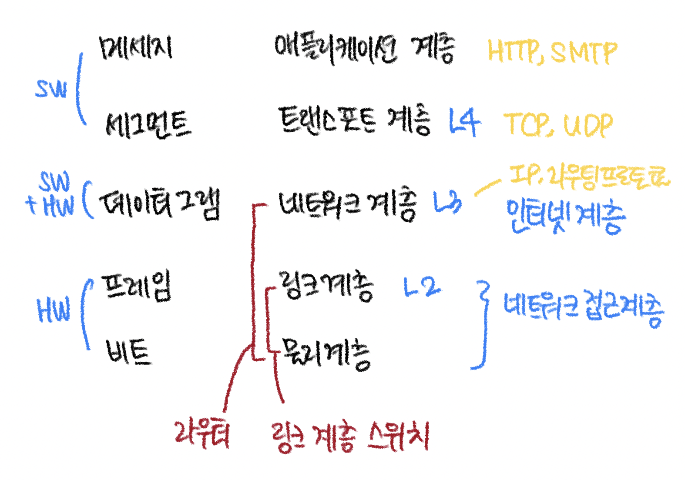

---

## 3.1 트랜스포트 계층 서비스 및 개요

- 트랜스포트 계층 프로토콜은 서로 다른 호스트에서 동작하는 애플리케이션 **프로세스들 간의** 논리적 통신을 제공
- 논리적통신(logical communication)
  - 애플리케이션의 관점에서 보면, (프로세스들이 동작하는) 호스트들이 직접 연결된 것처럼 보인다는 것을 의미
  - 역할: 호스트가 하위 물리적 계층를 신경쓰지 않고 메시지를 송신하기 위함
    - 실제로 호스트는 **수많은 라우터와 다양한 형태의 링크를 통해 연결**되어 지구상의 서로 다른 지역에 있을 수 있음
    - 애플리케이션 프로세스는 메시지 운반에 사용되는 물리적인 하위 구조의 세부사항에 상관없이 서로 메시지를 송신하기 위해서 트랜스포트 계층에서 제공하는 논리적 통신을 사용(3.1.1 예시 참고)  


- 송신하는 경우
  - `메시지`(애플리케이션 계층) → `세그먼트`(트랜스포트 계층, L4) → **변환과정** → `데이터그램`(네트워크 계층, L3)
  - **변환과정**
    1. 메세지를 작은 여러개의 조각으로 분할
    2. 각각의 조각에 트랜포트 계층 헤더를 추가
  - 전송과정(송신 측 트랜스포트 계층 관점)
    1. 애플리케이션 프로세스 `메시지`를 트랜스포트 계층 `세그먼트`으로 변환  
       - `세그먼트`(segment): 트랜스포트 계층 패킷(packet)
       - 변환과정: 메시지를 작은 조각으로 분할하고, 각각의 조각에 트랜스포트 계층 헤더를 추가해서 세그먼트 생성
       - `패킷`(Packet): 인터넷 내에서 데이터를 여러 개의 조각들로 나누어 전송을 하는데 이때, 이 조각을 패킷이라 함
    2. 네트워크 계층으로 세그먼트를 전달
       - 세그먼트가 네트워크계층 패킷(데이터그램, datagram) 안에 **캡슐화되어 목적지로 전달**됨  
- 수신하는 경우
  - 송신 과정의 반대 순서로 처리
  - 전송과정(수신 측 트랜스포트 계층 관점)
    1. 네트워크 계층은 `데이터그램`으로부터 트랜스포트 계층 `세그먼트`를 추출
    2. 트랜스포트 계층으로 `세그먼트`를 보냄
    3. 트랜스포트 계층은 수신 애플리케이션에서 *세그먼트 내부의 데이터를 이용할 수 있도록*, 수신된 세그먼트를 처리
- 트랜스포트 계층의 특징
  - 트랜스포트 계층 프로토콜은 **종단시스템(=호스트)** 에서 구현됨 (네트워크 라우터가 아님)
    - 네트워크 **라우터**는 오로지 데이터그램의 네트워크 계층 필드에 대해 동작
    - = 라우터는 트랜스포트 계층 세그먼트의 필드를 검사하지 않음
    - 중간 라우터는 트랜스포트 계층이 애플리케이션 메시지에 추가한 어떤 정보도 인식하지 못하며, 그 정보에 영향을 주지도 않음
      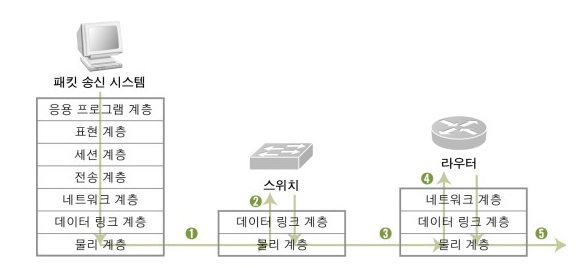
  - 네트워크 애플리케이션에는 하나 이상의 트랜스포트 계층 프로토콜이 사용 가능
    - 네트워크 애플리케이션: 각자 다른 end system에서 동작하고 네트워크를 통해 서로 통신하는 프로그램
    - 예시) 인터넷은 TCP와 UDP라는 두 가지 프로토콜을 가지고 있음

    > **하나의 애플리케이션에 여러개의 트랜스포트 프로토콜 사용 가능한 이유?** ❗️  
    > - 각 프로그램이 여러 개의 소켓을 가질 수 있음 (다른 여러 호스트/프로세스로 부터 데이터를 받아들일 수 있어야 하므로)  
    > - 각 소켓은 어떤 트랜스포트 계층 프로토콜을 정할 수 있음  
    > - → 따라서 "네트워크 어플리케이션이 여러 트랜스포트 계층을 사용할 수 있다"는 말이 성립!  

---

### 3.1.1 트랜스포트 계층과 네트워크 계층 사이의 관계

- 트랜스포트 계층은 네트워크 계층 바로 상위에 존재
- `트랜스포트 계층 프로토콜`: 서로 다른 호스트에서 동작하는 **프로세스들 사이**의 논리적 통신을 제공
- `네트워크 계층 프로토콜`: **호스트들 사이**의 논리적 통신을 제공

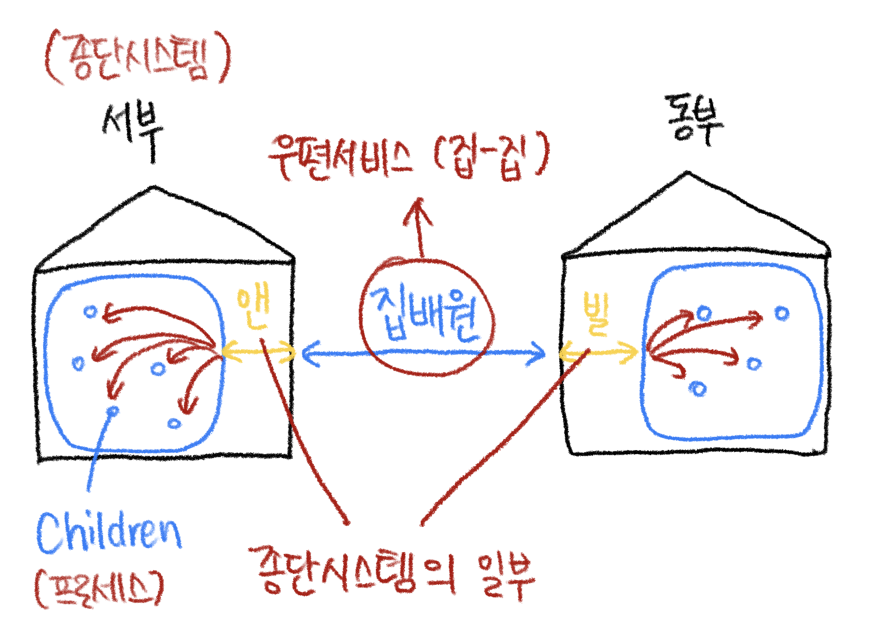

- 예시: 우편배달
  - 동부, 서부에 각각 집이 있음
  - 두 집안에는 아이들이 사는데, 이 아이들끼리 서로 편지쓰기를 좋아함
  - 서부에는 앤, 동부에는 빌 이라는 집사가 있음
  - 앤과 빌의 역할: 아이들의 편지를 모아서 집배원에게 전달하는 역할과 집배원이 가져다 준 편지를 아이들에게 나눠주는 것
  - 동부와 서부 사이에 편지를 전달하는 일은 집배원이 담당
  - 다음과 같이 매칭될 수 있음

    ```text
    - 애플리케이션 메시지 = 봉투 안의 편지
    - 프로세스 = 아이들
    - 호스트(종단 시스템) = 집
    - 트랜스포트 계층 프로토콜 = 앤, 빌
    - 네트워크 계층 프로토콜 = 집배원(우편서비스)
    ```

  - 트랜스포트 프로토콜(앤, 빌)은 `애플리케이션 프로세스 ~ 네트워크 경계` 간 메시지를 운반
  - 서부와 동부에 각각 수잔과 하비라는 집사가 추가로 고용되었다고 해보자,
    - 앤과 빌은 편지를 우편물을 정확히 전달할 수 있으나, 수잔과 하비는 우편물을 제대로 전달하지 못할 수 있음 (최선을 다하지만 우편물을 종종 잃어버리기도 함)
    - 컴퓨터 네트워크는 (애플리케이션에게 서로 다른 서비스를 제공하도록 하는 개별 프로토콜을 갖는) 다양한 트랜스포트 프로토콜을 만들 수 있게 함
  - 우편 서비스가, 두 집 사이에서 우편물이 배달되는 데 소요되는 최대기간을 보장하지 않는다면?
    - (= 하위계층이 최대 전송기간을 보장하지 않으면?)
    - 트랜스포트 계층이 제공할 수 있는 서비스는 하위 네트워크 계층 프로토콜의 서비스 모델에 의해서 제약받음
      - 하위 계층이 지연보장, 대역폭 보장이 불가능하다면, 트랜스포트 계층 프로토콜은 프로세스끼리 전송하는 메시지에 대한 지연보장, 대역폭 보장 등을 제공 불가
      - 하위 네트워크 프로토콜이 상응하는 서비스를 제공하지 못할 때에도(하위 네트워크 프로토콜이 비신뢰적일 때), 특정 서비스는 트랜스포트 프로토콜에 의해서 제공될 수 있음

---

### 3.1.2 인터넷 트랜스포트 계층의 개요

TCP/IP 네트워크는 애플리케이션 계층에게 두 가지 구별되는 트랜스포트 계층 프로토콜들을 제공

- **UDP (User Datagram Protocal)**: (애플리케이션에게) 비신뢰적이고 비연결형인 서비스를 제공
- **TCP (Transmission Control Protocol)**: (애플리케이션에게) 신뢰적이고 연결지향형 서비스를 제공
- 애플리케이션 개발자는 이 두가지 트랜스포트 프로토콜 중의 하나를 명시해야함  
- 소켓을 생성할 때, TCP와 UDP 중 하나를 선택해야 함
- **트랜스포트 계층 패킷**
  - TCP 패킷 → 세그먼트  
  - UDP 패킷 → 데이터그램  
  - 위처럼 표현하기도 하지만 네트워크 계층의 데이터그램과 혼동될 수 있으므로, 여기서는 **세그먼트(segment)** 라는 용어로 통일하여 사용

#### (3계층) IP 서비스 모델

 → 네트워크 계층(3계층)에 대한 간략한 설명  

- 트랜스포트 계층(4계층)의 바로 아래 하위 계층
- 인터넷의 네트워크 계층(3계층) 프로토콜은 `인터넷 프로토콜(IP)`라고 불림
- 각 호스트가 적어도 하나의 IP 주소를 가지고 있음!
- IP 서비스 모델은 호스트들 간에 논리적 통신을 제공하는 최선형 전달 서비스
- **최선형 전달 서비스** (best-effort delivery service)
  - 통신하는 호스트들 간에 세그먼트를 전달하기 위해서 최대한 노력하지만, 어떤 보장도 하지 않음
  - 세그먼트의 전송, 순서, 내부 데이터의 데이터 무결성(integrity, 오류검출) 등을 보장하지 않음
  - ► 따라서 **IP는 비신뢰적 서비스**(unreliable service)

#### (4계층) TCP, UDP의 서비스 모델

 → 트랜스포트 계층(4계층)에 대한 간략한 설명

- **UDP, TCP의 가장 기본적인 기능**
  1. **트랜스포트 다중화(transport multiplexing), 역다중화(demultiplexing)**
     - `종단 시스템 사이의 IP 전달 서비스`를 종단 시스템에서 동작하는 `두 프로세스 간의 전달 서비스`로 확장
     - `호스트 대 호스트 전달`을 `프로세스 대 프로세스 전달`로 확장
  2. **무결성 검사(오류검출)**
     - 헤더에 오류 검출 필드를 포함

- **UDP**
  - 가장 기본적인 기능 두 가지 서비스만 제공
    1. 프로세스 대 프로세스 데이터 전달
    2. 오류 검출
  - **비신뢰적인 서비스**
    - 프로세스에 의해서 전송된 데이터가 손상되지 않고, 목적지에 도착한다는 것을 보장하지 않음
    - *UDP에서의 오류검출은 option*
  - **비연결형 서비스**
- **TCP**
  - 가장 기본적인 기능 두 가지 서비스도 제공
  - **신뢰적인 데이터 전달(reliable data transfer)**
    - 흐름제어, 순서번호, 확인응답, 타이머등의 기술을 사용
    - 위의 기술을 사용함으로써, 프로세스에게 데이터가 순서대로 정확하게 전달되도록 확실히 함
    - 종단 시스템 간에 IP의 비신뢰적 서비스를 프로세스 사이의 신뢰적인 데이터 전송 서비스로 만듦
    - *TCP에서의 오류검출은 필수 제공*
  - **연결지향형 서비스**
  - **혼잡제어(congestion control) 사용**
    - → 보내는 쪽의 트래픽을 조절하여, 스위치/링크의 혼잡을 방지
    - TCP 연결이 과도한 양의 트래픽으로 모든 통신하는 호스트들 사이의 스위치와 링크를 폭주되게 하는 것을 방지
    - 특정 애플리케이션이 제공하는 특정 서비스가 아니라, 전체를 위한 서비스

    > - 혼잡한 네트워크 링크에서 각 TCP 연결이 링크의 대역폭을 공평하게 공유하여 통과하도록 해줌  
    > - 송신(보내는 쪽) 측의 TCP가 네트워크에 보낼 수 있는 트래픽을 조절함으로써 수행됨  

---

## 3.2 다중화와 역다중화

- 다중화/역다중화의 역할: 프로세스에게 데이터 전달
  - `호스트 대 호스트 전달 서비스`를 `프로세스 대 프로세스 전달 서비스`로 확장
- 트랜스포트 계층의 의무: 호스트에서 동작하는 해당 애플리케이션 프로세스에게, 수신된 세그먼트의 데이터를 전달해야함
  - = 여러 세션(ex. HTTP, FTP, Telnet, ...)이 있을 때, 하위의 네트워크 계층으로부터 수신된 데이터를 여러개의 프로세스 중 하나에게 전달해야함
    - 웹페이지를 다운로드 하는 것은 HTTP 프로세스를 가진다고 할 수 있음
    - HTTP 프로세스: HTTP(애플리케이션 계층 프로토콜)를 구현하는 종단시스템 내에 프로세스
- **소켓**
  - 역할: 프로세스로부터 네트워크로 데이터를 전달하는 출입구(인터페이스) 역할
    - 프로세스는 소켓을 가짐
    - → 수신 측 호스트의 *트랜스포트 계층은 실제로 데이터(세그먼트)를 직접 프로세스로 전달하지 않고*, **중간 매개자인 소켓에게 전달**
  - 소켓의 식별자
    - 호스트에는 하나 이상의 소켓이 존재할 수 있으므로 소켓은 **고유한 식별자를 가짐**
    - 식별자의 포맷은 UDP/TCP 소켓인지에 따라 달라짐
    - 세그먼트를 적절한 소켓으로 보내는 방법
      - 세그먼트는 필드 집합을 가지고 있음
      - **수신 소켓을 식별하기 위해서 `필드 집합`을 검사**
      - 역다중화/다중화 사용

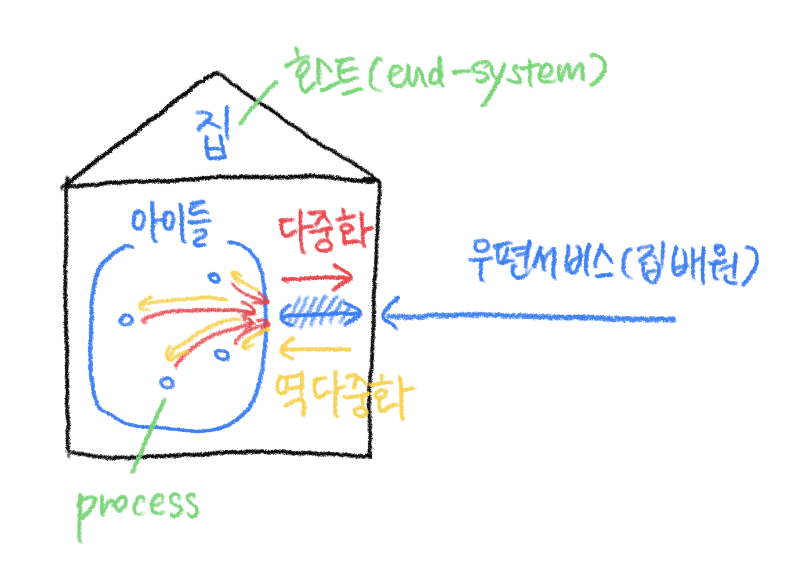

- **역다중화(Demultiplexing)**
  - 역다중화 방법: 트랜스포트 계층 세그먼트의 데이터를 올바른 소켓으로 전달
  - 하위 계층으로부터 수신한 세그먼트를 위쪽의 프로세스로 반드시 역다중화 해야함
- **다중화(Multiplexing)**
  - 소켓으로부터 데이터를 모으고
  - 이에 대한 세그먼트를 생성하기 위해서 각 데이터에 헤더정보로 캡슐화하고
  - 그 세그먼트들을 네트워크 계층으로 전달
- **트랜스포트 계층 다중화의 요구사항**
  1. <u>소켓은 유일한 **식별자**를 가짐
  2. 각 세그먼트는 세그먼트가 전달될 적절한 소켓을 가리키는 **특별한 필드**를 가짐</u>
  - 특별한 필드?
    - **출발지 포트 번호 필드**(source port number field)
    - **도착지 포트 번호 필드**(destination port number field)  
      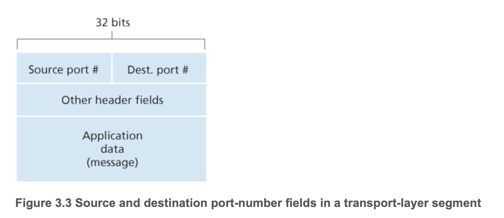
  - UDP와 TCP 세그먼트는 다른 필드들도 가지고 있음
  - 각 포트번호는 0~65535까지 16비트 정수
  - 0~1023까지의 포트번호는 **잘 알려진 포트 번호** → 사용을 엄격하게 제한
    - ex) HTTP(포트번호 80), FTP(포트번호 21), ...
    - 잘 알려진 **애플리케이션 프로토콜에서 사용되도록 예약**되어 있음
    - (잘 알려진 프로토콜 → 잘 알려진 포트번호 사용)
  - 새 어플리케이션 개발할 때, 애플리케이션에 포트 번호를 반드시 할당해야함
- **역다중화 절차 요약** (UDP의 기본적인 동작방식)
  - 호스트의 각 소켓은 포트 번호를 할당 받음
  - 세그먼트가 호스트에 도착하면, 트랜스포트 계층은 세그먼트 안의 목적지 포트번호를 검사하고, 상응하는 소켓으로 세그먼트를 보냄
  - 세그먼트 데이터는 소켓을 통해 해당되는 프로세스로 전달됨

> - 트랜스포트 프로토콜의 내용과 관련해서 다중화와 역다중화를 설명했지만,  
>   한 프로토콜이 그 상위 계층의 여러 프로토콜에 의해 사용될 때마다 관련되어 있음  
> - 다중화/역다중화는 모든 컴퓨터 네트워크에서 필요  

> - 다중화(Multiplexing): 두 개 이상의 저수준의 채널들을 하나의 고수준의 채널로 통합하는 과정  
> - 역다중화(Demultiplexing) 과정을 통해 원래의 채널 정보들을 추출 가능

---

### 비연결형(UDP) 다중화와 역다중화

- UDP 소켓 생성: `clientSocket = socket(AF_INET, SOCK_DGRAM)`
  - 트랜스포트 계층은 포트번호를 소켓에게 자동으로 할당
  - 특히, 현재 호스트에서 UDP 포트로 사용하지 않는 1024~65535 사이의 포트 번호를 할당함
- 특정 포트 번호를 UDP 소켓에 할당: `clientSocket.bind((’’, 19157))`

> 만약 개발자가 잘 알려진 프로토콜의 서버 측을 구현하고 있다면, 개발자는 상응하는 잘 알려진 포트번호를 할당해야만 함  
> 일반적으로 애플리케이션의 **서버 측이 특정 포트 번호를 할당**하는 것에 반하여,  
> 애플리케이션의 **클라이언트 측은 트랜스포트 계층이 포트번호를 자동으로 할당**

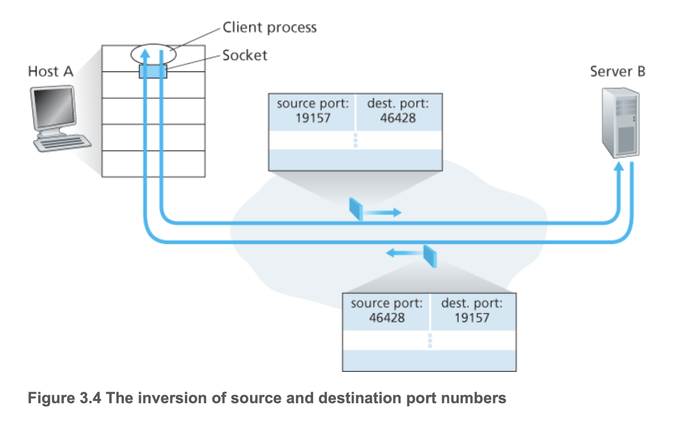

- UDP 소켓은 **목적지 IP 주소**와 **목적지 포트 번호**로 구성된 튜플에 의해서 식별됨 ❗️
- 따라서 **출발 주소가 다를지라도**, 동일한 목적지 IP 주소와 포트번호를 가진다면, 세그먼트들은 **같은 목적지 소켓을 통해** 동일한 프로세스로 전달됨

- 출발지 포트번호의 역할?
  - A에서 B로 가는 세그먼트에서 출발지 포트 번호는 **복귀주소**의 역할
  - B가 세그먼트를 다시 A로 보내기 원할 때 사용
  - 서버가 클라이언트로부터 수신한 세그먼트로부터 클라이언트 측(출발지) 포트 번호를 추출하기 위해 `recvfrom()` 함수를 사용 (2.7절)

> 📌 **UDP를 사용할 떄, 어떤 패킷이 어디서 왔는지 어떻게 알까?**  
    - UDP는 `(목적지 IP 주소, 목적지 포트 번호)` 를 통해서 소켓을 정해줌  
    - 같은 `(목적지 IP 주소, 목적지 포트 번호)`을 가지면 같은 소켓(같은 프로세스)에 전달됨  
    - 같은 소켓으로부터 전달된 세그먼트들을 구분하는 방밥: `출발지 IP, 출발지 포트번호` 확인  
    - 앞서, 식별자로서 `(목적지 IP 주소, 목적지 포트 번호)` 를 사용한다고 한 것은, 어떤 소켓에 전달할 지에 대한 내용이고
    - 수신 프로세스에서 실제 출발지 프로세스를 구분하기 위해서는 출발지 IP, 포트번호를 사용

> 📌 **트랜스포트 계층에서 출발지, 도착지 IP 주소 알아내는 방법?**  
    - IP 주소는 하위 계층의 헤더 정보이지만, UDP에서 가상 헤더로서 이들의 정보를 유지 → UDP의 허용된 계층위반
    - 가상헤더는 출발지 IP 주소, 도착지 IP 주소 등을 포함
    - (가상헤더: 12 바이트, UDP 헤더: 8 바이트)

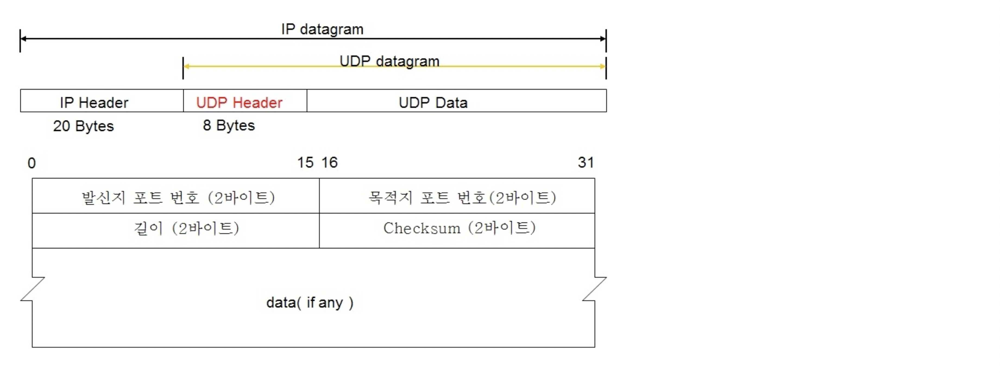
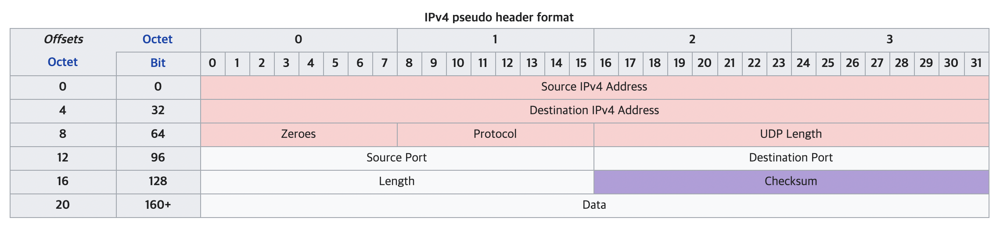  

- IP header와 IP 주소의 위치
  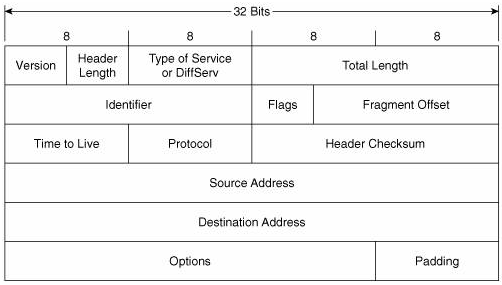

---

### 연결지향형(TCP) 다중화와 역다중화

- TCP 역다중화를 위해서 살펴볼 내용: TCP 소켓, TCP 연결설정
- `TCP 소켓` vs. `UDP 소켓`
  - UDP 소켓: 2개의 다른 요소들의 집합에 의해 식별
    - `(목적지 IP, 목적지 포트번호)`
    - 다른 출발지 주소를 가지는 세그먼트라도, 목적지만 같으면 같은 소켓을 통해 프로세스에 전달됨
  - TCP 소켓: 4개의 다른 요소들의 집합에 의해 식별
    - `(출발지 IP, 출발지 포트번호, 목적지 IP, 목적지 포트번호)`
    - 다른 출발지 주소를 가지는 세그먼트는, 다른 소켓을 통해서 프로세스에 전달됨
  - UDP와 다르게, **TCP 세그먼트는 출발지 주소가 다르면, 다른 소켓으로 전달됨**

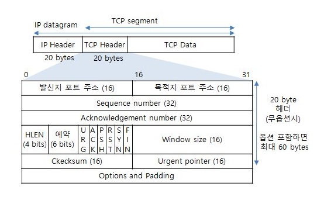  
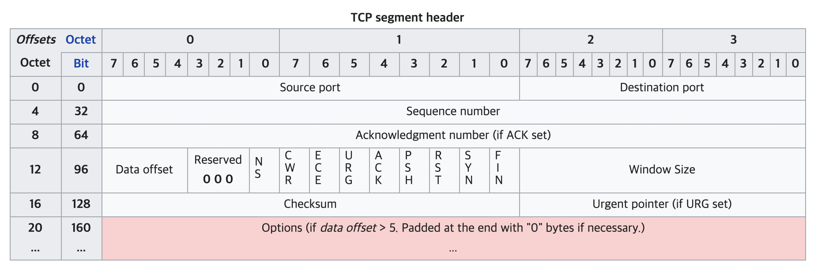  

#### (+ 2.7.2) TCP 클라이언트/서버 Remind

> server는 특정 port 지정해야하고, client는 자동으로 port가 할당됨

- TCP 서버 애플리케이션은 소켓 하나를 가지고 있음
  - 포트번호 12000을 가진 TCP 클라이언트로부터 연결 설정 요청을 기다림
- TCP 클라이언트는 다음과 같은 명령을 통해 **소켓을 생성**하고 **연결 설정 요구 세그먼트를 보냄**
  - `clientSocket = socket(AF_INET, SOCK_STREAM)`
  - `clientSocket.connect((serverName,12000))`
- 연결 설정 요청은 목적지 포트번호 12000과 TCP 헤더에 설정된 특별한 연결 설정 비트(3.5절)를 가진 TCP 세그먼트일 뿐!
  - 또한, 그 세그먼트는 (클라이언트에 의해 선택된)출발지 포트 번호를 포함
- 서버 프로세스로 동작하는 컴퓨터의 호스트 OS가 목적지 포트 12000을 포함하는 연결요청을 세그먼트가 수신하면, 포트번호 12000상에서 연결을 기다리고 있는 서버 프로세스를 찾아서, (그 서버는) 새로운 소켓을 생성
  - → 요약) 서버에서 12000 포트로 연결요청(세그먼트) 들어오기를 기다리다가, 연결요청 들어오면 새로운 소켓을 생성!
  - `connectionSocket, addr = serverSocket.accept()`
- 서버는 연결요청 세그먼트의 다음과 같은 4가지 값을 주목
  1. 세그먼트 안의 출발지 포트번호
  2. 출발지 호스트의 IP 주소
  3. 세그먼트 안의 목적지 포트번호
  4. 목적지 IP 주소
  - 새롭게 생성된 연결 소켓은 이 4가지 값에 의해서 식별됨
  - 그 다음에 도착하는 모든 세그먼트의 위 4가지 값들이 앞서 받은 연결요청 세그먼트의 4가지 값과 일치하면, 세그먼트는 이 소켓으로 역다중화(세그먼트→소켓) 됨


- `socket()`: 소켓 생성
- `bind()`: IP주소와 포트번호 결정(서버 입장에서의 로컬 IP, port)
- `listen()`: 연결대기, TCP 상태를 LISTENING으로 변경
- `accept()`: 연결수락, 자신에게 접속한 클라이언트와 통신할 수 있는 새로운 소켓을 생성(서버 관점에서의 원격 IP 주소, 원격 포트 번호 결정됨)
- `connect()`: 클라이언트가 서버에 접속하여 TCP 프로토콜 수준의 연결이 이루어지도록 함
- `send()`, `recv()`: 데이터 전송함수, 클라이언트와 통신 수행
  - `send()`: 애플리케이션 데이터를 송신 버퍼에 복사
  - `recv()`: 수신 버퍼에 도착한 데이터를 애플리케이션 버퍼로 복사
- `close()`: 소켓을 닫음

##### 정리

- 서버 호스트는 동시에 존재하는 많은 TCP 소켓을 지원할 수 있음
- 이 각각의 소켓은 프로세스에 접속되어있음
- 이들 소켓은 4개의 요소들의 집합(four-tuple)에 의해서 식별됨
  - 4가지 필드: (출발지 IP, 출발지 포트번호, 목적지 IP, 목적지 포트번호)
- 이 4가지 필드는 해당되는 소켓으로 세그먼트를 전달(역다중화)하기 위해서 사용

##### 예시

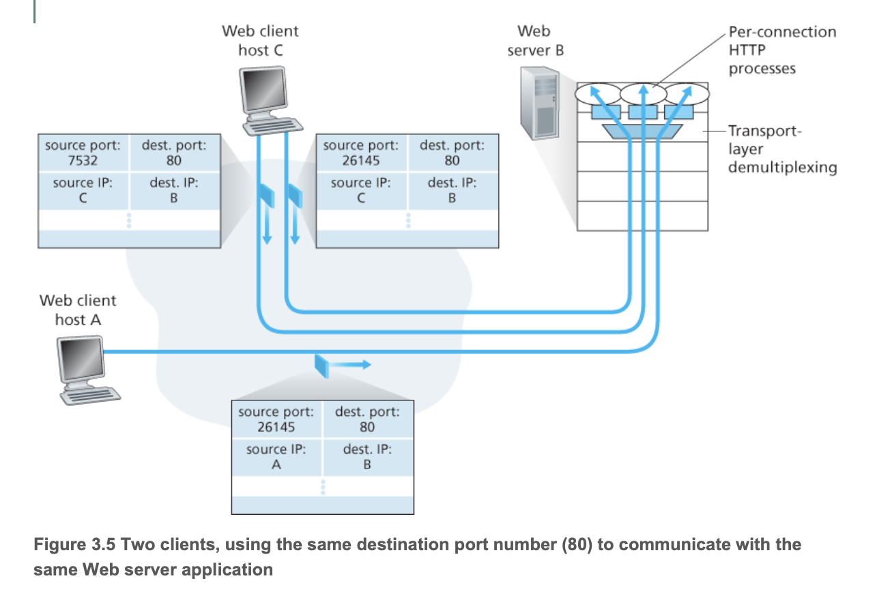

> 호스트 C가 서버 B로 2개의 *HTTP 세션을 시작*하고, 호스트 A가 호스트 B로 하나의 HTTP 세션을 시작하는 상황이 설명되어 있음  
> 호스트 A와 호스트 C, 그리고 서버 B는 각자 유일한 IP 주소인 A, C, B를 각각 가지고 있음  
> 호스트 C는 2개의 다른 *출발지 포트 번호(26145와 7532)를 자신의 HTTP(포트번호 80) 연결에 할당*함  
> 호스트 A는 C와 독립적인 출발지 포트 번호를 선택하므로, 이것 또한 HTTP 연결에 출발지 포트로 26145를 할당할 수도 있음  
> 그렇게 하더라도, 2개의 연결은 다른 출발지 IP 주소를 가지므로, 서버 B는 동일한 출발지 포트 번호를 가진 두 연결을 여전히 올바르게 역다중화 가능  

- 요약하자면, 서로 다른 IP(출발지)를 가지면, 같은 출발지 포트번호를 가질 수 있음
- 클라이언트의 프로세스(포트번호 26145)와 서버의 HTTP 프로세스(포트번호 80)을 연결
  - 같은 도착지 포트번호(80)을 가지고 있으나, 모두 다른 HTTP 프로세스로 전달되는 것을 볼 수 있음
  - HTTP는 TCP와 함께 사용되므로, TCP의 소켓 식별자 요소인 4가지 요소를 전부 고려하기 때문
  - 따라서, 같은 도착지 포트를 사용해도 다른 소켓으로 전달되어, 다르게 처리됨

> 📌 더 생각해볼 것
> - p87, 88같은 프로토콜을 가진 프로세스들 간에 연결만 가능한거 아닌가? 그럼 클라이언트도 HTTP 사용해야하는거 아닌가? 근데 왜 80 안쓰고 다른거쓰는가?  
> - → 80이 아닌 다른 포트번호도 HTTP를 사용할 수 있다.
> - 같은 프로토콜이 다른 포트번호를 가질수도있을까?  
> - → YES  
> - 브라우저로 웹서버 접속할 때, 브라우저의 포트는 항상 80? 그럼 여러 브라우저 띄우면?

---

- **세션(session)**
  - 클라이언트가 연결을 종료하여, 서버와의 연결을 끝내는 시점까지를 세션이라함
  - 논리적인 단위, 물리적으로는 연결이 끊어져있을 수도 있음
- HTTP 세션
  - 클라이이언트가 웹서버에 연결된 순간부터 웹 브라우저를 닫아 서버와의 HTTP 통신을 끝낼 때 까지의 기간
- 소켓 vs. 포트
  - **포트(Port)**: 프로세스를 식별하기 위해, 호스트 내부적으로 **프로세스가 할당받는 고유한 값**
    - 같은 호스트 내에서 서로 다른 프로세스가 같은 포트 넘버를 가질 수 있음, 대신 같은 소켓을 사용하지는 못함
      - `accept()`를 통해 만들어지는 소켓에는 새로운 포트 번호가 할당되는 것이 아니라, 서버가 가지는 포트(웹서버 기준, 80)와 동일한 포트 번호를 가짐
    - 만약 지정된 포트 번호를 다른 소켓이 사용하고 있다면, bind() API는 에러를 리턴  
    - 논리적인 접속장소
  - **소켓(Socket)** : 프로세스가 네트워크를 통해서 데이터를 주고받으려면 반드시 열어야 하는 창구 같은 것
  - 소켓과 포트는 다름!
    - 왜냐하면 같은 프로세스가 같은 포트를 가지고도 여러 개의 소켓을 열 수 있기 때문
    - 흥미롭게도 하나의 프로세스는 같은 프로토콜, 같은 IP 주소, 같은 포트 넘버를 가지는 수십 혹은 수만 개의 소켓을 가질 수 있음
    - 소켓을 정의하는 것과 소켓을 식별하는 것을 구분하자. IP 주소, 포트 넘버, 프로토콜로 소켓을 정의할 수 있지만, 이것이 소켓을 유일하게 식별하지는 않음
    - 소켓 통신 vs HTTP 통신 ❗️
      - https://mangkyu.tistory.com/48

---

### 웹 서버와 TCP

웹 서버와 이 웹 서버가 어떻게 포트 번호를 사용하는지


- 아파치 웹 서버(Apache Web Server): 포트번호 80 상에서 동작하는 호스트
- 예시
  - 클라이언트(브라우저)가 서버로 세그먼트를 보내면, 모든 세그먼트는 목적지 포트 번호 80을 가지고 있음
  - 특히, 초기 연결 설정 세그먼트들과 HTTP 요청 메시지를 전달하는 모든 세그먼트들은 목적지 포트번호 80을 가짐
  - **서버는, 각기 다른 클라이언트가 보낸 세그먼트를 출발지 IP 주소와 출발지 포트 번호로 구별**
  - 위의 그림에서는, 웹 서버가 각각의 연결에 따라서 새로운 프로세스를 할당
    - 이들 프로세스는 각자 연결 소켓을 가지며, 이 연결 소켓을 통해서 HTTP 요청을 수신하고, HTTP 응답을 전송
  - 연결 소켓과 프로세스 사이에 항상 일대일 대응이 이뤄지는 것은 아님
    - 요즘 고성능 웹 서버들은 하나의 프로세스만을 사용
    - 그러면서, 각각  새로운 클라이언트 연결을 위해, **새로운 연결 소켓**과 함께 **새로운 스레드**를 생성
    - 웹서버에서는 하나의 동일한 프로세스에 첨부된 많은 연결 소켓들(다른 식별자를 가진)이 동시에 존재할 수 있음
- 지속적인(persistent) HTTP
  - 존속기간 동안, 클라이언트와 서버는 동일한 서버 소켓을 통해서 HTTP 메시지를 교환할 것임
- 비지속적인(non-persistent) HTTP
  - 모든 요청/응답마다 새로운 TCP 연결이 생성되고 종료될 것
  - 새로운 소켓이 생성된 후 모든 요청/응답이 처리되고 나면 매번 종료되므로 웹서버 성능에 심한 부담을 줌

> **Nginx**
> - 웹서버 구현마다 다르지만, 최근 많이 사용하는 Nginx 같은 경우, process pool을 만들어서 이걸 worker 프로세스라고 부름
> - 이 worker 프로세스들을 관리하는 master 프로세스가 있는데, 요청이 올떄마다 worker 프로세스에게 요청을 포워딩해서, worker 프로세스에서 처리하도록 구현되어 있음
> - 80에 물려있는 프로세스가 요청을 worker 프로세스에 그대로 포워딩 함  
> - 여러 프로세스가 하나의 포트를 공유한다는 것 보다는, 80에 마스터 프로세스가 물려있고, 자식 프로세스가 생성되서 실제 요청에대한 응답을 처리한다고 생각하면 됨  
> - Nginx 설정에 worker 프로세스 몇개까지 유지할 것인지에 대한 설정도 존재  
> - 대부분, nginx하나당 초당 2-10만건 처리가 가능하기 때문에 Nginx에서 병목잡히는경유는 거의없음  
> - 따라서, 포트에 연결된 소켓이 문제인경우는 거의 없음  
> (+ 80이 대표적인 포트일 뿐이고, 다른 포트도 많이 씀, 그러나 사용자에게 노출되는 서버는 80을 사용)  
> https://icarus8050.tistory.com/57  

---

## 3.3 비연결형 트랜스포트: UDP

- 트랜스포트 계층은 최소한, 네트워크 계층과 애플리케이션 레벨 프로세스 간의 **데이터를 넘겨주기 위해서 다중화와 역다중화 서비스를 제공**해야함
- UDP는 트랜스포트 계층 프로토콜이 할 수 있는 최소 기능으로 동작
  1. 다중화/역다중화 기능
  2. 간단한 오류 검사 기능
  - UDP 선택 시, 애플리케이션은 거의 IP와 직접 통신하는 셈
- UDP를 선택했을 때의 전송 절차
  - UDP는 애플리케이션 프로세스로부터 메시지를 가져와서,
  - **다중화/역다중화 서비스에 대한 필드**(출발,목적 포트번호 + 외 2개)들을 추가한 후,
  - 최종 세그먼트를 네트워크 계층으로 넘김
  - 네트워크 계층은 트랜스포트 계층 세그먼트를 IP 데이터그램으로 캡슐화하고, 세그먼트를 수신 호스트에게 **최선형 전달 서비스**로 전달
  - 만약 세그먼트가 수신 호스트에 도착하면, UDP는 세그먼트의 데이터를 해당하는 애플리케이션 프로세스로 전달하기 위해서 **목적지 포트 번호를 사용**
- UDP는 세그먼트를 송신하기 전에 핸드셰이크를 사용하지 않음 → **비연결형**
  - **핸드셰이크**: 송신 트랜스포트 계층 개체들과 수신 트랜스포트 계층 개체들 사이의 초기 연결 설정 과정
    - 채널에 대한 정상적인 통신이 시작되기 전에 두 개의 실체 간에 확립된 통신 채널의 변수를 동적으로 설정하는 자동화된 협상 과정
    - 채널의 물리적인 확립이 잇따르며, 정상적인 정보 전송 이전에 이루어짐
    - TCP는 상대방과 연결이 잘 되었는지 확인 후, "나 보낸다!"라고 신호를 보내지만, UDP는 상대방과 연결이 잘 되었든 안되었든 데이터를 전송하는 것
      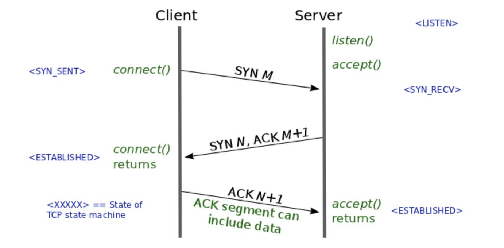
- TCP와 다르게, UDP는 신뢰적인 데이터 전송 서비스를 지원하지 않음 → **비신뢰적**

> 🔍 **DNS와 UDP 예시**
    - **DNS는 일반적으로 UDP를 사용하는 애플리케이션 계층 프로토콜**의 예시
    - 호스트에서 DNS 애플리케이션이 질의를 생성할 때, DNS 질의 메시지를 작성하고 UDP에게 메시지를 넘겨줌
    - 목적지 종단 시스템 상에서 동작하는 UDP 개체와 호스트 측 **UDP는 어떠한 핸드셰이크도 수행하지 않고** 메시지에 헤더 필드를 추가한 후에 최종 세그먼트를 네트워크 계층에 넘겨줌
    - 네트워크 계층은 UDP 세그먼트를 데이터그램으로 캡슐화하고 네임(name) 서버에 데이터그램을 송신함
    - 이때, 질의 호스트에서의 DNS 애플리케이션은 질의에 대한 응답을 기다림
    - 만약 질의 호스트가 응답을 수신하지 못하면, 질의를 다른 네임서버로 송신하거나, 요청한 애플리케이션으로 응답을 수신할 수 없다는 것을 통보

#### UDP 장점, 사용이유

1. **무슨 데이터를 언제 보낼지에 대해 애플리케이션 레벨에서 더 정교한 제어**
   - UDP 하에서 애플리케이션 프로세스가 데이터를 UDP에 전달하자마자 UDP는 데이터를 UDP 세그먼트로 만들고, **즉시** 그 세그먼트를 네트워크 계층으로 전달함
   - 이에 반해, TCP는 혼잡제어 매커니즘을 가짐
     - 호스트들 사이에서 하나 이상의 링크가 과도하게 혼잡해지면, 트랜스포트 계층 TCP 송신자들을 조절
     - TCP는 신뢰적인 전달이 얼마나 오래 걸리는 지에 관계없이, 목적지가 세그먼트의 수신 여부를 확인응답할 때까지 데이터의 세그먼트 재전송을 계속할 것임
     - UDP에 적합한 조건
       - ex) 실시간 애플리케이션
         - 종종 최소 전송률을 요구
         - 지나치게 지연되는 세그먼트 전송을 원하지 않음
         - 조금의 데이터 손실은 허용할 수 있음
     - → 이들 애플리케이션은 UDP를 사용할 수 있고, 애플리케이션의 한 부분으로서 UDP의 기본 세그먼트 전달 외에 필요한 어떤 추가 기능을 구현할 수 있음 ❓

2. **연결 설정이 없음**
   - TCP는 데이터 전송을 시작하기 전에 세 방향 핸드셰이크(three-way handshake)를 사용함
   - 반면, UDP는 형식적인 예비동작 없이 전송 → UDP는 연결을 설정하기 위한 어떤 지연도 없음
   - DNS - UDP
     - DNS가 TCP보다, UDP에서 더 많이 동작하는 지에 대한 일반적인 이유임
     - DNS가 TCP에서 동작하면 많이 느려질 것
   - HTTP - TCP
     - HTTP 문서로 된 웹 페이지는 신뢰성이 중요하므로 UDP보다는 TCP를 더 많이 사용

   > UDP는 속도 증가, 지연 감소를 위해서 사용되고, TCP는 신뢰성이 중요한 경우에 사용됨

3. **연결 상태가 없음**
   - TCP는 종단 시스템에서 연결 상태를 유지
   - 연결 상태 정보: 수신 버퍼 및 송신 버퍼, 혼잡제어 파라미터, 순서번호와 확인응답 파라미터, ... 를 포함
     - TCP의 *신뢰적인 데이터 전송 서비스 구현*, *혼잡 제어*를 제공하기 위해서 필요
   - UDP는 연결 상태를 유지하지 않음
     - 위의 파라미터 중, 어떤 것도 기록하지 않음
     - 그래서 일반적으로 특정 애플리케이션에 할당된 서버는 애플리케이션이 TCP보다 UDP에서 동작할 때, 좀 더 많은 클라이언트를 수용 가능

4. **작은 패킷 오버헤드**
   - TCP: 세그먼트마다 20바이트의 헤더 오버헤드
   - UDP: 세그먼트마타 8바이트의 헤더 오버헤드

  > - UDP는 TCP보다 구조가 아주 단순해 전송 효율이 좋으며, 고속 전송이 필요한 환경에 유용  
  > - 메모리등이 작은 네트워크 장비에 사용하기 적합  

#### UDP의 단점

- UCP는 혼잡제어를 사용하지 않음
- 혼잡제어는 네트워크가 폭주 상태에 빠지는 것을 막기 위해 필요!
- 만약 모두가 혼잡제어를 사용하지 않고 높은 비트의 비디오 스트리밍을 시작하면?
  - 라우터에서 많은 패킷 오버플로 발생
  - 소수의 UCP 패킷만이 (출발지-목적지) 경로를 무사히 통과할 수 있게됨
  - 제어되지 않은 UDP 송신자에 의해 발생된 높은 손실률
  - 이 높은 손실률을 감소시키기 위해 TCP 송신자들의 속도를 줄이게 만듦 (혼잡은 TCP 송신자들의 송신률을 감소시킴)
- 요약
  - UDP의 혼잡제어 결여는, UDP 송신자와 수신자 간의 높은 손실률을 초래할 수 있고, TCP 세션을 줄이기도 함

---

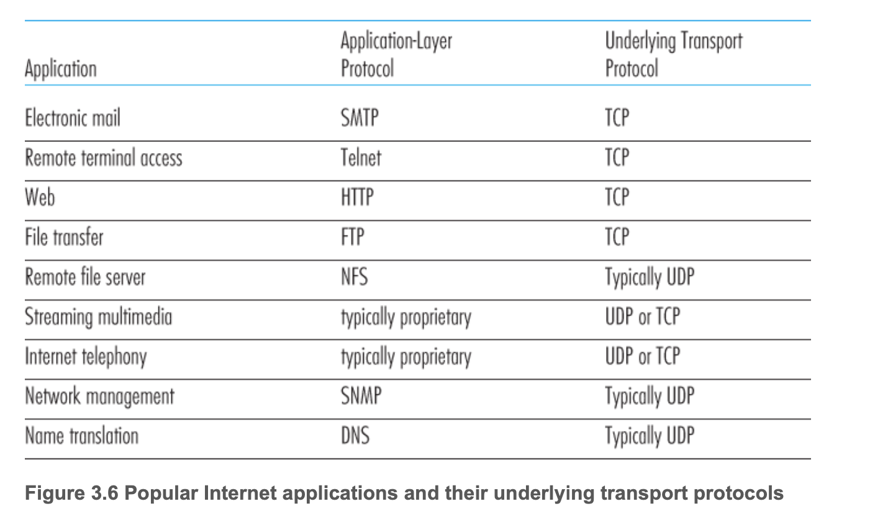

- TCP 예시
  - 전자메일, 원격 터미널 접속, 웹, TCP상의 파일 전송 등은 TCP에서 동작
  - 이들은 모두 신뢰적인 데이터 전송 서비스를 필요로 함
- UDP 예시
  - 네트워크 관리 데이터를 전달하는 데에 사용됨
  - 네트워크 관리 애플리케이션은 네트워크가 혼잡한 상태에 있을 때 자주 동작해야하므로, TCP에서는 수행되기 어려움
  - DNS는 TCP의 연결 설정 지연을 피하기 위해서 UDP에서 동작
- UDP와 TCP를 모두 사용하는 경우
  - 인터넷 전화, 실시간 비디오 회의, 저장된 오디오와 비디이오의 스트리밍 같은 *멀티미티어 애플리케이션*
  - 적은 양의 패킷 손실은 허용됨
  - 인터넷 전화와 화상회의 같은 실시간 애플리케이션은 TCP 혼잡제어가 나쁜 영향을 미침
  - 패킷 손실률이 낮고, 보안적인 이유로 UDP 트래픽을 막는 일부 조직(8장 참조)에서 TCP는 점점 더 스트리밍 매체 전송에 매력적인 프로토콜이 되고 있음

> 🔍 애플리케이션이 **신뢰성을 애플리케이션 자체에서 제공하는 경우**, UDP를 사용할 떄에도 신뢰적인 데이터 전송 가능  
> - 확인응답 매커니즘, 재전송 매커니즘 등의 추가를 통해 제공 가능
> - 그러나 구현하기 어렵고, 굳이 TCP 있는데, UDP 써서 애플리케이션 계층에서 신뢰성 보장할 이유가 없음

---

### 3.3.1 UDP 세그먼트 구조

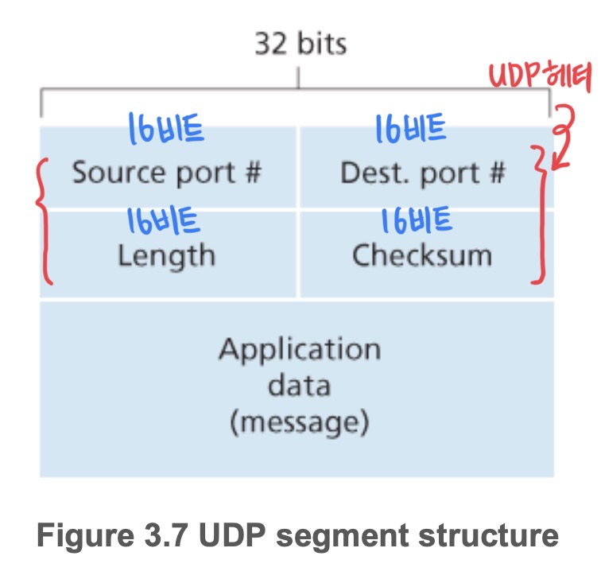

- 애플리케이션 데이터는 UDP 데이터그램의 데이터 필드에 위치
- UDP 헤더는 2바이트(16비트)씩 구성된 4개의 필드를 가짐
- UDP 헤더의 구성
  - 2개의 포트번호
    - **출발지 포트번호**
    - **목적지 포트번호**
    - 포트번호는 (목적지) 호스트가 (역다중화 기능을 수행하는) 정확한 프로세스에게 애플리케이션 데이터를 넘기게 하기 위함
  - **체크섬(checksum)**
    - 세그먼트에 오류가 발생했는지를 검사하기 위함
    - 사실, 체크섬은 UDP 세그먼트 이외에 IP 헤더의 일부 필드도 계산함(가상헤더)
    - UDP 헤더와 데이터를 모두 포함하여 체크
  - **길이**
    - 헤더를 포함하는 UDP 세그먼트의 길이(바이트 단위)를 나타냄
    - UDP헤더와 데이터를 합친 길이

---

### 3.3.2 UDP 체크섬

- UDP 체크섬은 오류 검출을 제공
- **체크섬(Checksum)**: 패킷에 오류가 발생했는지 판별
  - 세그먼트가 출발지로부터 목적지로 이동했을 때, UDP 세그먼트 안의 비트에 대한 변경사항이 있는지 검사하는 것
- 체크섬 생성 방법
  - 송신 측에서 UDP는 세그먼트 안에 있는 모든 데이터를 **16비트 워드 단위로 더하고**,
  - 이에 대하여 다시 **1의 보수**를 수행
  - 덧셈 과정에서 발생하는 오버플로는 `윤회식 자리올림 (wrap around)` 사용
    - **윤회식 자리올림**: 계산 시에 생긴 오버플로우를 최하위 비트에 더해줌  
      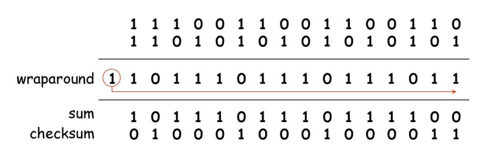  
      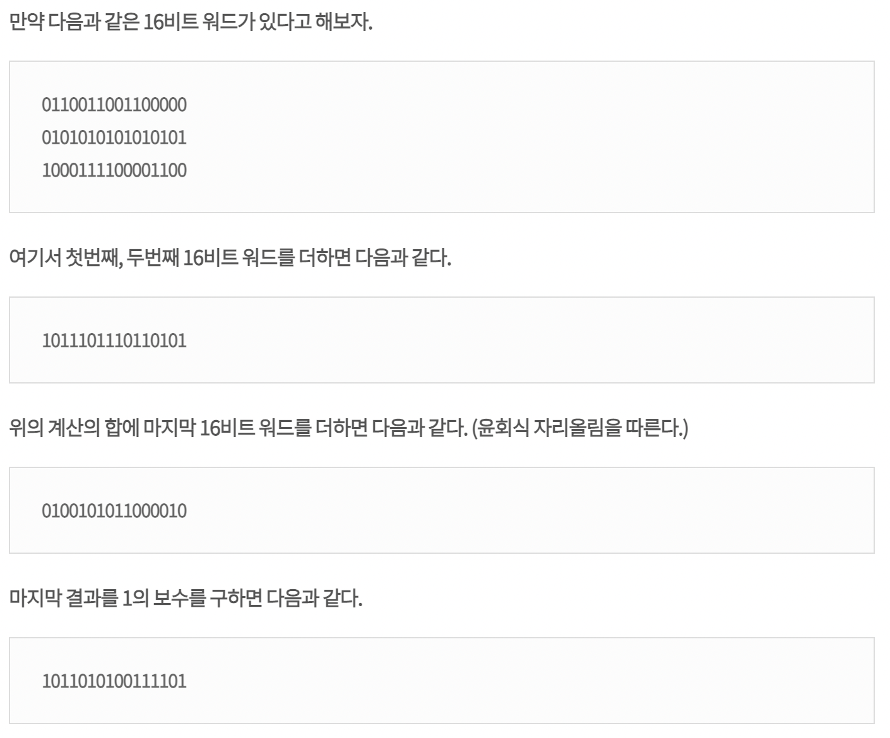  
- 체크섬 확인 방법
  - 수신측에서는 **세그먼트 안의 모든 16비트 워드와 체크섬을 함께 더함**
  - 더한 값이 `1111111111111111`이 아니라면(0이 하나라도 포함되었다면), 패킷에 오류가 발생했음을 알 수 있음
- 예시
  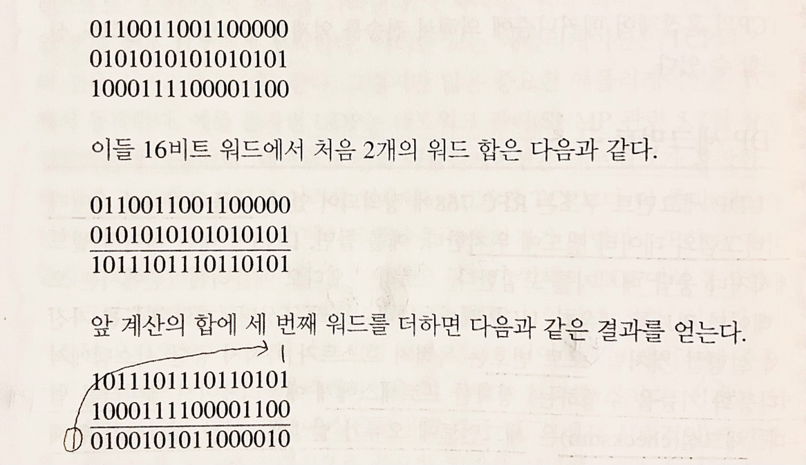
  - 마지막 합은 오버플로(자리넘침)가 있고, 이를 윤회식 자리올림을 하였음에 유의
  - 1의 보수는 모든 0을 1로 변환, 모든 1을 0으로 변환
    - 위의 덧셈 결과 `0100101011000010`의 체크섬은 `1011010100111101`(1의 보수까지 한 결과)
  - 수신자에서는 체크섬을 포함한 4개의 모든 16비트 워드들을 더해봄
  - 만약 패킷에 어떤 오류도 있지 않다면, 수신자에서 합은 `1111111111111111`이 될 것
  - 비트 중에서 하나라도 0이 있다면 패킷에 오류가 발생했음을 알 수 있음  

> 모든 비트를 더한 것의 1의 보수가 체크섬  
> 오류 확인시, 모든 비트를 더한 것과 체크섬을 더하면 `1111111111111111`이 나와야 정상!

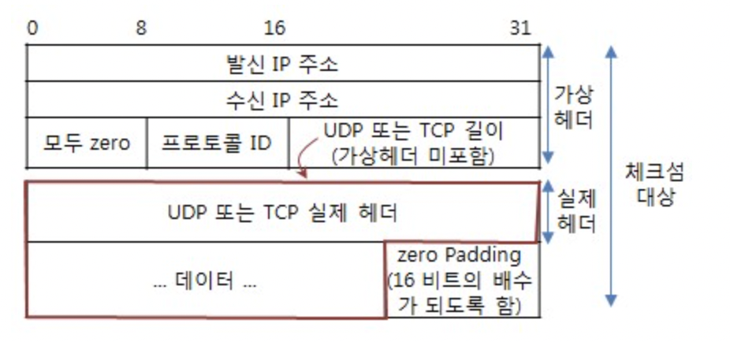

- UDP 체크섬 계산 대상 : (가상 헤더 + 실제 헤더 + 데이터 + Padding)
  - 가상 헤더 : 출발지 IP 주소, (zero), 수신 IP 주소, 프로토콜 ID, 길이
  - IP 프로토콜에서는 3계층 헤더만 체크섬을 계산하지만 ❓, UDP에서는 데이터까지 체크섬을 계산
  - ✔️ UDP의 체크섬 기능은 optional
    - 필드 값이 0이면 송신자가 체크섬 계산을 하지 않았다는 의미
    - → 수신 프로세스에서는 체크섬으로 오류검출 기능을 수행하지 않음
    - (TCP는 헤더는 체크섬 필수)

- **UDP 헤더 체크섬에서 가상 헤더를 포함하여 체크섬을 계산하는 이유?**
  - 목적지가 **어떤 수신 호스트** 내의 어떤 포트이냐를 함께 고려해야 하므로, TCP 또는 UDP 실제 헤더 이외에, 그 앞의 **IP 헤더 부분**까지도 포함시키게 됨
  - IP는 UDP 세그먼트에 존재하지 않으나, IP도 체크섬이 필요(IP는 가상헤더 안에 들어있음)
  - 수신측은, 수신된 IP 헤더로부터 가상 헤더에 필요한 필드들을 추출하여, 이들을 합친 전체 패킷에 대해 체크섬 계산을 하게 됨

- **링크 계층 프로토콜이 오류 검사를 제공하는데, 왜 UDP가 체크섬을 제공하는가?**
  - <u>출발지와 목적지 사이의 **모든 링크가** 오류 검사를 제공한다는 보장이 없기 떄문</u>
  - 즉, 링크 중에서 하나가 오류 검사를 제공하지 않는 프로토톨을 사용할 수도 있다는 것
  - 그러므로, 세그먼트들이 정확하게 링크를 통해 전송되었을지라도, **세그먼트가 라우터의 메모리에 저장될 때 비트 오류가 들어오는 것이 가능함**
  - 주어진 링크 간의 신뢰성과 메모리의 오류 검사가 보장되지 않기 때문에, 종단간의 데이터 전송 서비스가 오류 검사를 제공해야한다면, UDP는 종단 간의 트랜스포트 계층에서 오류검사를 해야함
  - → 종단간의 원리


  > 🔍 **종단간의 원리**(end-end principle) ❓  
  > - 어떤 기능이 종단 기반으로 구현해야 하므로, 하위 레벨에 위치한 기능들은 상위 레벨에서 이들을 제공하는 비용을 비교했을 때, 중복되거나 거의 유용하지 않을 수 있음  
  > - ex) IP는 어떤 2 계층 프로토콜에서도 동작해야하므로, 트랜스포트 계층은 안전장치로써 오류 검사를 제공 (→ 중복)  
  > - 인터넷에서, 우리가 원하는 호스트에 연결하기 위해서는 그 과정에 있는 라우터들을 거쳐야함  
  > - 여러 라우터를 거치며, 정확성(correctness)를 필요로 함  
  > - 목적지에 보내고자하는 메세지는 라우터를 거치는 동안에도 계속 유지가 되어야함  
  > - 또한 규약이 있어야함 이런 것들을 모두 포괄적으로 담은 것이 end-to-end principle  
  > → 목적: file이 무사히 전달되는 것  

- **오류 발생 시**
  - UDP는 오류 검사 기능을 제공하지만, 오류를 회복하기 위한 어떤 일도 하지 않음
    - 일부 UDP 구현에서는 손상된 세그먼트를 그냥 버리고, 다른 구현에서는 경고와 함께 손상된 세그먼트를 애플리케이션에게 넘겨주기도 함

---

