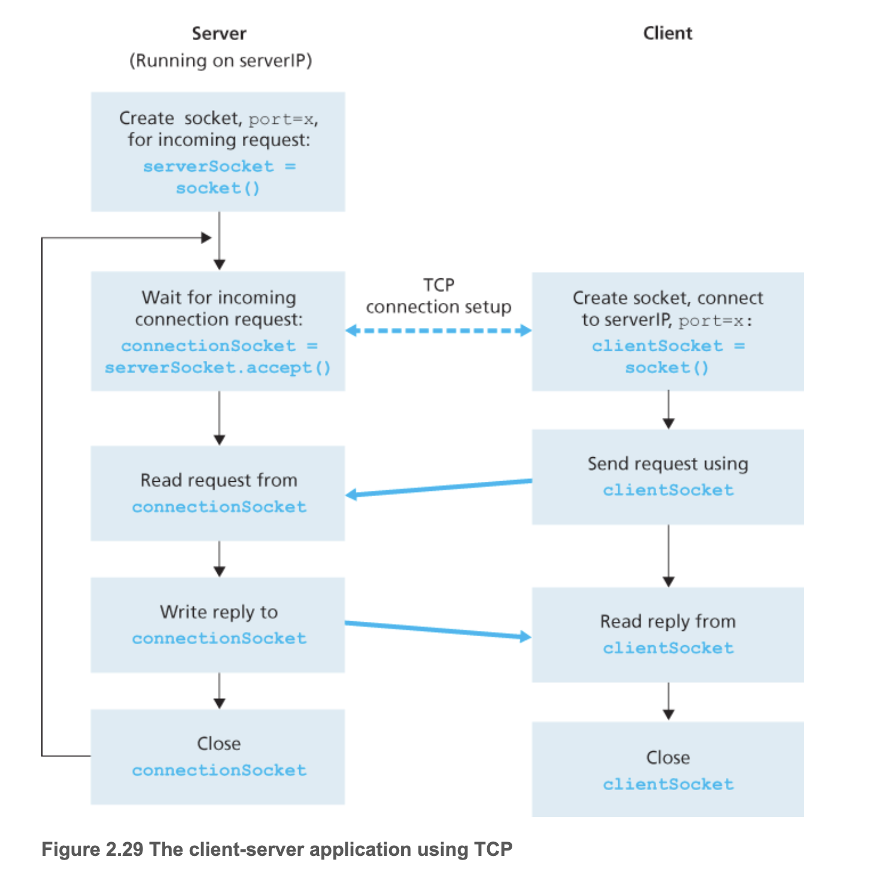

# CH.03 트랜스포트 계층

## 3.1 트랜스포트 계층 서비스 및 개요

- 트랜스포트 계층 프로토콜은 서로 다른 호스트에서 동작하는 애플리케이션 **프로세스들 간의** 논리적 통신을 제공
- ✏️ `논리적통신`(Logical communication)?
  - 애플리케이션의 관점에서 보면, (프로세스들이 동작하는) 호스트들이 직접 연결된 것처럼 보인다는 것을 의미
  - 역할: 호스트가, 하위 물리적 계층를 신경쓰지 않고 메시지를 송신하기 위해서
    > 실제로 호스트는 *수많은 라우터와 다양한 형태의 링크*를 통해 연결되어 지구상의 서로 다른 지역에 있을 수 있음
    애플리케이션 프로세스는 *메시지 운반에 사용되는 물리적인 하위 구조*의 세부사항에 상관없이 서로 메시지를 송신하기 위해서 트랜스포트 계층에서 제공하는 논리적 통신을 사용

    > 🔍 하위 계층은 트랜스포트 계층의 관심 범위가 아니다. 자세한 설명은 3.1.1에서 예시를 통해 확인!

- 송신하는 경우
  - `메시지`(애플리케이션 계층) → `세그먼트`(트랜스포트 계층, L4) → **변환과정** → `데이터그램`(네트워크 계층, L3)
  - 변환과정
    1. 메세지를 작은 여러개의 조각으로 분할
    2. 각각의 조각에 트랜포트 계층 헤더를 추가

  > - 송신 측의 트랜스포트 계층은 송신 애플리케이션 프로세스로부터 수신한 메시지를, 트랜스포트 계층 세그먼트(segment)인 트랜스포트 계층 패킷으로 변환  
  > - 변환은, 애플리케이션 메시지를 트랜스포트 계층 세그먼트로 만들기 위해 작은 조각으로 분할하고, 각각의 조각에 트랜스포트 계층 헤더를 추가함으로써 수행됨  
  > - 이후, 트랜스포트 계층은 송신 종단시스템에 있는 네트워크 계층으로 세그먼트를 전달하고, 여기서 세그먼트가 네트워크계층 패킷(데이터그램) 안에 **캡슐화되어 목적지로 전달**됨  

- 수신하는 경우
  - 송신 과정의 반대 순서로 처리
  - 수신측에서 네트워크 계층은 데이터그램으로부터 트랜스포트 계층 세그먼트를 추출하고 트랜스포트 계층으로 세그먼트를 보냄
  - 이후에 트랜스포트 계층은 수신 애플리케이션에서 세그먼트 내부의 데이터를 이용할 수 있도록 수신된 세그먼트를 처리

- 트랜스포트 계층 프로토콜은 네트워크 라우터가 아닌 종단시스템(=호스트)에서 구현됨
- 네트워크 라우터는 오로지 데이터그램의 네트워크 계층 필드에 대해 동작
  - = 라우터는 (데이터그램과 함께 캡슐화 된) 트랜스포트 계층 세그먼트의 필드를 검사하지 않음
  - 중간 라우터는 트랜스포트 계층이 애플리케이션 메시지에 추가한 어떤 정보도 인식하지 못하며, 그 정보에 영향을 주지도 않음
- 네트워크 애플리케이션에는 하나 이상의 트랜스포트 계층 프로토콜이 사용 가능 ❓
  - 네트워크 애플리케이션: 각자 다른 end system에서 동작하고 네트워크를 통해 서로 통신하는 프로그램
  - 예를들어 인터넷은 TCP와 UDP라는 두 가지 프로토콜을 가지고 있음
  - 이러한 프로토콜 서비스를 요청하는 애플리케이션에게 트랜스포트 계층에서 서로 다른 서비스 집합을 제공

---

### 3.1.1 트랜스포트 계층과 네트워크 계층 사이의 관계

- 트랜스포트 계층은 네트워크 계층 바로 상위에 존재
- `트랜스포트 계층 프로토콜`: 서로 다른 호스트에서 동작하는 **프로세스들 사이**의 논리적 통신을 제공
- `네트워크 계층 프로토콜`: **호스트들 사이**의 논리적 통신을 제공
- 예시: 우편배달
  - 동부, 서부에 각각 집이 있음
  - 두 집안에는 아이들이 사는데, 이 아이들끼리 서로 편지쓰기를 좋아함
  - 서부에는 앤, 동부에는 빌 이라는 집사가 있음
  - 앤과 빌의 역할: 아이들의 편지를 모아서 집배원에게 전달하는 역할과 집배원이 가져다 준 편지를 아이들에게 나눠주는 것
  - 동부와 서부 사이에 편지를 전달하는 일은 집배원이 담당
  - 다음과 같이 매칭될 수 있음
    - 애플리케이션 메시지 = 봉투 안의 편지
    - 프로세스 = 아이들
    - 호스트(종단 시스템) = 집
    - 트랜스포트 계층 프로토콜 = 앤, 빌
    - 네트워크 계층 프로토콜 = 집배원(우편서비스)
    - 
  - 트랜스포트 프로토콜(앤, 빌)은 `애플리케이션 프로세스 ~ 네트워크 경계` 간 메시지를 운반
  - 서부와 동부에 각각 수잔과 하비라는 집사가 추가로 고용되었다고 해보자,
    - 앤과 빌은 편지를 우편물을 정확히 전달할 수 있으나, 수잔과 하비는 우편물을 제대로 전달하지 못할 수 있음 (최선을 다하지만 우편물을 종종 잃어버리기도 함)
    - 앤과 빌은 TCP, 수잔과 하비는 UDP
    - 컴퓨터 네트워크는 (애플리케이션에게 서로 다른 서비스를 제공하도록 하는 개별 프로토콜을 갖는) 다양한 트랜스포트 프로토콜을 만들 수 있게 함
  - 우편 서비스가, 두 집 사이에서 우편물이 배달되는 데 소요되는 최대기간을 보장하지 않는다면?
    - 트랜스포트 계층이 제공할 수 있는 서비스는 하위 네트워크 계층 프로토콜의 서비스 모델에 의해서 제약받음
      - 하위 계층이 지연보장, 대역폭 보장이 불가능하다면, 트랜스포트 계층 프로토콜은, 프로세스끼리 전송하는 메시지에 대한 지연보장, 대역폭 보장 등을 제공 불가
      - 하위 네트워크 프로토콜이 상응하는 서비스를 제공하지 못할 때에도(하위 네트워크 프로토콜이 비신뢰적일 때), 특정 서비스는 트랜스포트 프로토콜에 의해서 제공될 수 있음

---

### 3.1.2 인터넷 트랜스포트 계층의 개요

TCP/IP 네트워크는 애플리케이션 계층에게 두 가지 구별되는 트랜스포트 계층 프로토콜들을 제공

- UDP(User Datagram Protocal): (애플리케이션에게) 비신뢰적이고 비연결형인 서비스를 제공
- TCP(Transmission Control Protocol): (애플리케이션에게) 신뢰적이고 연결지향형 서비스를 제공

> - 애플리케이션 개발자는 이 두가지 트랜스포트 프로토콜 중의 하나를 명시해야함  
> - 소켓을 생성할 때, TCP와 UDP 중 하나를 선택해야 함

> TCP 패킷 → 세그먼트  
> UDP 패킷 → 데이터그램  
> 위처럼 표현하기도 하지만 네트워크 계층의 데이터그램과 혼동될 수 있으므로, 여기서는 세그먼트라는 용어로 통일하여 사용

#### IP 서비스 모델 → 네트워크 계층에 대한 간략한 설명

- 트랜스포트 계층의 바로 아래 하위 계층
- 네트워크 계층 프로토콜: 인터넷 프로토콜(IP)
- IP 서비스 모델은 호스트 들 간에 논리적 통신을 제공하는 최선형 전달 서비스
- **최선형 전달 서비스** (best-effort delivery service)
  - 통신하는 호스트들 간에 세그먼트를 전달하기 위해서 최대한 노력하지만, 어떤 보장도 하지 않음
  - 세그먼트의 전송, 순서, 내부 데이터의 데이터 무결성(integrity, 오류검출) 등을 보장하지 않음
  - 따라서 **IP는 비신뢰적 서비스**(unreliable service)
- 각 호스트가 적어도 하나의 IP 주소를 가지고 있음

#### TCP, UDP의 서비스 모델 → 트랜스포트 계층에 대한 간략한 설명

- UDP, TCP의 가장 기본적인 기능
  1. 트랜스포트 다중화(transport multiplexing), 역다중화(demultiplexing)
     - 종단 시스템 사이의 IP 전달 서비스를 종단 시스템에서 동작하는 두 프로세스 간의 전달 서비스로 확장
     - "호스트 대 호스트 전달"을 "프로세스 대 프로세스 전달"로 확장
  2. 무결성 검사(오류검출)
     - 헤더에 오류 검출 필드를 포함
- UDP
  - 가장 기본적인 기능 두 가지 서비스만 제공
    1. 프로세스 대 프로세스 데이터 전달
    2. 오류 검출
  - 비신뢰적인 서비스
    - 프로세스에 의해서 전송된 데이터가 손상되지 않고, 목적지에 도착한다는 것을 보장하지 않음
- TCP
  - 신뢰적인 데이터 전달(reliable data transfer)
    - 흐름제어, 순서번호, 확인응답, 타이머등의 기술을 사용
    - 위의 기술을 사용함으로써, 프로세스에게 데이터가 순서대로 정확하게 전달되도록 확실히 함
  - 종단 시스템 간에 IP의 비신뢰적 서비스를 프로세스 사이의 신뢰적인 데이터 전송 서비스로 만듦
  - 혼잡제어(congestion control) 사용
    - → 보내는 쪽의 트래픽을 조절하여, 스위치/링크의 혼잡을 방지
    - TCP 연결이 과도한 양의 트래픽으로 모든 통신하는 호스트들 사이의 스위치와 링크를 폭주되게 하는 것을 방지
    - 특정 애플리케이션이 제공하는 특정 서비스가 아니라, 전체를 위한 서비스

    > - 혼잡한 네트워크 링크에서 각 TCP 연결이 링크의 대역폭을 공평하게 공유하여 통과하도록 해줌  
    > - 송신(보내는 쪽) 측의 TCP가 네트워크에 보낼 수 있는 트래픽을 조절함으로써 수행됨  

---

## 3.2 다중화와 역다중화

- 다중화/역다중화의 역할
  - `호스트 대 호스트 전달 서비스`를 `프로세스 대 프로세스 전달 서비스`로 확장
- 다중화/역다중화는 모든 컴퓨터 네트워크에서 필요
- 트랜스포트 계층의 의무
  - 호스트에서 동작하는 해당 애플리케이션 프로세스에게, 수신된 세그먼트의 데이터를 전달해야함
  - = 여러 세션(ex. FTP, Telnet, HTTP, ...)이 있을 때, 하위의 네트워크 계층으로부터 수신된 데이터를
      여러개의 프로세스 중 하나에게 전달해야함
    - 웹페이지를 다운로드 하는 것은 HTTP 프로세스를 가진다고 할 수 있음
- **소켓**
  - 프로세스는 소켓을 가짐
  - 소켓을 통해 네트워크에서 프로세스로 데이터를 전달
  - 프로세스로부터 네트워크로 데이터를 전달하는 출입구 역할
  - → 수신 측 호스트의 *트랜스포트 계층은 실제로 데이터를 직접 프로세스로 전달하지 않고*, 대신 **중간 매개자인 소켓에게 전달**
  - 호스트에는 하나 이상의 소켓이 존재할 수 있으므로 소켓은 **고유한 식별자를 가짐**
  - 식별자의 포맷은 UDP/TCP 소켓인지에 따라 달라짐
- *어떻게 수신 측 호스트가 수신한 `트랜스포트 계층 세그먼트`를 적절한 `소켓`으로 향하게 하는가?*
  - 트랜스포트 계층 세그먼트는 필드 집합을 가지고 있음
  - 수신 소켓을 식별하기 위해서 필드 집합을 검사
  - 역다중화/다중화 사용
- **역다중화(Demultiplexing)**
  - 트랜스포트 계층 세그먼트의 데이터를 올바른 소켓으로 전달
  - 하위 계층으로부터 수신한 세그먼트를 위쪽의 프로세스로 반드시 역다중화 해야함
- **다중화(Multiplexing)**
  - 소켓으로부터 데이터를 모으고
  - 이에 대한 세그먼트를 생성하기 위해서 각 데이터에 헤더정보로 캡슐화하고
  - 그 세그먼트들을 네트워크 계층으로 전달

> 트랜스포트 프로토콜의 내용과 관련해서 다중화와 역다중화를 설명했지만, 한 프로토콜이 그 상위 계층의 여러 프로토콜에 의해 사용될 때마다 관련되어 있음

> - 다중화(Multiplexing): 두 개 이상의 저수준의 채널들을 하나의 고수준의 채널로 통합하는 과정  
> - 역다중화(Demultiplexing) 과정을 통해 원래의 채널 정보들을 추출 가능

- 트랜스포트 계층 다중화의 요구사항
  1. **소켓은 유일한 식별자를 가짐**
  2. **각 세그먼트는 세그먼트가 전달될 적절한 소켓을 가리키는 *특별한 필드*를 가짐**
  - 특별한 필드?
    - **출발지 포트 번호 필드**(source port number field)
    - **도착지 포트 번호 필드**(destination port number field)
  - UDP와 TCP 세그먼트는 다른 필드들도 가지고 있음
  - 각 포트번호는 0~65535까지 16비트 정수
  - 0~1023까지의 포트번호는 **잘 알려진 포트 번호** → 사용을 엄격하게 제한
    - ex) HTTP(포트번호 80), FTP(포트번호 21)...
    - 잘 알려진 애플리케이션 프로토콜에서 사용되도록 예약되어 있음
  - 새 어플리케이션 개발할 때, 애플리케이션에 포트 번호를 반드시 할당해야함
  
- 역다중화 절차 요약(UDP의 기본적인 동작방식)
  - 호스트의 각 소켓은 포트 번호를 할당 받음
  - 세그먼트가 호스트에 도착하면, 트랜스포트 계층은 세그먼트 안의 목적지 포트번호를 검사하고, 상응하는 소켓으로 세그먼트를 보냄
  - 세그먼트 데이터는 소켓을 통해 해당되는 프로세스로 전달됨

---

### 비연결형 다중화와 역다중화

- UDP 소켓 생성: `clientSocket = socket(AF_INET, SOCK_DGRAM)`
  - 트랜스포트 계층은 포트번호를 소켓에게 자동으로 할당
  - 특히, 현재 호스트에서 UDP 포트로 사용하지 않는 1024~65535 사이의 포트 번호를 할당함
- 특정 포트 번호를 UDP 소켓에 할당: `clientSocket.bind((’’, 19157))`

> 만약 개발자가 잘 알려진 프로토콜의 서버 측을 구현하고 있다면, 개발자는 상응하는 잘 알려진 포트번호를 할당해야만 함  
> 일반적으로 애플리케이션의 **서버 측이 특정 포트 번호를 할당**하는 것에 반하여,  
> 애플리케이션의 **클라이언트 측은 트랜스포트 계층이 포트번를 자동으로 할당**

- UDP 소켓은 **목적지 IP 주소**와 **목적지 포트 번호**로 구성된 튜플에 의해서 식별됨
- 따라서 **출발 주소가 다를지라도**, 동일한 목적지 IP 주소와 포트번호를 가진다면, 세그먼트들은 **같은 목적지 소켓을 통해** 동일한 프로세스로 전달됨
- 출발지 포트번호의 역할?
  - A에서 B로 가는 세그먼트에서 출발지 포트 번호는 **복귀주소**의 역할
  - B가 세그먼트를 다시 A로 보내기 원할 때 사용
  - 서버가 클라이언트로부터 수신한 세그먼트로부터 클라이언트 측(출발지) 포트 번호를 추출하기 위해 `recvfrom()` 함수를 사용 (2.7절)

---

### 연결지향형 다중화와 역다중화

- TCP 역다중화를 위해서 살펴볼 내용
  - TCP 소켓
  - TCP 연결설정
- `TCP 소켓` vs. `UDP 소켓`
  - UDP 소켓: 2개의 다른 요소들의 집합에 의해 식별
    - (목적지 IP, 목적지 포트번호)
    - 다른 출발지 주소를 가지는 세그먼트라도, 목적지만 같으면 같은 소켓을 통해 프로세스에 전달됨
  - TCP 소켓: 4개의 다른 요소들의 집합에 의해 식별
    - (출발지 IP, 출발지 포트번호, 목적지 IP, 목적지 포트번호)
    - 다른 출발지 주소를 가지는 세그먼트는, 다른 소켓을 통해서 프로세스에 전달됨
  - UDP와 다르게, **TCP 세그먼트는 출발지 주소가 다르면, 다른 소켓으로 전달됨**

#### 2.7.2절 TCP 클라이언트/서버 Remind

- TCP 서버 애플리케이션은 소켓 하나를 가지고 있음
  - 포트번호 12000을 가진 TCP 클라이언트로부터 연결 설정 요청을 기다림
- TCP 클라이언트는 다음과 같은 명령을 통해 **소켓을 생성**하고 **연결 설정 요구 세그먼트를 보냄**
  - `clientSocket = socket(AF_INET, SOCK_STREAM)`
  - `clientSocket.connect((serverName,12000))`
- 연결 설정 요청은 목적지 포트번호 12000과 TCP 헤더에 설정된 특별한 연결 설정 비트(3.5절)를 가진 TCP 세그먼트일 뿐!
  - 또한, 그 세그먼트는 (클라이언트에 의해 선택된)출발지 포트 번호를 포함
- 서버 프로세스로 동작하는 컴퓨터의 호스트 OS가 목적지 포트 12000을 포함하는 연결요청을 세그먼트가 수신하면, 포트번호 12000상에서 연결을 기다리고 있는 서버 프로세스를 찾아서, (그 서버는) 새로운 소켓을 생성
  - → 요약) 서버에서 12000 포트로 연결요청(세그먼트) 들어오기를 기다리다가, 연결요청 들어오면 새로운 소켓을 생성!
  - `connectionSocket, addr = serverSocket.accept()`
- 서버는 연결요청 세그먼트의 다음과 같은 4가지 값을 주목
  1. 세그먼트 안의 출발지 포트번호
  2. 출발지 호스트의 IP 주소
  3. 세그먼트 안의 목적지 포트번호
  4. 목적지 IP 주소
  - 새롭게 생성된 연결 소켓은 이 4가지 값에 의해서 식별됨
  - 그 다음에 도착하는 모든 세그먼트의 위 4가지 값들이 앞서 받은 연결요청 세그먼트의 4가지 값과 일치하면, 세그먼트는 이 소켓으로 역다중화(세그먼트→소켓) 됨

##### 정리

- 서버 호스트는 동시에 존재하는 많은 TCP 소켓을 지원할 수 있음
- 이 각각의 소켓은 프로세스에 접속되어있음
- 이들 소켓은 4개의 요소들의 집합(four-tuple)에 의해서 식별됨
  - 4가지 필드: (출발지 IP, 출발지 포트번호, 목적지 IP, 목적지 포트번호)
- 이 4가지 필드는 해당되는 소켓으로 세그먼트를 전달(역다중화)하기 위해서 사용

> 호스트 C가 서버 B로 2개의 *HTTP 세션을 시작*하고, 호스트 A가 호스트 B로 하나의 HTTP 세션을 시작하는 상황이 설명되어 있음.  
> 호스트 A와 호스트 C, 그리고 서버 B는 각자 유일한 IP 주소인 A, C, B를 각각 가지고 있음.  
> 호스트 C는 2개의 다른 *출발지 포트 번호(26145와 7532)를 자신의 HTTP(포트번호 80) 연결에 할당*함.  
> 호스트 A는 C와 독립적인 출발지 포트 번호를 선택하므로, 이것 또한 HTTP 연결에 출발지 포트로 26145를 할당할 수도 있음.  
> 그렇게 하더라도, 2개의 연결은 다른 출발지 IP 주소를 가지므로, 서버 B는 동일한 출발지 포트 번호를 가진 두 연결을 여전히 올바르게 역다중화 가능  

- 요약하자면, 서로 다른 IP(출발지)를 가지면, 같은 출발지 포트번호를 가질 수 있음
- 클라이언트의 프로세스(포트번호 26145)와 서버의 HTTP 프로세스(포트번호 80)을 연결
- 같은 도착지 포트번호(80)을 가지고 있으나, 모두 다른 HTTP 프로세스로 전달되는 것을 볼 수 있음(4가지 요소를 전부 고려하기 때문)

---

- 세션(session)
  - 클라이언트가 연결을 종료하여, 서버와의 연결을 끝내는 시점까지를 세션이라함
  - 논리적인 단위. 물리적으로는 연결이 끊어져있을 수도 있음.
- HTTP 세션
  - 클라이이언트가 웹서버에 연결된 순간부터 웹 브라우저를 닫아 서버와의 HTTP 통신을 끝낼 때 까지의 기간
- 소켓 vs. 포트
  - 포트(Port): 네트워크를 통해 데이터를 주고받는 프로세스를 식별하기 위해 호스트 내부적으로 **프로세스가 할당받는 고유한 값**
    - 같은 호스트 내에서 서로 다른 프로세스가 같은 포트 넘버를 가질 수 없음
    - 논리적인 접속장소
  - 소켓(Socket): 프로세스가 네트워크를 통해서 데이터를 주고받으려면 반드시 열어야 하는 창구 같은 것
  - 소켓과 포트는 다름!
    - 왜냐하면 같은 프로세스가 같은 포트를 가지고도 여러 개의 소켓을 열 수 있기 때문
    - 흥미롭게도 하나의 프로세스는 같은 프로토콜, 같은 IP 주소, 같은 포트 넘버를 가지는 수십 혹은 수만 개의 소켓을 가질 수 있음
    - 소켓을 정의하는 것과 소켓을 식별하는 것을 구분하자. IP 주소, 포트 넘버, 프로토콜로 소켓을 정의할 수 있지만, 이것이 소켓을 유일하게 식별하지는 않음
    - 소켓 통신 vs HTTP 통신?

---

### 웹 서버와 TCP

웹 서버와 이 웹 서버가 어떻게 포트 번호를 사용하는지

- 아파치 웹 서버(Apache Web Server): 포트번호 80 상에서 동작하는 호스트
- 예시
  - 클라이언트(브라우저)가 서버로 세그먼트를 보내면, 모든 세그먼트는 목적지 포트 번호 80을 가지고 있을 것!
  - 특히, 초기 연결 설정 세그먼트들과 HTTP 요청 메시지를 전달하는 모든 세그먼트들은 목적지 포트번호 80을 가질 것!
  - 서버를 각기 다른 클라이언트가 보낸 세그먼트를 출발지 IP 주소와 출발지 포트 번호로 구별함
  - 프로세스는 각자 연결 소켓을 가지며, 이 연결 소켓과 프로세스 사이에 항상 일대일 대응이 이뤄지는 것은 아님
    - 요즘 고성능 웹 서버들은 하나의 프로세스만을 사용
    - 그러면서, 각깍 새로운 클라이언트 연결을 위해, **새로운 연결 소켓**과 함께 **새로운 스레드**를 생성
    - 웹서버에서는 하나의 동일한 프로세스에 첨부된 많은 연결 소켓들(다른 식별자를 가진)이 동시에 존재할 수 있음

