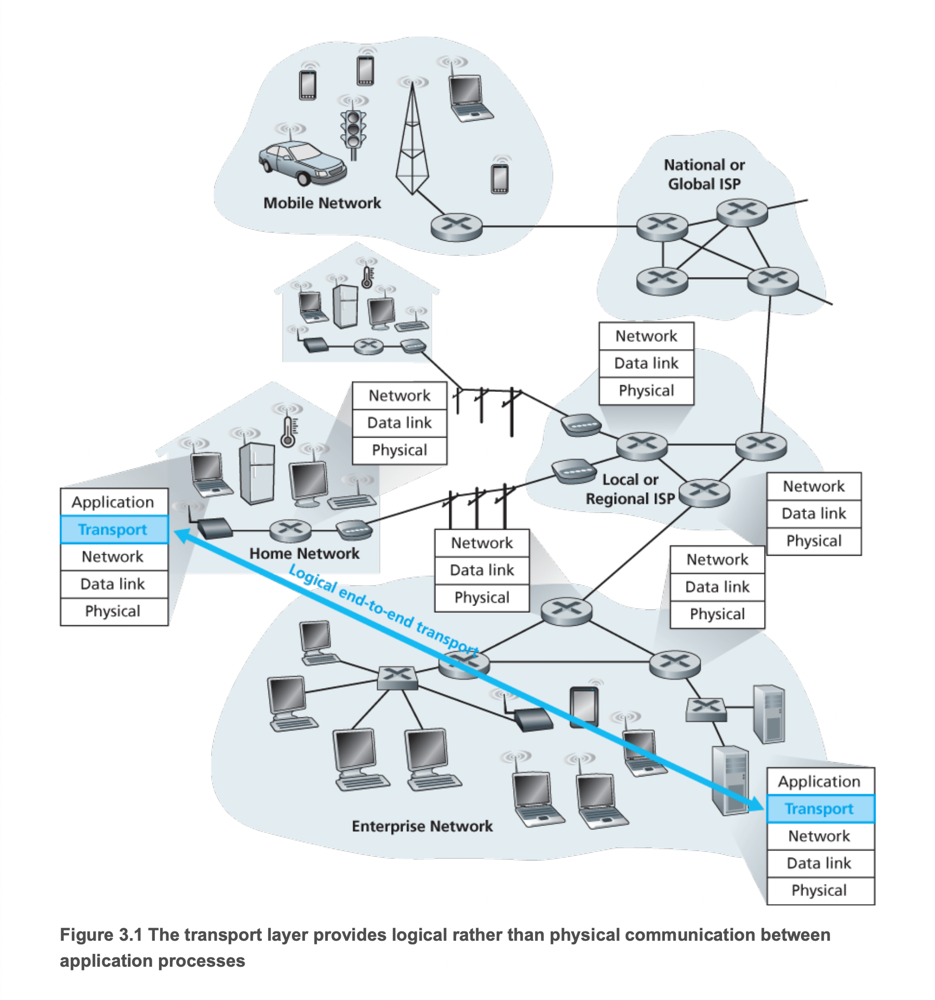
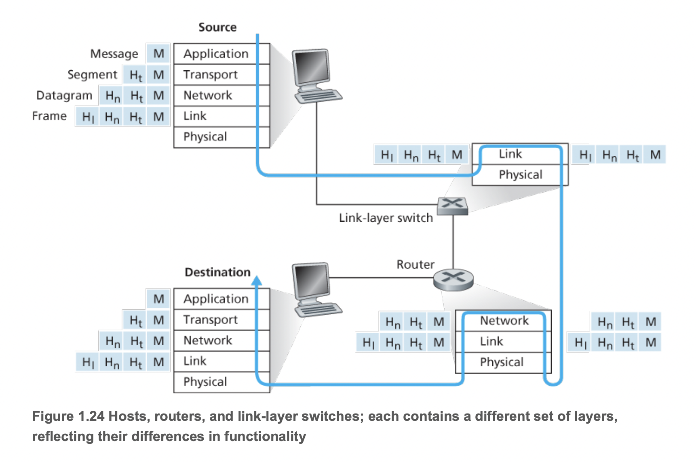

# CH.03 트랜스포트 계층

## 3.1 트랜스포트 계층 서비스 및 개요

- 트랜스포트 계층 프로토콜은 서로 다른 호스트에서 동작하는 애플리케이션 프로세스들 간의 논리적 통신을 제공
- ✏️ 논리적통신(Logical communication)?
  - 애플리케이션의 관점에서 보면, (프로세스들이 동작하는) 호스트들이 직접 연결된 것처럼 보인다는 것을 의미
  - 역할: 호스트가, 하위 물리적 계층를 신경쓰지 않고 메시지를 송신하기 위해서
    > 실제로 호스트는 *수많은 라우터와 다양한 형태의 링크*를 통해 연결되어 지구상의 서로 다른 지역에 있을 수 있음. 애플리케이션 프로세스는 *메시지 운반에 사용되는 물리적인 하위 구조*의 세부사항에 상관없이 서로 메시지를 송신하기 위해서 트랜스포트 계층에서 제공하는 논리적 통신을 사용

- 트랜스포트 계층 프로토콜은 네트워크 라우터가 아닌 종단시스템(=호스트)에서 구현됨
- 송신 측의 트랜스포트 계층은 송신 애플리케이션 프로세스로부터 수신한 메시지를, 트랜스포트 계층 세그먼터(segment)인 트랜스포트 계층 패킷으로 변환
- 변환은, 애플리케이션 메시지를 트랜스포트 계층 세그먼트로 만들기 위해 작은 조각으로 분할하고, 각각의 조각에 트랜스포트 계층 헤더를 추가함으로써 수행된다. 이후, 트랜스포트 계층은 송신 종단시스템에 있는 네트워크 계층으로 세그먼트를 전달하고, 여기서 세그먼트가 네트워크계층 패킷(데이터그램) 안에 캡슐화되어 목적지로 전달된다.
- 네트워크 라우터는 오로지 데이터그램의 네트워크 계층 필드에 대해 동작한다.
  - = 라우터는 데이터그램과 함께 캡슐화된 트랜스포트 계층 세그먼트의 필드를 검사하지 않음
- 수신측에서 네트워크 계층은 데이터그램으로부터 트랜스포트 계층 세그먼트를 추출하고 트랜스포트 계층으로 세그먼트를 보낸다. 이후에 트랜스포트 계층은 수신 애플리케이션에서 세그먼트 내부의 데이터를 이용할 수 있도록 수신된 세그먼트를 처리한다.
- 네트워크 애플리케이션에는 하나 이상의 트랜스포트 예층 프로토콜이 사용 가능
  - 예를들어 인터넷은 TCP와 UDP라는 두 가지 프로토콜을 가지고 있음
  - 이러한 프로토콜 서비스를 요청하는 애플리케이션에게 트랜스포트 계층에서 서로 다른 서비스 집합을 제공

### 3.1.1 트랜스포트 계층과 네트워크 계층 사이의 관계

- 트랜스포트 계층은 네트워크 계층 바로 상위에 존재
- 