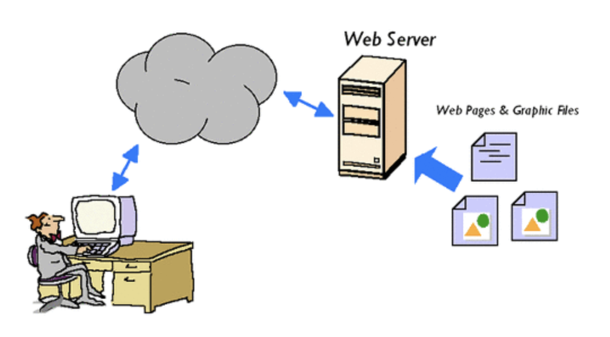
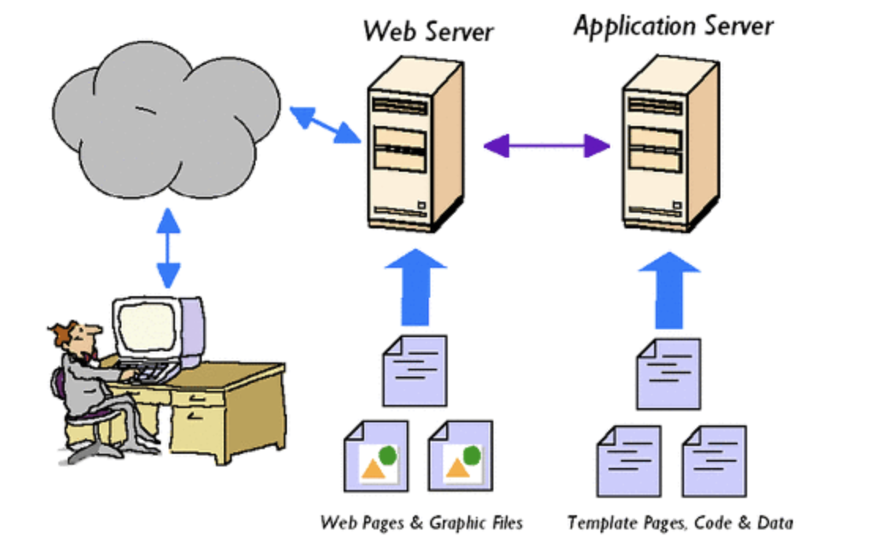

# Web Server VS Web Application Server
### 정적 페이지 (Static Page)
- **데이터베이스에서 정보를 가져오거나 별도의 서버에서의 처리가 없어도**, 사용자들에게 보여줄 수 있는 페이지
- 어떠한 사용자가 오던 간에 동일한 페이지를 보여줌
- 예시: html, css, js, Image 

### 동적 페이지 (Dynamic Page)
- 서버에서 데이터베이스에서 정보를 가져와서 처리하는 것처럼, **어떠한 요청에 의하여 서버가 일을 수행하고 해당 결과가 포함된 파일을 보여주는 페이지**
- 사용자들마다 다른 페이지가 보여질 수 있음

## Web Server

### 역할
- 클라이언트가 요청한 정적인 콘텐츠를 HTTP 프로토콜을 통하여 제공해주는 서버 -> **정적인 콘텐츠 제공**
- 동적인 요청이 클라이언트로부터 들어왔을 때, 해당 요청을 웹서버에서 처리할 수 없기 때문에 **컨테이너(Container)로 보내줌
### 예시
- Nginx, Apache HTTP Server

## 웹 컨테이너 (Web Container)
- 동적인 데이터들을 처리하여 정적인 페이지로 생성해주는 소프트웨어 모듈
> <사용자가 로그인해서 My Page 메뉴에 들어간다 가정>
>
> 해당 메뉴는 각 사용자에 따라 보여질 정보가 다르다. 사용자의 요청이 들어오면 웹 서버는 정적인 요소만 Client로 보낼 수 있고 동적인 요소는 처리할 수 없음.
> -> 컨테이너는 이러한 부분을 대신 처리해서 웹 서버에 정적인 파일로 만들어서 보내준다.

## WAS (Web Application Server)

- DB 조회나 어떤 로직을 처리해야하는 동적인 컨텐츠를 제공하는 서버
- 웹 서버와 컨테이너를 붙여놓은 서버
### 예시
- Tomcat, Jeus, Django
### 과정
1. WAS에서 데이터베이스에서 자신의 정보에 해당하는 데이터를 가져옴
2. 원하는 데이터를 가공하여 myinfo.ejs 파일로 해당 데이터를 보내줌 (.ejs 파일에서는 node.js에서의 변수나 정보를 사용할 수 있게 만들어 놓음)
3. 정보를 넣어야할 곳에 데이터베이스에서 가져온 정보를 넣고, ejs 파일을 html로 바꿔줌
4. html을 웹 서버로 전송 
5. 웹 서버는 위의 html 요소를 클라이언트에 다시 보내줌 

> <WAS는 Web Server+Container인데, Web Server와 WAS를 따로 사용하는 이유>
>
> 이미지나 단순 html 파일과 같은 리소스를 제공하는 서버는 Container 기능이 필요 없고 Web Server를 사용하는 것이 더 빠르고 안정적이기 때문

## Server Side Rendering VS Client Side Rendering
### Server Side Rendering (SSR)
- 페이지를 이동할 때마다 새로운 페이지를 요청
- 모든 템플릿은 서버 연산을 통해 렌더링하고 완성된 페이지 형태(html, view)로 응답
- 예시: WAS

### Client Side Rendering (CSR)
- 클라이언트 측에서 렌더링하는 방식
- 필요한 부분만 리로딩없이 서버로부터 받아서 화면을 갱신 
- 예시: Android, iOS, 브라우저
