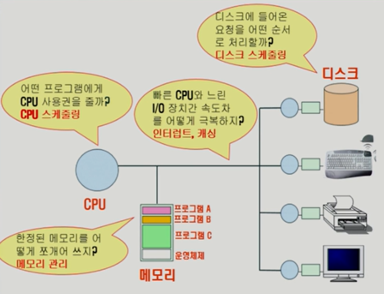
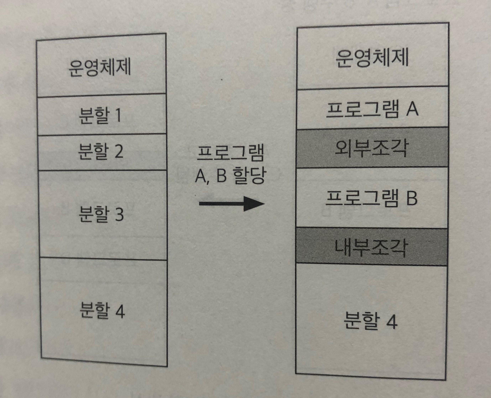
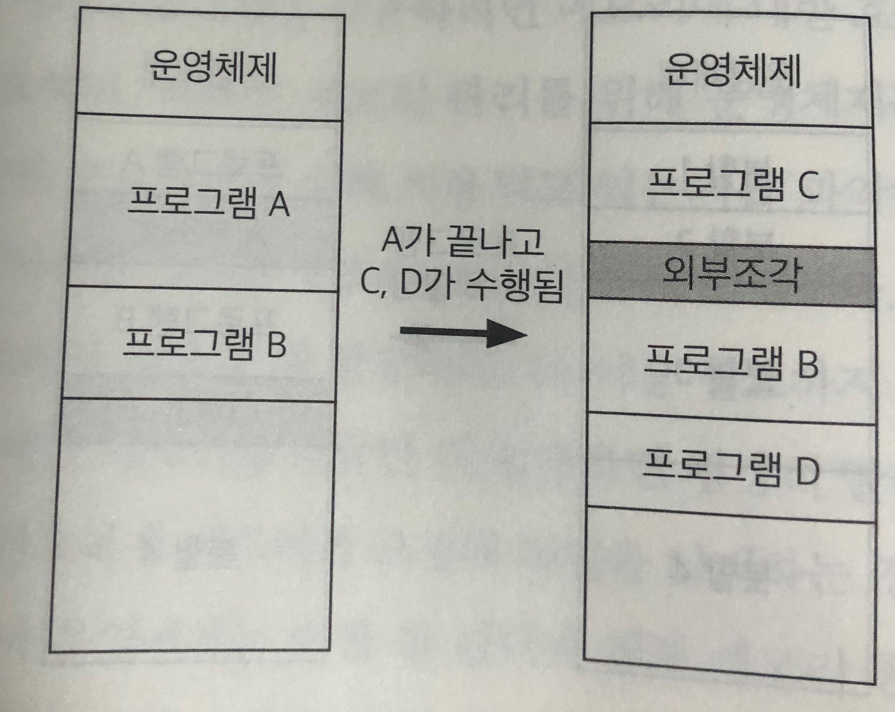

# CH.02 2장 운영체제 개요

## 1. 운영체제의 정의
- 컴퓨터 하드웨어 바로 윗단에 설치되어
사용자 및 다른 모든 소프트웨어와 하드웨어를 연결하는 소프트웨어 계층
- 위상은 아래와 같음.
 
    

> 사용자 입장에서는 하드웨어 자체를 다룬다는 것이 쉽지 않으므로, 하드웨어 위에 기본적으로 운영체제를 탑재해 전원을 켰을 때 손쉽게 사용할 수 있는 상태가 되도록 하는 것

- 다른 응용 SW와는 다르게 하드웨어적인 것을 직접 관리하는 역할을 해주면서
편리한 인터페이스를 제공해야 하기 때문에 굉장히 까다로운 SW

- 소프트웨어가 컴퓨터 시스템에서 실행되기 위해서는 메모리에 그 프로그램이 올라가 있어야 함.
운영체제 자체도 하나의 소프트웨어
즉, 전원이 켜짐과 동시에 메모리에 올라감.

  - but, 운영체제처럼 규모가 큰 프로그램이 모두 메모리에 올라간다면 한정된 메모리 공간의 낭비가 심함
  - 따라서, 필요한 부분만을 메모리에 올려놓고 그렇지 않은 부분은 필요할 때 메모리로 올려서 사용하게 됨
  - 이 때 메모리에 상주하는 운영체제의 부분을 **커널(kernel)** 이라고 부르며
좁은 의미의 운영체제라고도 부름
    - 넓은 의미의 운영체제는 커널뿐 아니라 시스템을 위한 유틸리티들을 광범위하게 포함하는 개념 
    - ex) Ms 윈도우 환경에서 파일을 복사하는 프로그램 등

___
## 2. 운영체제의 기능(목적)
1) 컴퓨터 시스템 내의 **자원*을 효율적으로 관리하는 것** 
- 중요한 핵심기능으로 **자원관리자(resource manager)** 라고 부르기도 함
  > *자원이란?  
  > CPU, 메모리, 하드디스크 등 하드웨어 자원뿐 아니라 소프트웨어 자원까지 통칭해서 부르는 말
  - 주어진 자원으로 최대한의 서능을 내도록 -> 효율성
  - 하지만 전체적인 성능을 향상시키기 위해 일부 프로그램 or 사용자가 불이익이 발생하지 않도록 -> 형평성

"하나의 cpu를 짧은 시간 간격으로 실행중인 프로그램을 번갈아 실행해서 개별 프로그램 입장에서는 cpu를 혼자 독식하고 있는 듯한 환상을 제공"

2) 컴퓨터 시스템을 편리하게 사용할 수 있는 환경*을 제공하는 것
    >*편리한 환경 제공이란?  
    운영체제가 여러 사용자 및 프로그램에게 각각 독자적으로 컴퓨터를 사용하는 것과 같은 **환상(illusion)** 을 제공하는 것
    >>이는 하드웨어를 직접 다루는 복잡한 부분은 운영체제가 대행해주고, 각 사용자 및 프로그램은 그에 대한 자세한 내용을 알지 못해도 프로그램을 실행할 수 있도록 해주는 기능을 뜻함.

___
## 3. 운영체제의 분류
1) 동시 작업을 지원하는지의 여부에 따라 단일작업(single tasking)용 운영체제와 다중작업(multi tasking)용 운영체제로 나누어볼 수 있음
- 단일 작업용 운영체제 : 한 번에 하나의 프로그램만 실행시킬 수 있는 운영체제로, 초창기 운영체제는 대개 단일작업용 운영체제에 해당되었음 
    - ex) DOS(Disk Operating System) 환경에서는 하나의 프로그램이 실생되는 동안 다른 프로그램을 실행시킬 수 있는 명령어 입력 라인이 뜨지 않아 한 번에 하나의 작업만 실행 가능함
- 다중 작업용 운영체제 : 최근 대부분의 운영체제로, 하나의 프로그램이 끝나기 전에 다른 프로그램을 실행시키는 것이 가능함
  - 여러 프로그램을 같이 실행시키지만 사용자 개개인의 관점에서는 각 프로그램에 대한 키보드 입력의 결과를 곧바로 화면에 보여주기 때문에 이러한 시스템을 **대화형 시스템(interactive system)** 이라고도 부름
  - ex) MS 윈도우, 유닉스 환경
    
    ><다중작업용 운영체제, 주의해야할 점>  
    여러 프로그램이 CPU와 메모리를 공유하게 됨  
    CPU의 처리 속도가 워낙 빨라 여러 프로그램들이 CPU에서 번갈아 실행되면 사용자 입장에서는 여러 프로그램이 동시에 실행되는 것처럼 보이기 때문임

    이와 같이, CPU의 작업 시간을 여러 프로그램들이 조금씩 나누어 쓰는 시스템을 **시분할 시스템(time sharing system)** 이라고 부름
    메모리 공간을 분할해 여러 프로그램들을 동시에 메모리에 올려놓고 처리하는 시스템을 **다중프로그래밍 시스템(multi-programming system)** 이라고 부름  
      
    => 다중작업,시분할, 다중 프로그래밍, 대화형 시스템은 모두 여러 프로그램이 하나의 컴퓨터에서 동시에 실행됨   
       
- 다중처리기 시스템 : 하나의 컴퓨터 안에 CPU가 여러 개 설치된 경우를 뜻하므로 앞의 용어들과는 의미가 다름 
  - 서로 다른 CPU에서 여러 프로그램이 동시에 실행될 수 있어 처리가 더욱 빨라지지만, 운영체제 입장에서는 여러 CPU를 관리하기 위해 더욱 복잡한 메커니즘을 필요로 함.  
      
    
1) 다중 사용자에 대한 동시 지원 여부
- 단일 사용자용 운영체제 : 한 번에 한명의 사용자만이 사용하도록 허용하는 운영체제
  - ex) DOS, MS 윈도우처럼 혼자 사용하지만 다중작업이 가능한 경우
- 다중 사용자용 운영체제 : 여러 사용자가 동시에 접속해 사용할 수 있게 하는 운영체제
  - ex) MS 윈도우 계열에서도 서버 기능을 지원해 가능함
  - ex) 이메일 서버나 웹서버 등 서버

   
3) 작업을 처리하는 방식
- 일괄처리 방식 : 요청된 작업을 일정량씩 모아서 한꺼번에 처리하는 방식
  - 사용자 입장에서 응답시간이 길다는 단점이 존재
  - ex) 초창기 컴퓨터에 사용되던 펀치 카드(punch card) 처리 시스템
- 시분할 방식 : 여러 작업을 수행할 때 컴퓨터의 처리 능력을 일정한 시간 단위로 분할해 사용하는 방식
  - 현대의 범용 컴퓨터의 대부분이 이 방식이고, 
  사용자들은 일괄 처리 방식에 비해 짧은 응답시간을 가짐
  - <U>**대화형 시스템***</U>은 시분할 방식의 대표적인 특징 

    * 사용자의 요청에 대한 결과를 곧바로 얻을 수 있는 시스템을 의미
  - ex) 유닉스 운영체제의 서버 컴퓨터 
- 실시간(real time) 운영체제 : 정해진 시간 안에 어떠한 일이 반드시 처리됨을 보장해야 하는 시스템에서 사용
  - ex) 원자로, 공장 제어 시스템, 미사일 제어 시스템 등
  - 시간 제약의 중요성에 따라 세분화
    - 경성 실시간 시스템(hard realtime system) : 주어진 시간을 지키지 못할 경우 매우 위험한 결과를 초래할 가능성이 있는 로켓, 원자로 제어 시스템 등
    - 연성 실시간 시스템(soft realtime system) : 멀티미디어 스트리밍 시스템과 같이 데이터가 정해진 시간 단위로 전달되어야 올바른 기능을 수행할 수 있는 시스템
  
    
1) 운영체제의 예
- MS윈도우 : 개인용 컴퓨터를 위한 운영체제
  - 편리한 인터페이스와 각종 기능들
- 유닉스 운영체제 : 프로그램 개발 환경을 위해 설계된 운영체제
  - 대부분의 코드가 c언어로 작성됨
  - 이식성(portability) 좋음 
  - 커널의 크기가 작음
  - 소스코드가 공개되었음
  
    
5) 운영체제의 자원 관리 기능  
자원은 하드웨어 자원과 소프트웨어 자원으로 나뉨.
- 하드웨어 자원 : CPU와 메모리를 비롯해 주변장치 or 입출력 장치라 불리는 장치들로 구성
  - CPU -> 여러 프로세스들이 CPU를 효율적으로 나누어 사용할 수 있도록 관리 되어야함
  - 메모리 -> 시스템 내에 한정된 용량만 존재하기 때문에 서로 다른 다수의 프로세스들이 나누어 쓸 수 있도록 해야함
  - 입출력 장치도 마찬가지  
     
  - CPU와 메모리는 보조기억장치*에 파일 형태로 저장. 왜?  
    - 전원이 꺼지면 처리 중이던 정보가 모두 지워지기 때문에 전원이 나가도 기억해야 하기 때문에  
    - *보조기억장치 : 하드디스크, 키보드, 모니터 등 => 운영체제의 관리 대상에 포함  

- 메모리에 있는 것을 읽어다가 cpu가 연산을 함
cpu의 작업공간이 메모리이기 때문에 외부장치를 직접 접근할 수 없음
- ex) 디스크에서 어떤 파일의 내용을 읽어와야 실행가능하다고 할 때, 직접 디스크에서 읽어오는 것이 아니라 i/o 디바이스들은 그 i/o를 전담하는 일종의 작은 cpu(=i/o 컨트롤러)에게 부탁을 해서 메모리로 올린 후 cpu가 일을 처리함

- 프로그램이 I/O 요청을 하게 되면,느린 작업을 하는 I/O 컨트롤러에게 부탁을 한 후 빠른 CPU는 I/O 작업을 기다리는 것이 아니라 당장 일할 수 있는 프로그램을 실행함

- I/O 컨트롤러가 CPU가 시킨 일을 다 하면 CPU에게 '인터럽트'를 걸어서 CPU에게 알려주고, 매번 메모리에서 기계어를 실행하고 나면 인터럽트를 체크를 하는 CPU는 자동으로 운영체제에게 넘어감

- 운영체제는 인터럽트를 걸어온 이유를 보고 CPU 스케쥴링을 통해 CPU를 점유할 수 있게끔 됨.
___
- CPU를 관리하는 방법 **"CPU 스케쥴링"**
  - CPU가 하나밖에 없는 가장 기본적인 컴퓨터 구조에서 프로세스는 여러 개가 동시에 수행 될 수 있음. 그러므로 매 시점 어떠한 프로세스에 CPU를 할당해 작업을 처리할 것인지 결정하는 일이 필요함
  - 목표 : CPU를 가장 효율적을 사용하면서도, 특정 프로세스가 불이익을 당하지 않도록 하는 것 
  - 대표적인 CPU 스케쥴링 기법 : 선입선출(FIFO), 라운드 로빈(RR), 우선순위(priority) 기법 등
    - 선입선출 기법 : CPU를 사용하기 위해 도착한 프로세스들 중 먼저 온 것을 먼저 처리해주는 방식
      - CPU 자체의 효율적인 사용 측면에서는 문제가 없지만 전체 시스템 입장에서는 비효율적인 결과를 초래할 가능성이 있음.
      - ex) 장시간 cpu를 사용해야 하는 프로세스가 먼저 도착하고 짧은 시간만 cpu를 사용하면 되는 프로세스들이 나중에 도착한 경우 
    - 라운드 로빈 기법 : CPU를 한 번 할당받아 사용할 수 있는 시간을 일정하게 고정된 시간으로 제한함. 
    
    - 우선 순위 스케쥴링 : CPU사용을 위해 대기 중인 프로세스들에 우선순위를 부여하고 우선순위가 높은 프로세스에 CPU를 먼저 할당함.
- <U>메모리</U>* 관리하는 방법  
*메모리 : CPU가 직접 접근할 수 있는 컴퓨터 내부의 기억장치
  - 프로그램이 CPU에서 실행되려면 해당 부분이 메모리에 올라가 있어야 함
 이 때, 한정된 메모리 공간에 여러 프로그램을 수용하려면 메모리에 대한 효율적인 관리 메커니즘이 필요함.
    - 따라서, 메모리 관리를 위해 OS는 메모리의 어느 부분이 어떤 프로그램에 의해 사용되고 있는지를 파악하여 이를 유지하게 되는데, 이러한 정보는 **주소** 를 통해 관리됨
  - 다수의 사용자 프로그램이 동시에 메모리에 올라간 경우 서로 다른 프로세스의 영역을 침범하지 않도록 보안을 유지하는 역할도 함.  
    
   - 물리적 메모리를 관리하는 방식 : 고정분할(fixed partition) 방식, 가변 분할(variable partition) 방식, 가상메모리(virtual memory) 방식 등이 있음
        

     - 고정분할 방식 : 몇 개의 분할로 미리 나누어 관리함.나뉜 각각의 분할에는 하나의 프로그램이 적재될 수 있음. but, 융통성 X(적재되는 프로그램의 수가 분할 개수로 한정, 분할의 크기보다 큰 프로그램은 적재가 불가능)
       - 내부조각(internal fragmentation) : 분할의 크기보다 작은 프로그램이 적재되는 경우 해당 분할 내에 남는 영역 -> 비효율적으로 낭비되는 공간 
  
        

     - 가변 분할 방식 : 매 시점 프로그램의 크기에 맞게 메모리를 분할해서 사용하는 방식
    

       - 내부조각은 발생하지 않지만 외부조각(external fragmentation*)이 발생할 수 있음.  
        *외부조각 : 프로그램에 할당되지는 않았지만 그 크기가 작아 프로그램을 올리지 못하는 메모리 영역 = 낭비되는 메모리 자원

     - 가상메모리 : 물리적 메모리보다 더 큰 프로그램이 실행되는 것을 지원함
       - 현대의 범용 컴퓨터 환경에서 가장 널리 사용되는 메모리 관리 기법
       - 실행될 수 있는 프로그램의 크기는 가상메모리의 크기에 의해 결정됨
       - 프로그램은 물리적 메모리와는 독립적으로 0번지부터 시작하는 자신만의 가상메모리 주소를 갖음
       - 현재 사용되고 있는 부분만 메모리에 올리고, 나머지는 하드디스크와 같은 보조기억장치(=>스왑 영역(swap area))에 저장해두었다가 필요할 때 적재하는 방식을 취함
         - 프로그램을 구성하는 가상메모리 주소 공간은 페이지(page)라는 동일한 크기의 작은 단위로 나뉘어 물리적 메모리와 스왑 영역에 일부분씩 저장됨
         - 이렇게 동일한 단위로 메모리르 나누는 기법 : 페이징 기법
  
        - OS는 이 가상메모리의 주소를 물리적 메모리의 크기와 상관 없이, 사용할 수 있는 메모리의 크기가 충분히 크다고 가정하고 프로그램을 개발할 수 있음