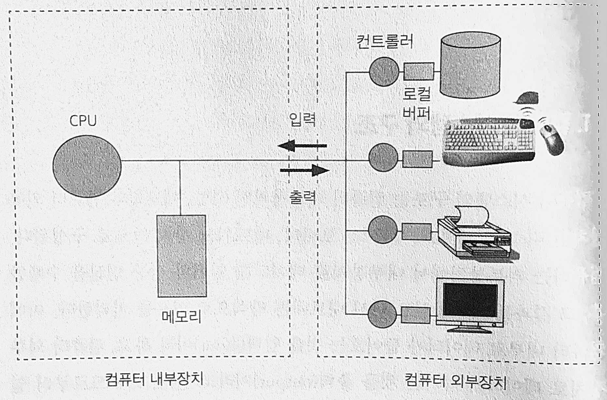
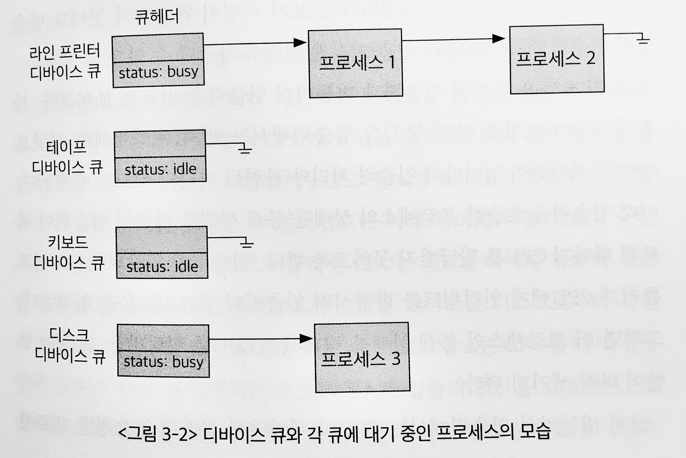
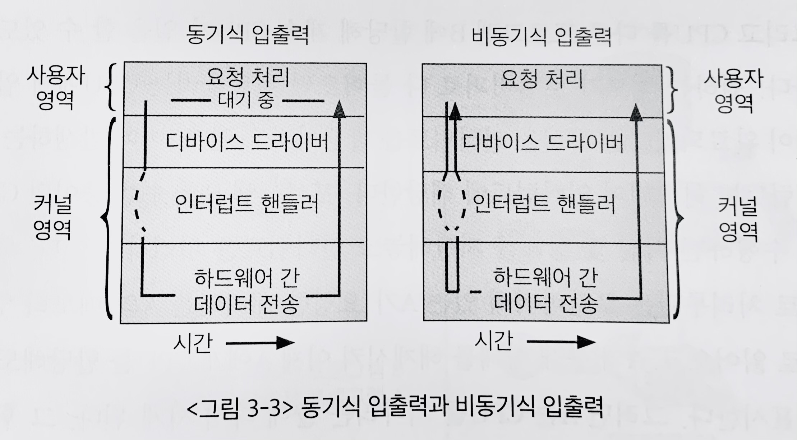
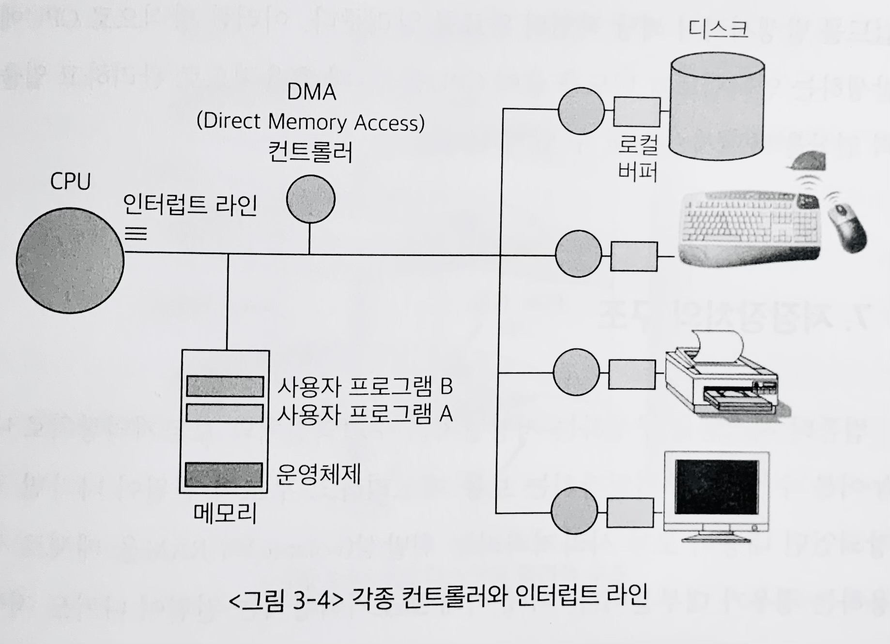
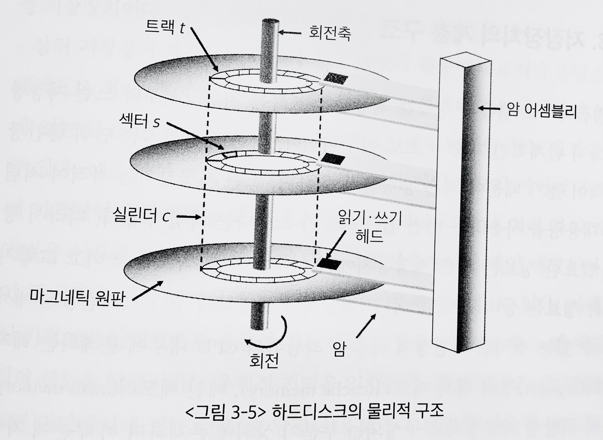
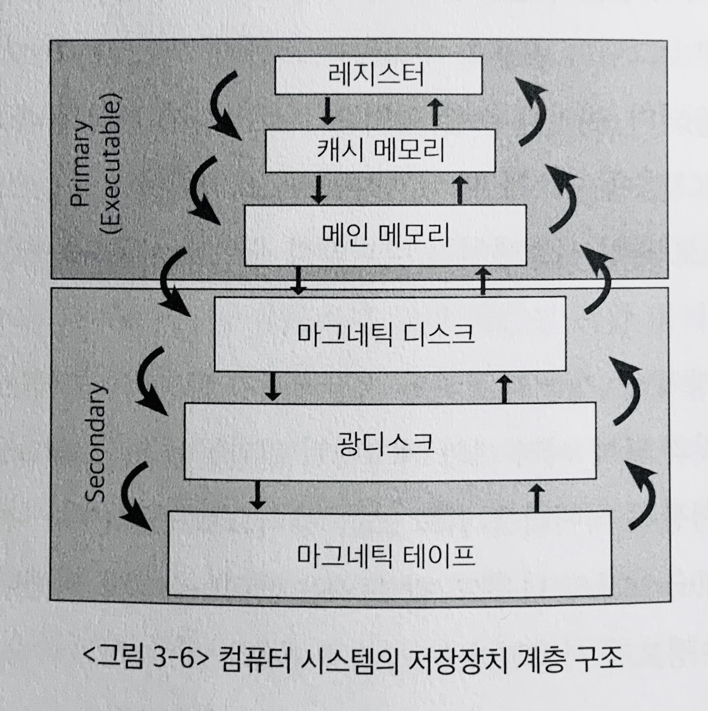
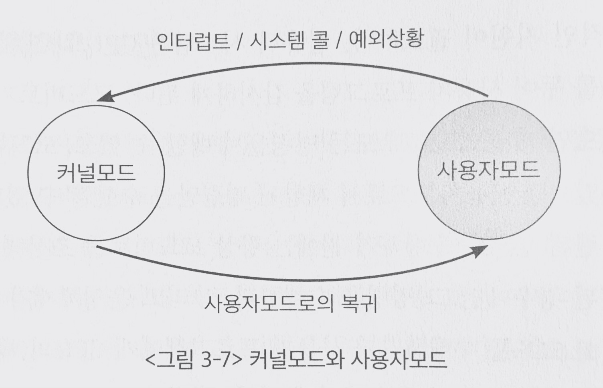
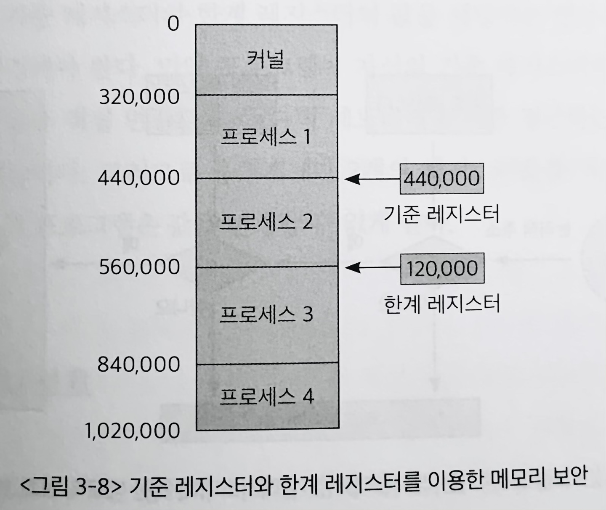
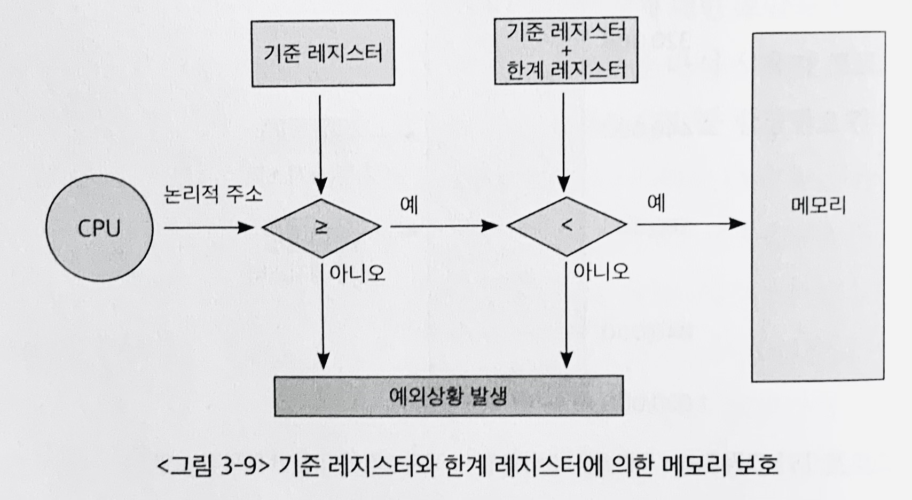

# 3장 컴퓨터 시스템의 동작원리

## 1. 컴퓨터 시스템의 구조

### 내부장치와 외부장치

- 내부장치: CPU, 메모리
- 외부장치: 디스크, 키보드, 마우스, 네트워크 장치

### 입출력

- **입력**: 컴퓨터 내부로 데이터가 들어오는 것
- **출력**: 컴퓨터 외부장치로 데이터가 나가는 것

> <u>디스크도 외부장치</u>이므로, 디스크에서 내용을 읽어오고, 연산 후에 디스크에 데이터를 저장하는 것도 "입출력이 일어났다"고 말할 수 있음

### (장치) 컨트롤러

- 일종의 작은 CPU
- 메모리 및 입출력 장치 등의 하드웨어 장치에 붙어있으며, **장치를 제어하는 역할**을 담당

### 프로그램이 수행되려면?

- 프로그램이 수행되기 위해서는 해당 프로그램이 메모리에 올라가 있어야함

- ✔ **커널**: 운영체제 중, 항상 메모리에 올라가 있는 부분

> 운영체제는 컴퓨터가 부팅되었을 때부터 항상 수행되면서, 각종 **자원들을 관리**해야하므로 ➡ **항상 메모리에 올라가 있어야함**
> 그러나 운영체제의 모든 코드를 메모리에 상주시키면 메모리가 낭비됨(비쌈)
> 따라서 **가장 핵심적인 부분만 메모리에 상주시켜**놓고, 나머지는 필요할 때마다 불러서 쓰게됨
> 앞서 언급한 "가장 핵심적인 부분이자, 메모리에 상주하는 운영체제의 부분"을 **커널**이라고 함

## 2. CPU 연산과 I/O 연산

- "연산을 한다" = "CPU가 일을 한다"
- 연산을 담당?
  - 입출력장치의 I/O 연산 ➡ 입출력 컨트롤러
  - 컴퓨터 내부의 연산 ➡ 메인 CPU
- 입출력장치와 메인 CPU는 동시에 수행 가능
  - 두가지 일이 동시에 다른 곳에서 발생하므로
- 장치 컨트롤러는 장치로 들어오고 나가는 **데이터를 임시로 저장하기 위한 작은 메모리**를 가지고 있음 ➡ **로컬버퍼**
- 외부장치에서 데이터를 읽어오는경우,
  - 로컬버퍼에 데이터가 임시로 저장된 후, 메모리에 전달됨
    - 장치에서 로컬버퍼로 읽어오는 일은 컨트롤러가 담당

> **디스크 읽어오기 예시)**
> 1. 프로그램 A가 디스크에서 데이터를 읽어오라는 명령을 내림
> 2. 디스크 컨트롤러가 물리적인 디스크에서 내용을 읽어, **로컬버퍼에 저장**
> 3. 디스크 컨트롤러가 다 읽어오면, 프로그램 A는 메인 CPU에서 다음 일을 수행할 수 있음

> 2번 과정에서, **로컬버퍼에 데이터를 다 읽어왔는지 확인하는 역할**은 메인 CPU가 하는 것이 아니라, **장치 컨트롤러가 인터럽트를 발생**시켜 CPU에 보고하게 됨

### 인터럽트

- **인터럽트**: 컨트롤러들이 CPU의 서비스가 필요할 때 이를 통보하는 방법
 

- CPU는 매 시점, 메모리에서 명령(Instruction) 단위로 하나씩 읽어와서 수행
- 이때, CPU 옆에는 **인터럽트 라인**(Interrupt Line)이 있어서, 여기로 <u>신호가 들어오면 하던일을 멈추고, 인터럽트 처리를 우선 수행</u>
- 정확히는, 명령 하나를 수행할 때마다 인터럽트 발생 여부를 확인함
  - 인터럽트 발생 시, 다음 명령을 수행하기 전에 인터럽트 처리를 하게됨
  - 인터럽트 없을 시, 다음 명령을 계속 수행

  **✔ 요약: 인터럽트는 CPU에게 알려줄 필요가 있는 이벤트 발생 시, 컨트롤러가 발생시키는 것**

## 3. 인터럽트의 일반적 기능

> **RE: 디스크 읽어오기 예시)**
> 1. 프로그램 A가 디스크에서 데이터를 읽어오라는 명령을 내림
> 2. 디스크 컨트롤러가 물리적인 디스크에서 내용을 읽어, **로컬버퍼에 저장**
> 3. 디스크 컨트롤러가 다 읽어오면, 프로그램 A는 메인 CPU에서 다음 일을 수행할 수 있음

> **CPU가 인터럽트 발생을 인지한 이후?**
> CPU는 메모리에서 명령어를 읽어와 수행을 하다가, 인터럽트가 발생하면 인터럽트를 우선 **처리**한다고 하였음
> ➡ CPU는 인터럽트를 어떻게 처리할까?

### 인터럽트 처리

- 운영체제 커널에는 인터럽트가 들어왔을 때 해야할 일이 미리 다 프로그래밍 되어, 그 코드가 보관되어 있음
- 운영체제는 각종 하드웨어 및 소프트웨어 자원관리뿐 아니라 사용자 프로그램에 필요한 서비스도 제공 ➡ 이와같이, 운영체제가 해야 할 일들을 운영체제 개발자가 미리 프로그래밍해서 커널 내에 포함시켜 두는 것이고, 이 중 하나가 **인터럽트 처리 루틴**임
- **인터럽트 처리루틴**: 다양한 인터럽트 에 대해 각각 처리해야 할 업무들을 정의하고 있음

#### 인터럽트의 종류

- **하드웨어 인터럽트(인터럽트)**: 컨트롤러와 같은 하드웨어 장치가 CPU의 인터럽트 라인을 세팅
- **소프트웨어 인터럽트(트랩, trap)**: 소프트웨어가 CPU의 인터럽트 라인을 세팅
 

- 인터럽트 라인에 신호를 주어, 인터럽트가 발생했음을 알려주는 방식은 동일
- 그러나 누가 인터럽트 라인을 세팅했느냐의 차이
- 인터럽트 발생 이후, 처리하는 방식도 동일

> 1. 인터럽트 발생
> 2. CPU는 하던일을 멈추고, 운영체제 커널 내에서 해당 인터럽트의 처리를 위해 정의된 코드를 찾음 ➡ 운영체제는 할 일을 쉽게 찾아가기 위해 **인터럽트 벡터**(Interrupt Vector)를 가짐
> 3. 인터럽트 벡터를 따라 **인터럽트 처리루틴**(Interrupt Service Routine) 또는 **인터럽트 핸들러**(Interrupt Handler) 수행
> 4. 인터럽트 처리 완료 후, 원래 수행하던 작업으로 돌아가서 중단되었던 일을 계속해서 수행

- **인터럽트 벡터**: 인터럽트 종류마다 번호를 정해서, 번호에 따라 처리해야 할 코드가 위치한 부분을 가리키고 있는 자료구조
- **인터럽트 처리루틴, 인터럽트 핸들러**: 실제로 인터럽트를 처리해야 할 코드가 정의된 위치

> 4번 단계) 중단되었던 일을 계속해서 수행해야 하므로, **인터럽트 처리 전에 수행중이던 작업이 무엇이었는지 저장 필요** ➡ 운영체제는 정보를 저장하기 위한 장소를 별도로 가지고 있음

#### 소프트웨어 인터럽트

- **소프트웨어 인터럽트 : 트랩(trap)**
  - 예외상황(Exception), 시스템콜(System call)
- **Exception**
  - **비정상적인 작업을 시도, 권한이 없는 작업을 시도할 때** 발생
  - ex) DividedbyZero(0으로 나누기), OutOfRange(자신의 메모리 영역 바깥에 접근하려는 시도)
- **System call**
  - 사용자 프로그램이 운영체제 내부에 정의된 코드를 실행하고 싶을 때 **운영체제에 서비스를 요청**하는 방법
    - 사용자의 프로그램 자신의 코드는 직접 CPU를 가지고 실행
    - 사용자 프로그램이 운영체제 내부에 정의된 코드를 실행하고자 할 떄에는 **인터럽트 라인 세팅**을 통해 **CPU 제어권을 운영체제로 넘겨 실행**하게 됨
 

  > ex) 내 프로그램이 화면 출력이 필요한 경우, 본인이 직접 입출력 수행하는 코드를 작성하는 것이 아니라 이미 존재하는 커널의 코드를 호출해서 처리

  > 시스템 콜이나 예외상황은 사용자 프로세스로 부터 CPU의 제어권이 운영체제에 이양이 되어 처리되는데, 이 과정에서 <u>프로그램 코드가 직접 인터럽트 라인을 세팅하는 명령을 실행</u>하여 <u>인터럽트 발생시킨 후에 제어권이 넘어가</u>게 되므로, 이들도 넓은 의미에서는 인터럽트의 범주에 포함시킴

## 4. 인터럽트 핸들링(Interrupt Handling)

- **인터럽트 핸들링**: 인터럽트가 발생한 경우에 처리해야 할 일의 절차
- **인터럽트 핸들러**: (=인터럽트 서비스 루틴, ISR) 인터럽트 접수에 의해 발생되는 인터럽트에 대응하여 특정 기능을 처리하는 기계어 코드 루틴 [위키](https://ko.wikipedia.org/wiki/%EC%9D%B8%ED%84%B0%EB%9F%BD%ED%8A%B8_%ED%95%B8%EB%93%A4%EB%9F%AC)

### 인터럽트 핸들링 절차

1. `프로그램 A` 실행 중 인터럽트 발생
2. `프로그램 A`의 현재 상태를 저장 - CPU에서 실행중인 명령의 메모리 주소 와 몇몇 정보들
3. CPU 제어권을 인터럽트 루틴(커널)에 넘김, 인터럽트 핸들러 실행
4. `프로그램 A`의 상태 복원

#### 프로그램의 현재 상태를 저장하는 방법

- CPU에서 명령 실행 시, CPU 내부의 임시 기억장치인 **레지스터**에 데이터를 읽거나 쓰면서 작업함
- 이때 인터럽트로 인해 <u>새로운 명령을 실행하면 기존의 레지스터 값들이 지워지게 되므로</u> CPU 내의 상태를 어딘가에 저장해두어야 함
- 현재 정보를 모두 저장한 이후에야 인터럽트 처리를 실행할 수 있음
- 운영체제는 현재 시스템 내에서 실행되는 프로그램들을 관리하기 위해 **프로세스 제어블록(PCB: Process Control Block**)이라는 자료구조를 둠
- PCB는 각각의 프로그램마다 하나씩 존재하며 해당 프로그램의 어느 부분이 실행 중이었는지를 저장함
  - 구체적으로, 프로그램이 실행 중이던 코드의 메모리 주소와 레지스터값, 하드웨어 상태등이 저장됨

> **추가설명)**
> 프로그램이 실행되던 중에 인터럽트가 발생하면 그 프로그램의 **실행상태를 PCB에 저장**한 후, **CPU의 제어권이 인터럽트 처리루틴(커널)으로** 넘어가게 되며, 인터럽트 처리가 끝나면 저장된 상태를 **PCB로부터 CPU상에 복원**하여 인터럽트 당하기 직전의 위치부터 실행이 이어지게 됨

> 오늘날의 컴퓨터에서 운영체제는 인터럽트가 발생할 때에만 실행됨
> 시스템 부팅 후 정상상태에 머무르게 되면, CPU는 항상 사용자 프로그램에 의해 사용되며, 운영체제는 단지 인터럽트가 발생했을 때에만 잠깐 CPU의 제어권을 획득할 수 있음
> ➡ **✔ "운영체제가 CPU를 점유하는 경우는 인터럽트가 발생했을 때 뿐임"**
> "그럼에도 불구하고 SW/HW 자원을 체계적이고 효율적으로 관리할 수 있음" ➡ 어떻게?

## 5. 입출력 구조

- **입출력**: 컴퓨터 시스템이 컴퓨터 외부의 입출력 장치들과 데이터를 주고받는 것
- 입출력 방식
  - **동기식**(Synchronous I/O) ➡ 기다림
  - **비동기식**(Asynchronous I/O) ➡ 안기다림

### 동기식 입출력

#### 기본원리

- 어떤 프로그램이 입출력을 요쳥했을 때 입출력 작업이 완료된 후에야 그 프로그램이 후속 작업을 수행할 수 있는 방식
- <u>장치가 입출력 진행하는 동안 프로그램 실행하지 않고 기다림</u>
- 장치의 입출력이 완료되어 인터럽트를 통해 그 사실이 전달된 후에야 CPU의 제어권이 프로그램에 넘어가서 다음 명령 수행가능

#### 문제점: 자원낭비

- `CPU의 명령 수행 속도` >>> `입출력 연산 속도`(데이터 읽어오기 등..)
- CPU는 입출력 연산이 끝날 때까지 인터럽트를 기다리며 **자원을 낭비**

> - 매 시점 하나의 입출력만 가능
> - 입출력동안 CPU는 연산을 멈춤

#### 해결방안: CPU 상태에 따른 CPU 제어권 양도

- `프로그램 A`가 <u>입출력 수행시, CPU를 다른 프로그램에 이양</u>하여 CPU가 계속 쉬지않고 일할 수 있도록 관리
- 입출력이 완료될때까지 `프로그램 A`에 CPU를 할당하더라도 명령을 수행하지 못하기 때문에, <u>입출력 연산이 끝나기 전까지는 (입출력 실행시킨) `프로그램 A`에게 CPU 제어권을 주지 않음</u>
- ✔ 운영체제는 이를 관리하기 위해서 **프로그램을 몇가지 상태로 나눔**
  - (누구한테 CPU 제어권을 줘도 되고, 누구한테 주면 안되는지)
- <u>CPU 할당 시, 곧바로 명령을 수행할 수 있는 프로그램에만 CPU를 할당함</u>
- 입출력 중인 프로그램의 상태: 봉쇄상태(Blocked State)
  - 봉쇄상태의 프로그램에는 CPU를 할당하지 않음
> - 매 시점 다수의 입출력만 가능
> - 입출력동안 CPU는 다른 프로그램에 이양되므로, 연산을 쉬지않음

#### 입출력 순서의 동기성 보장 문제

- 다른 프로그램에게 CPU를 이양하므로, <u>다수의 입출력 연산이 동시에 요청되거나 처리될 수 있음</u>
- 💥 **동시에 입출력 요청이 들어왔다면**, 컨트롤러는 사용자의 의도와 다른 순서로 요청을 처리할 수 있음 💥 예시그림필요

#### 입출력 순서의 동기성 보장에 대한 해결책

- 입출력 요청의 동기화를 위해 **장치별로 큐(Queue)를 두어 요청한 순서대로 처리**
- 디스크 차원에서는, 큐에 있는 순서대로 처리함으로서 동기화 문제 해결 가능
- 장치마다 큐 헤더가 존재하고 각 장치별로 입출력 수행 순서를 지켜주기 위한 큐 관리
- 컨트롤러는 순서에 따라 매 시점 하나씩 자신에게 주어진 입출력 작업을 처리

> **정리**
> CPU 연산속도가 입출력 장치의 속도보다 훨씬 빠르기 때문에,
> CPU의 유휴시간을 줄이기 위해서 다른 프로그램이 CPU를 사용할 수 있게 해줌
> 입출력 연산이 완료되면 CPU에게 입출력이 완료되었음을 알려주는 방식으로 진행

#### 연산완료를 알리는 방법?

- 연산 완료의 통보는 **하드웨어 인터럽트를 통해서 수행**
- 운영체제 커널은 인터럽트 처리루틴으로 가서, 입출력 연산을 끝낸 프로그램이 CPU를 할당받을 수 있도록 ➡ 그 **프로그램의 상태를 봉쇄상태로 부터 해제** 시킴

##### 연산완료 후 과정

0. `프로그램 A`가 봉쇄상태에 있는 동안 `프로그램 B`가 CPU를 점유하고 있었다고 한다면
1. `프로그램 B`는 인터럽트가 발생했으므로, 현재 수행하던 지점과 상태를 저장해놓고, 인터럽트를 처리함 
    > ➡ 이 인터럽트는...
    >
    > 1) `프로그램 A`가 **요청했던 데이터를 로컬버퍼에서 A의 메모리 영역으로 읽어**오고
    > 2) **`프로그램 A`를 봉쇄상태로 부터 해제**하여, CPU 할당을 가능하게 해줌
    >
    > - 인터럽트가 들어온다고 해서 `프로그램 A`를 바로 실행시키는 것은 아님
    > - `프로그램 A`는 CPU를 받기 위해서 대기명단에 오르게 되고

2. 위의 과정인 인터럽트가 끝나면, `프로그램 B`가 CPU를 점유하게 됨
 

### 비동기식 입출력

- 입출력 연산을 요청한 후에 연산이 끝나기를 기다리는 것이 아니라 CPU의 제어권을 입출력 연산을 호출한 그 프로그램에게 곧바로 다시 부여하는 방식
- 입출력요청의 결과 **(데이터)와 관련없이 수행할 수 있는 작업을 먼저 처리**하고, 읽어올 데이터가 꼭 필요한 일들은 입출력 완료 후에 수행
  - 이는 쓰기 작업에도 동일하게 적용됨
- 연산이 완료되면 인터럽트를 통해 CPU에게 알려줌
- 이후, 저장했던 시점부터 (데이터 필요로 하는 명령들을) 수행 재개

## 6. DMA (Direct Memory Access)

### 기존의 방식

- 원칙적으로 **메모리는 CPU에 의해서만 접근할 수 있는 장치**임
- 따라서, CPU 이외의 장치가 메모리의 데이터에 접근하기 위해서는 **CPU에게 인터럽트를 발생시켜**, CPU가 이를 **대행**하는 식으로만 접근 가능
- 이와 같이, **컨트롤러는 CPU에게 인터럽트를 발생**시키고, **CPU는 컨트롤러의 로컬버퍼와 메모리 사이에서 데이터를 옮기는 역할**을 수행

### 문제점

- 모든 메모리 접근 연산이 CPU에 의해서 이루어지는 경우, 입출력 장치가 메모리 접근을 원할 때마다 **인터럽트를 보내서 CPU의 업무를 방해함 ➡ CPU 효율이 떨어짐**

### 해결책

- **DMA(Direct Memory Access)**: CPU 이외에 메모리 접근이 가능한 장치
  - 일종의 컨트롤러
  - CPU가 입출력 장치들의 메모리 접근 요청에 의해 자주 인터럽트 당하는 것을 막아주는 역할
  - DMA를 사용하면, 로컬버퍼에서 메모리로 읽어오는 작업을 CPU 대신, DMA가 대행함 ➡ 이제 CPU는 원래 하던 작업을 멈추고 인터럽트를 처리할 필요 XXX
  - 바이트(Byte) 단위가 아닌, **블록(Block)이라는 큰 단위로 정보를 메모리로 읽어**온 후, **CPU에게 인터럽트를 발생시켜**서 해당 작업의 완료를 알려줌
- CPU에 발생하는 인터럽트 빈도를 줄여줌 ➡ CPU를 효율적으로 관리하고 입출력 연산을 빠르게 수행할 수 있음

## 7. 저장장치의 구조

- 컴퓨터 시스템을 구성하는 저장장치
  - **주기억장치**: 메모리, RAM, 휘발성(volatile, 전원이 나가면 저장되었던 내용 사라짐)
  - **보조기억장치**: 마그네틱 디스크, 플래시메모리, CD, 마그네틱 테이프, 비휘발성(nonvolatile, 전원이 나가도 저장된 내용을 기억할 수 있음)

### 보조기억장치의 용도

1. 파일시스템(File System)
   - 전원이 나가도 유지해야 할 정보를 파일 형태로 저장
2. 스왑영역(Swap Area)
   - 메모리의 연장공간
   - 메모리는 크기가 한정되고, 가격이 상대적으로 비싼데다가, 용량이 적음
   - 다수의 프로그램이 메모리에 올라가 동시에 수행되면 당연히 공간이 부족
   - 이 경우에, 운영체제는 프로그램 수행에 당장 필요한 부분만 메모리에 올려놓고, 그렇지 않은 부분은 디스크의 스왑 영역에 내려놓음
   - 디스크에 내려놓는 일: **스왑 아웃(swap out)**
   - 메모리 영역으로 올리는 일: **스왑 인(swap in)**
     - 해당 데이터가 필요할 떄에 메모리에 올리게 됨
   - 하드디스크가 가장 널리 사용됨

> **스왑영역과 파일시스템의 차이**
> 스왑영역은 프로그램이 실행될 때 내용을 저장했다가 프로그램이 종료될 때 삭제하는 메모리의 연장공간으로서의 역할을 담당
> 파일시스템처럼 비휘발성 용도로 사용되는 것과는 역할이 구분됨

### 하드디스크

- 보조기억장치 중 가장 대표적인 저장매체
- 사진
- 구성요소
  - 여러개의 마그네틱 원판
  - 암(arm): arm이 이동하며 원판에 저장된 데이터를 읽고 씀
  - 트랙(track): 디스크 원판의 표면이 나뉘는 단위
  - 섹터(sector): 각 트랙이 나뉘는 단위, 섹터에 최소한의 단위 정보가 저장됨

## 8. 저장장치의 계층 구조

- 빠른 저장장치부터 느린 저장장치까지 단계적인 계층구조로 이루어짐
- 빠른 저장장치: 단위 공간당 가격이 비싸므로 적은 용량을 사용
- 느린 저장장치: 가격이 저렴하여 대용량을 사용하는 반면, 접근속도가 느림
- ✔ **당장 필요한 정보는 빠른 저장장치에 넣어두어 속도를 높임**
- ✔ 당장 필요하지 않은 정보는 상대적으로 느린 저장장치에 보관
- **레지스터: CPU 내부에 존재**
- **휘발성 (상위) 저장장치: 레지스터, 캐시 메모리, 메인 메모리**
- 비휘발성 (하위) 저장장치: 마그네틱 디스크, 광디스크, 마그네틱 테이프, ...

### 캐싱기법

- **캐싱기법**: 상대적으로 용량이 적은 빠른 저장장치를 이용해, 느린 저장장치의 성능을 향상시키는 총체적 기법
- 방법
  - 상대적으로 느린 저장장치에 있는 내용 중, 당장 사용되거나 <u>빈번히 사용될 정보를 빠른 저장장치에 선별적으로 저장</u>
- 효과
  - 두 **저장장치 사이의 속도를 완충**시킴
  - 빠른 저장장치에 자주 사용될 정보를 저장하면, 필요한 정보를 빠른 저장 장치에서 곧바로 찾을 수 있는 경우가 많아져, 시스템의 평균적인 **성능 향상**!

#### 캐싱기법이 효율적인 이유

- 프로그램, 데이터를 구성하는 모든 부분이 균일하게 사용되는 것이 아닌,
- 일부분만 집중적으로 사용되고, 특정 부분은 거의 사용되지 않기 때문!

## 9. 하드웨어의 보안

- **다중 프로그래밍(multi-programming) 환경**: 여러 프로그램이 동시에 실행될 수 있음
  - 각 프로그램이 다른 프로그램의 실행을 방해하거나 **프로그램 간에 충돌을 일으키는 문제**를 막기 위해, **하드웨어에 대한 각종 보안기법 필요**
- 하드웨어적 보안을 유지하기 위해서 두가지 모드 지원
  - **커널모드(kernel mode, system mode)**
  - **사용자모드(user mode)**

- 어떤 프로그램이 다른 프로그램의 메모리 영역이나 파일 영역을 침범하는 등의 중요한 정보에 접근하여 <u>위험한 상황을 초래할 수 있는 연산</u>은 **커널모드에서만 실행**

### 커널모드

- 운영체제가 CPU의 제어권을 가지고 운영체제 코드를 실행하는 모드
- 커널모드에서는 모든 종류의 명령을 전부 실행 가능

### 사용자모드

- 일반 사용자 프로그램이 실행되는 모드
- 제한적인 명령만 수행 가능
- 시스템에 중요한 영향을 미치는 연산은 커널모드에서만 실행 가능하도록 함으로써 하드웨어의 보안을 유지 가능
  - 이를 실현하기 위해서는 하드웨어적 지원 필요
  - (➡ 사용자 프로그램이 CPU를 점유하는 동안에 운영체제는 자신의 코드를 실행할 수 없으므로(CPU를 사용자가 점유), 사용자가 시스템에 치명적인 일을 수행하더라도 운영체제가 컨트롤 할 수 없음)
  - 모드비트(mode bit) 사용

### 모드비트 (mode bit)

- CPU 내부에 mode bit를 두어, 사용자 프로그램을 감시
- **`mode bit == 0`: 커널모드, 모든 명령 수행가능**
- **`mode bit == 1`: 유저모드, 제한된 명령 수행 가능**
- CPU는 보안과 관련된 명령을 수행하기 전에는 항상 mode bit를 조사하여, 그 값이 0으로 세팅된 경우에만 그 명령을 수행
- 운영체제가 CPU를 점유하여 자신의 코드를 수행하다가, 사용자 프로그램에 CPU의 제어권을 넘길 때, mode bit를 1으로 세팅하여 넘김
- ✔ 유저모드에서 보안과 관련된 명령을 수행하는 것은 제한되므로 ➡ 하드웨어 보호 가능

> 사용자 프로그램이 하드웨어 접근 등의 보안이 필요한 명령 수행해야 하는 경우,
> **시스템 콜을 통해 운영체제가 대신 해줄 것을 요청** 
> ➡ CPU의 제어권은 운영체제로 넘어가게 되고, 인터럽트 발생시 `mode bit = 0`으로 세팅됨 
> ➡ 요청된 작업이 끝나면, `mode bit = 1`로 만들고 사용자 프로그램에 CPU를 넘김

- **특권명령**: 시스템 보안과 관련된 명령들 ➡ `mode bit = 0`인 경우에만 수행가능

### 디스크 보안

- 사용자 프로그램이 디스크에 저장된 파일에 자유롭게 접근할 수 있다면, 보안상 문제 발생 가능
  - 자신의 소유가 아닌 **다른 사람의 파일에 접근**할 수 있기 때문
  - 따라서 **모든 입출력 명령은 특권명령**으로 규정되어, 사용자 프로그램이 직접 입출력하는 것을 차단함

> **정리)**
>
> 1. 사용자 모드에서 사용자 프로그램 수행되다가 입출력하고 싶으면
> 2. 시스템 콜을 통해 운영체제에 입출력(특권명령) 요청을 함
> 3. 운영체제가 CPU를 할당받아서 인터렙트 벡터의 특정 위치를 통해, 해당 인터럽트 처리루틴으로 이동
> 4. 인터럽트 하드웨어에 의해 `mode bit = 0`으로 세팅되므로 운영체제는 입출력 수행가능
> 5. 운영체제는 이 요청이 올바른 요청인지 확인 후, 실행(운영체제가 확인할 수 있게 되어, 파일에 대한 보안유지 가능)
> 6. 요청된 입출력이 완료되면 CPU의 제어권을 다시 사용자에 프로그램에 넘길 수 있게 만듦 (`mode bit = 1`로 만듦)
> 7. 사용자 프로그램이 다시 CPU를 할당받으면, 시스템 콜 이후의 명령을 수행가능

## 10. 메모리 보안

### 문제점 & 필요성

- 디스크 뿐만아니라 메모리도 보안이 필요
- 여러 프로그램이 메모리에 동시에 올라가서 실행되기 때문
- 하나의 사용자 프로그램이 다른 사용자 프로그램이나 운영체제가 위치한 **(타) 메모리 영역을 침범**할 수 있기 때문
  - ex) 내 C++ 프로그램에 포인터 참조 실수해서 운영체제 커널을 참조하려는 시도...
  - 특히 인터럽트 벡터와 인터럽트 처리루틴이 있는 곳은 각별한 보안이 필요
  - 사용자 프로그램이 인터럽트 처리 루틴을 접근하거나 변경할 수 있을 경우, 운영체제만 수행할 수 있는 특권명령의 보안성이 침해되는 이상한 명령으로 바뀔 수 있기 때문!

### 해결방법

- **2개의 레지스터를 사용**해서 프로그램이 **접근하려는 메모리 부분이 합법적인지 체크**
- 2개의 레지스터
  - **기준 레지스터(base register)**: 어떤 프로그램이 수행되는 동안 그 프로그램이 합법적으로 접근할 수 있는 메모리 상의 가장 작은 주소를 보관
  - **한계 레지스터(limit register)**: 그 프로그램이 기준 레지스터 값부터 접근할 수 있는 메모리의 범위를 보관
  - ✔ 즉, 이 둘은 어떤 프로그램이 **실제 메모리에 올라가 있는 부분의 시작주소**와 그 **프로그램의 길이**를 각각 보관하여, 메모리 접근 연산이 있을 때마다 하드웨어적으로 **현재 접근하려는 위치가 합법적인 범위에 있는지 체크**함

- 접근하려는 주소가 범위 안에 없으면 불법적인 메모리 접근(illegal memory access) ➡ Exception(예외상황, 소프트웨어 인터럽트) 발생
- **Exception은 운영체제에 소프트웨어 인터럽트를 발생시켜**, CPU의 제어권을 해당 프로그램으로부터 운영체제로 이양시키고, 운영체제는 해당 프로그램을 강제종료 시킴
- 단, 여기서 말했던 메모리 보호 기법은 <u>하나의 프로그램이 메모리의 한 영역에 연속적으로 위치하는 단순화된 메모리 관리 기법을 사용하는 경우에만 해당</u>
- ~~➡ 7장에서 paging등에 대해 더 자세히 다룰 예정(+ 비연속적 메모리 공간에서의 메모리 관리 기법 등 ...)~~

### 추가정보

- **메모리 접근 연산**은 사용자 프로그램이 CPU를 가지고 있는 동안 수행할 수 있는 연산이므로 **특권명령은 아님**
- 다만 사용자 프로그램이 메모리에 접근하기 전에 하드웨어적으로 그 접근이 합법적인지를 체크하여 메모리를 보호하게 됨
- ➡ 입출력 연산(운영체제만이 수행가능)과 메모리 접근 연산의 차이점!
  - 유저모드: 기준 레지스터/한계 레지스터 사용하여 제한된 메모리에만 접근(보호)
  - 커널모드: 모든 메모리에 접근 가능
- 메모리 접근 명령 자체는 특권명령이 아니지만, **기준 레지스터와 한게 레지스터에 값을 세팅하는 연산은 특권명령**
  - ➡ 올바르지 않은 접근 시도를 막기 위함
  - 사용자가 레지스터 값을 변경할 수 있다면, 결국 메모리 접근 제한을 사용자 마음대로 풀어버릴 수 있다는 것이므로 위험 ⁖ ✔ 특권명령으로 지정되어야함 ✔ 

## 11. CPU 보호

- 일반적으로 컴퓨터 시스템에 CPU는 하나이므로 어떤 프로그램이 무한루프 등으로 CPU를 부적절하게 독점해버린다면, 다른 프로그램/OS가 CPU를 빼앗을 방법이 없음
- CPU가 하나의 프로그램에 의해 독점되는 것을 막기 위해 운영체제는 **타이머(timer)** 라는 하드웨어를 사용

### 타이머

- <u>정해진 시간이 지나면 인터럽트를 발생시켜, 운영체제가 CPU의 제어권을 획득할 수 있도록 하는 역할을 수행</u>
- 타이머에 의해 발생되는 인터럽트 처리 루틴의 역할
  - 현재 CPU를 점유하고 명령을 실행중인 프로그램으로부터, CPU를 빼앗아서 다른 프로그램에게 이양하기
- 타이머는 일정한 시간 단위로 세팅될 수 있으며, 매 **클럭 틱(Clock tick)** 때마다 1씩 감소함 ➡ *타이머가 0이 되는 순간 인터럽트 발생*
- **로드 타이머(load timer)**: 타이머를 세팅하는 명령(특권명령)
- 시분할 시스템에서, 현재 시간을 계산하기 위해서도 사용됨
  - **시분할 시스템**: 여러 프로그램이 CPU의 시간을 조금씩 나누어 사용하는 시스템 ~~(우리가 사용하는 대부분의 컴퓨터)~~

## 12. 시스템 콜을 이용한 입출력 수행

- 입출력명령 = 특권명령 = 사용자 프로그램이 직접 수행 불가능
- 입출력 명령은 운영체제 코드에 구현되어있음
- 사용자 프로그램은 직접 입출력 수행하지 않고(못함), 운영체제에게 시스템 콜이라는 서비스 대행 요청을 하여 입출력을 수행
- **시스템 콜(System Call)**: 소프트웨어적인 인터럽트
- 사용자 프로그램이 시스템 콜을 할 경우, 트랩(소프트웨어 인터럽트)이 발생해, CPU의 제어권이 운영체제로 넘어가게 됨
- 운영체제는 해당 시스템 콜을 처리하기 위한 루틴으로 가서 정의된 명령을 수행
  - 컨트롤러에 입출력 요청을 수행하도록 명령
  - 디스크 컨트롤러가 입출력 마치면, CPU에게 인터럽트 발생시켜, 입출력 완료를 알림
  - 중지되었던 프로그램이 다시 CPU를 할당받을 수 있게 함
 