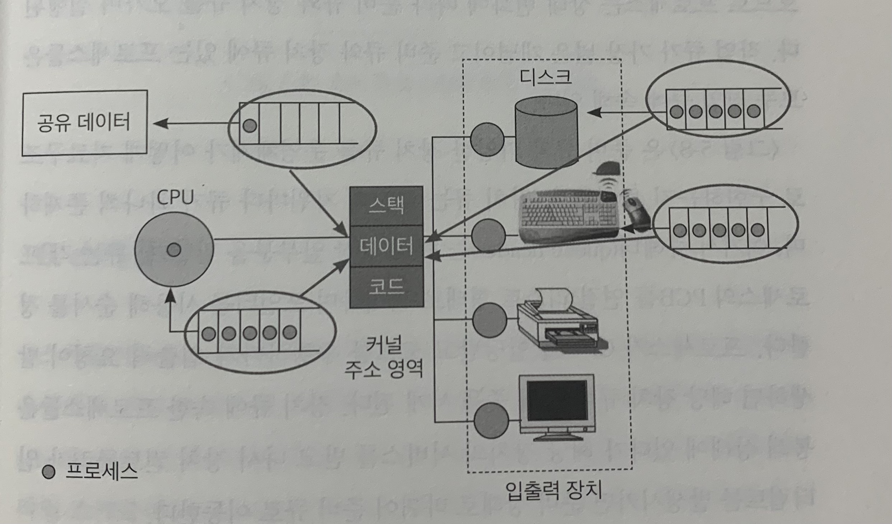

# 5장 프로세스 관리
## 1. 프로세스의 개념
### 프로세스
- 실행 중인 프로그램
- 디스크에 실행파일 형태로 존재하던 프로그램이 메모리에 올라가서 실행되기 시작하면 프로세스가 된다. 

### 프로세스의 문맥 (Context)
- 프로세스가 현재 어떤 상태에서 수행되고 있는지 정확히 규명하기 위해 **필요한 정보**
- 프로세스 문맥이 필요한 이유
	- 여러 프로세스가 함께 수행되는 시분할 시스템 환경에서는 CPU를 획득, 반환을 반복하며 CPU 관리가 일어남. 
	- 따라서 CPU를 빼앗겼다가 다시 획득해 명령 수행을 재개하는 시점에, 직전 수행 시점의 정확한 상태를 재현해야하기 때문
- 프로세스 문맥이 포함하고 있는 정보
	1. 프로세스의 주소 공간(코드, 데이터, 스택 상태)
	2. 레지스터가 갖고 있었던 값
	3. 시스템 콜을 통해 커널에서 수행한 일의 상태
	4. 프로세스에 관해 커널이 관리하고 있는 각종 정보
- 프로세스의 문맥 분류 
	1. 하드웨어 문맥
		- CPU의 수행 상태 나타냄
		- 프로그램 카운터 값, 레지스터들에 저장하고 있는 값
	3. 프로세스의 주소 공간
		- 프로세스의 독자적인 주소 공간 
		- 코드, 데이터, 스택
	4. 커널 상의 문맥
		- 프로세스를 관리하기 위한 자료구조 
		- PCB, 커널 스택

## 2. 프로세스의 상태
### 실행(running)
- 프로세스가 CPU를 보유하고, 기계어 명령을 실행하고 있는 상태
- 일반적으로 CPU는 하나이기에 여러 프로세스가 동시에 수행된다고 해도 **실제로 실행 상태에 있는 프로세스는 매 시점 하나 뿐이다.**
 
### 준비(ready)
- 프로세스가 CPU만 보유하면 당장 명령을 실행할 수 있지만 CPU를 할당받지 못한 상태

### 봉쇄(blocked, wait, sleep)
- CPU를 할당받더라도 당장 명령을 실행할 수 없는 프로세스의 상태

### 시작(new)
- 프로세스가 생성 중인 상태

### 완료(terminated)
- 프로세스가 종료 중인 상태 

### 중지(suspended, stopped)
- 외부적인 이유로 프로세스의 수행이 정지된 상태
- 중기 스케줄러의 등장으로 추가

### 프로세스 상태 변화 예시
- 입출력을 요청한 프로세스
	1. 디스크에서 읽어오는 장업은 CPU 처리 속도에 비해 상대적으로 오랜 시간이 걸리므로 디스크 입출력이 완료될 대까지 **CPU를 반환**한다. 
	2. 해당 프로세스는 입출력 서비스를 기다리며 **봉쇄 상태**
	3. CPU 스케줄러가 **준비 상태**에 있는 다른 프로세스에게 CPU 할당해주고 해당 프로세스는 **실행 상태**
	4. 디스크 입출력을 요청한 프로세스는 디스크 입출력을 기다리고 있는 큐에 있다가 디스크 컨트롤러로부터 서비스를 받는다. 
	5. 디스크 컨트롤러는 CPU에게 인터럽트를 발생시켜 입출력 완료됨을 알린다. 
	6. CPU는 인터럽트에 대응하는 루틴을 수행하고 처리가 끝나면 인터럽트 처리 루틴 이전에 수행되던 프로세스에게 CPU를 할당해준다. 
	7. 경우에 따라서는 이전 프로세스가 아닌 입출력을 끝낸 프로세스에게 CPU를 할당하는 경우가 있다. (우선순위에 따라) 

## 3. 프로세스 제어블록(PCB) 
- 운영체제가 시스템 내의 프로세스들을 관리하기 위해 프로세스마다 유지하는 정보들을 담는 커널 내의 자료구조

### PCB 구성 요소
1. **프로세스의 상태**
	- CPU를 할당해도 되는지 여부 결정
2. **프로그램 카운터의 값**
	- 다음에 수행할 명령의 위치를 가리킴
3. **CPU 레지스터의 값**
	- CPU 연산을 위해 현 시점에 레지스터에 어떤 값을 저장하고 있는지 나타냄
4. **CPU 스케줄링 정보**
	- CPU 스케줄링을 위해 필요한 정보
5. **메모리 관리 정보**
	- 메모리 할당을 위해 필요한 정보
6. **자원 사용 정보**
	- 사용자에게 자원 사용 요금을 계산해 청구하는 용도
7. **입출력 상태 정보**
	- 프로세스가 오픈한 파일 정보 등 프로세스의 입출력 관련 상태 정보

## 4. 문맥교환
- 실행시킬 프로세스를 변경하기 위해 원래 수행 중이던 프로세스의 문맥을 저장하고 새로운 프로세스의 문맥을 세팅하는 과정 (CPU의 제어권이 이양되는 과정)

### 문맥 교환이 일어나는 경우
- 타이머 인터럽트가 발생하는 경우
- 실행 상태에 있던 프로세스가 입출력 요청 등으로 봉쇄 상태로 바뀌는 경우

### 모드 변경 (문맥 교환 X)
- **프로세스가 실행 상태일 때 시스템 콜이나 인터럽트가 발생**하면 CPU의 제어권이 운영체제로 넘어와 현재 프로세스 작업을 멈추고 운영체제 커널의 코드가 실행된다.
- 이때, CPU의 실행 위치 등 프로세스의 문맥 중 일부를 PCB에 저장하게 되지만 이 과정은 문맥 교환이라 하지 않는다.
- 이유: 하나의 프로세스의 실행 모드가 사용자 모드 -> 커널 모드로 변경되는 것일 뿐, 다른 프로세스로 변경되는 것이 아니기 때문
- 모드 변경의 오버헤드 < 문맥 교환의 오버헤드 
 
### 문맥교환의 오버헤드
- 문맥 교환에 소요되는 시간 == 문맥 교환의 오버헤드
- 적절한 CPU 할당 시간을 정하는 것이 중요
	- 타이머에 CPU 할당 시간 **작게** 설정 -> 오버헤드 커짐
	- 타이머에 CPU 할당 시간 **크게** 설정 -> 시분할 시스템의 의미 퇴색

### CPU 디스패치(dispatch)
- 준비 상태에 있는 프로세스들 중에서 CPU를 할당받을 프로세스를 선택한 후 실제로 CPU의 제어권을 넘겨받는 과정

## 5. 프로세스를 스케줄링하기 위한 큐
### 하드웨어 자원을 기다리는 큐
### 준비 큐(Ready Queue)
- 프로세스를 줄 세우는 큐
- 운영체제는 준비 상태에 있는 프로세스들을 줄 세우기 위해 준비 큐를 두고 준비 큐의 제일 앞에 줄 서 있는 프로세스에 제일 먼저 CPU를 할당한다.

### 장치 큐(Device Queue)
- 특정 자원을 기다리는 프로세스들을 줄 세우는 큐
- 자원별로 큐가 존재함
	- 예시: 디스크 입출력 큐, 키보드 입출력 큐

### 준비 큐와 장치 큐의 모습
- 큐는 각 프로세스의 PCB를 연결 리스트 형태로 관리하며 포인터를 사용해 순서를 정한다. 

----
### 소프트웨어 자원을 기다리는 큐
### 공유 데이터를 기다리는 큐
- 앞서 공유 데이터에 접근 중인 프로세스가 다 사용하고 반납할 때까지는 다른 프로세스가 CPU를 할당받았다 하더라도 접근하지 말고 기다려야 한다.
- 이유
	- 새롭게 CPU를 할당받은 프로세스가 동일한 데이터에 접근하게 되면 데이터의 일관성이 깨어질 수 있기 때문에 **공유 데이터는 매 시점 하나의 프로세스만이 접근할 수 있도록 해야함**
- 큐를 두어서, 순서대로 데이터의 접근 권한을 준다. 
---

### -> 프로세스의 상태 관리는 커널의 주소 영역 중 데이터 영역에 다양한 큐를 두어 수행하게 된다. 

### 작업 큐(Task Queue)
- 시스템 내의 모든 프로세스를 관리하기 위한 큐
- 프로세스의 상태와 무관하게 현재 시스템 내에 있는 모든  포르세스가 작업 큐에 속함
- 준비 큐와 장치 큐에 있는 포르세스들은 모두 작업 큐에 속함

## 6. 스케줄러
- 어떤 프로세스에게 자원을 할당할지를 결정하는 운영체제 커널의 코드

### 스케줄러의 분류
1. 장기 스케줄러(long term scheduler)
	- 작업 스케줄러
	- 역할
		- 어떤 프로세스를 준비 큐에 진입시킬지 결정하는 역할
		- 프로세스에게 메모리를 할당하는 문제에 관여
		- 메모리에 동시에 올라가 있는 프로세스의 수를 조절
	- 특성
		- 수십 초 혹은 분 단위로 가끔 호출되기 때문에 상대적으로 속도가 느린 것이 허용됨 
		- 현대의 시분할 시스템에는 주로 두지 않음 (과거의 자원 빈약 시절에 사용)

2. 단기 스케줄러(short term scheduler)
	- CPU 스케줄러
	- 역할
		- 준비 큐에 있는 여러프로세스들 중 어떤 프로세스에게 CPU를 할당할 것인지 결정하는 역할
		- 시분할 시스템에서는 타이머 인터럽트가 발생하면 단기 스케줄러가 호출됨
	- 특성
		- 밀리초 단위로 매우 빈번하게 호출되므로 수행 속도가 충분히 빨라야함

3. 중기 스케줄러(medium term scheduling)
	- 현대의 시분할 시스템용 운영체제에서 장기 스케줄러 대신 사용
	- 너무 많은 프로세스에게 메모리를 할당해 시스템의 성능이 저하되는 경우 이를 해결하기 위해 **메모리에 적재된 프로세스의 수를 동적으로 조절하기 위해 추가된 스케줄러**
	- 예시
		- 프로세스 당 보유하고 있는 메모리 양이 극도로 적어진 경우
			1. CPU 수행에 당장 필요한 프로세스의 주소 공간조차도 메모리에 올려놓기 어려운 상황 발생
			2. 디스크 입출력이 수시로 발생하여 시스템 성능 저하 야기
			3. 중기 스케줄러는 메모리에 올라와 있는 프로세스 중 일부를 선정하여 메모리를 뺏는다. 
			4. 해당 내용을 디스크의 스왑 영역에 저장 -> **스왑 아웃(swap out)**
	- 프로세스 상태의 중지
		- 중지 상태에 있는 프로세스는 메모리 자원이 당장 필요하지 않음 
			- 이유: 외부에서 재개시키지 않는 이상 다시 활성화될 수 없기 때문
		- 따라서, 중지 상태의 프로세스는 메모리를 통째로 빼앗기고 디스크로 스왑 아웃된다.
		- 중지 상태의 분류
			1. 중지 준비 상태
				- 준비(ready) 상태에 있던 프로세스가 중기 스케줄러에 의해 디스크로 스왑 아웃되었을 때 해당 프로세스의 상태
			2. 중지 봉쇄 상태
				- 봉쇄(block) 상태에 있던 프로세스가 중기 스케줄러에 의해 디스크로 스왑 아웃되었을 때 해당 프로세스의 상태
				- 중지 봉쇄 상태의 프로세스가 봉쇄되었던 조건을 만족하면 **중지 준비 상태**로 바뀐다. 

## 7. 프로세스의 생성
- 시스템이 부팅된 후 최초의 프로세스는 운영체제가 직접 생성
- 그 다음부터는 이미 존재하는 프로세스(부모)가 다른 프로세스(자식)를 복제 생성

### 프로세스 특징
- 조상 프로세스가 종료될 경우, 후손 프로세스들을 연쇄적으로 종료시킨 뒤에 조상 프로세스가 종료될 수 있다.
- 프로세스가 생성되면 자신만의 독자적인 주소 공간(address space)을 갖게 된다. 
	- 부모 프로세스의 주소 공간 != 자식 프로세스의 주소 공간
	- 처음 주소 공간을 생성할 때, 부모 프로세스의 주소 공간 내용을 그대로 복사해 생성 
	- 자식 프로세스가 다른 프로그램을 수행하기 위해서는 생성된 주소 공간 위에 새로운 프로그램의 주소 공간을 덮어씌워 실행한다. 

### 프로세스의 자원 획득 방법
1. 운영 체제로부터 직접 자원 할당
2. 부모 프로세스와 자원을 공유

### 프로세스의 종료
1. 자발적 종료
	- 프로세스는 명령을 모두 수행한 후, 시스템 콜 exit( )을 통해 운영체제에게 자신이 종료됨을 알림
	- 종료를 통보받은 운영체제는 프로세스로부터 자원을 회수하고 시스템 내에서 이 프로세스를 정리하게 된다. 

2. 비자발적 종료 (강제 종료)
	- 부모 프로세스가 자식 프로세스의 수행을 강제로 종료 
	- 비자발적 종료가 발생하는 경우
		1. 자식 프로세스가 할당 자원의 한계치를 넘어서 많은 양의 자원을 요구할 때
		2. 자식 프로세스에게 할당된 작업이 더 이상 필요하지 않을 때
		3. 부모 프로세스가 종료(exit)되는 경우

### 프로세스의 생성
- fork( )
	- 운영체제는 자식 프로세스의 생성을 위해 fork( ) 시스템 콜 제공
	- fork( )를 통해 생성된 프로세스는 부모 프로세스의 주소 공간, 프로그램 카운터, 레지스터 상태, PCB 및 커널 스택 등 모든 문맥을 복제 -> **자식 프로세스는 부모 프로세스가 현재 수행한 시점부터 수행하게 된다.**
	
	- 특징
		- 프로세스 식별자는 부모 프로세스와 다른 식별자를 가진다. 
			- 프로세스 식별자: 운영체제가 프로세스를 관리하기 위해 사용
		- fork( ) 함수 결과값으로 원본에게는 양수를 주고 복제본에게는 0을 준다. 

- exec( )
	- 유닉스에서는  프로세스의 주소 공간에 새로운 프로그램을 덮어씌우는 exec( ) 지원
	- 자식 프로세스에게 부모와는 다른 독자적인 프로그램을 수행시킬 수 있음

### 프로세스와 관련된 시스템 콜
1. fork( )
2. exec( )
3. exit( )
4. wait( )

### wait( ) 시스템 콜
- 자식 프로세스가 종료되기를 기다리며 부모 프로세스가 봉쇄 상태에 머무르도록 할 때 사용
- fork( ) 후에 wait( )를 호출하면 커널은 자식 프로세스가 종료될 때까지 부모 프로세스를 봉쇄 상태에 머무르게 하고, 자식 프로세스가 종료되면 부모를 준비 상태로 변경시켜 작업 재개함
- -> **부모 프로세스와 자식 프로세스 간의 동기화(Synchronization) 가능**

## 8. 프로세스 간의 협력
### 운영체제가 제공하는 대표적인 매커니즘
- IPC(Inter-Process Communication)
	- **프로세스들 간의 통신과 동기화를 이루기 위한 메커니즘**
		- IPC란, 하나의 컴퓨터 안에서 실행 중인 서로 다른 프로세스 간에 발생하는 통신
		- 통신에서는 데이터 불일치 문제가 발생하지 않도록 동기화 보장해줘야함
	- IPC의 대표적인 방법
		1. 메시지 전달(message passing) 방식
		2. 공유 메모리(shared memory) 방식
	
### IPC - 메시지 전달(message passing) 방식
- 프로세스 간에 공유 데이터를 일체 사용하지 않고 메시지를 주고받으면서 통신하는 방식
- 특징
	- 두 프로세스의 주소 공간이 다르기 때문ㅇ에 직접 메시지 전달 불가 -> 커널이 수행
	- 통신하기 원하는 두 프로세스는 **커뮤니케이션 링크**를 생성한 후,  메시지를 주고받는다. 
	- **send, receive 연산**을 이용해 프로세스는 전달할 메시지를 운영체제에게 시스템 콜 방식으로 전달한다.

- 분류 
	1. 직접 통신(direct communication)
	2. 간접 통신(indirect communication)
	
- 직접 통신
	- 통신하려는 프로세스의 이름을 명시적으로 표기
		- send(P, message): 프로세스 P에게 메시지 전송함
		- receive(Q, message): 프로세스 Q에게 메시지 전달받음
	- 커뮤니케이션 링크의 특성
		- 링크는 자동적으로 생성
		- 하나의 링크는 정확히 한 쌍의 프로세스에게 할당됨
		- 각 쌍의 프로세스에게는 오직 하나의 링크만 존재
		- 링크는 대부분의 경우 양방향성

- 간접 통신
	- 메시지를 메일박스(mail box) 또는 포트(port)로부터 전달받음
	- 메일 박스
		- 각 메일 박스에는 고유의 ID가 있으며 메일박스를 공유하는 프로세스들만 서로 통신 가능
		- 커뮤니케이션 링크
			- 링크는 프로세스 간에 메일박스를 공유하는 경우에만 생성
			- 하나의 링크가 여러 프로세스들에게 할당될 수 있음
			- 각 프로세스의 쌍은 여러 링크를 공유할 수 있음
			- 링크는 단방향성, 양방향성 모두 가능
		- 메일 박스를 사용할 때, 발생할 수 있는 의문 상황
			- P1, P2, P3가 메일박스 A를 공유하는 경우 P1이 메시지를 보냈다면 P2와 P3 중 어느 프로세스가 메시지를 받게 되는가?
			- 해결법
				1. 2개의 프로세스에게만 링크를 할당하는 방법
				2. 링크에 대한 receive( ) 연산을 매 시점 하나의 프로세스만 수행할 수 있도록 하는 방법
				3. 시스템이 임의로 수신자를 결정하는 방법

### IPC - 공유 메모리(shared memory) 방식
- 프로세스들이 주소 공간의 일부를 공유
- 원래 서로 다른 프로세스는 각자 독립적인 주소 공간을 가지기 때문에 자신만 볼 수 있지만, 주소 공간 중 일부를 **공유 메모리 영역**으로 하여 여러 프로세스가 읽고 쓰는 것이 가능하도록 함
- 특징
	- 공유 메모리 주소 영역에 대해서는 프로세스 A, B가 동일한 물리적 메모리 주소로 매핑되게 함
	- 프로세스들 간의 통신을 수월하게 만드는 인터페이스 제공
	- 서로의 데이터 일관성 문제 유발 가능
		- 해결법: 커널이 책임 안짐. 따라서, 프로세스들끼리 직접 공유메모리 접근에 대한 동기화 문제를 책임져야 함.

