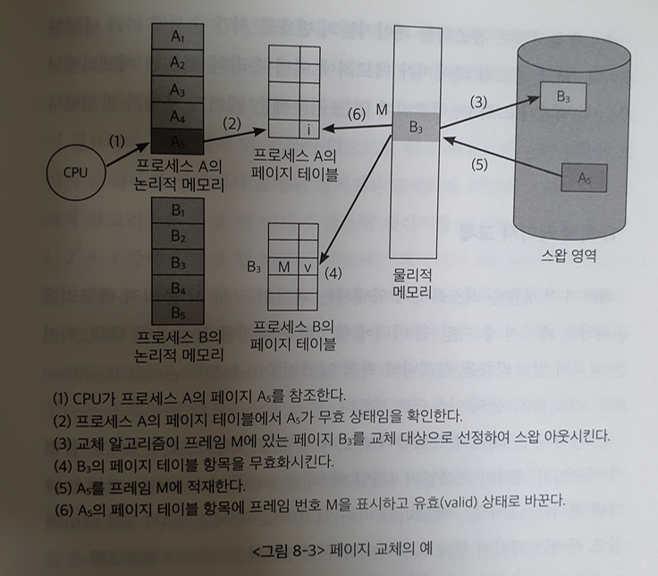

# 8. 가상메모리

* 시분할 환경에서는 한정된 메모리 공간을 여러 프로그램이 조금씩 나누어서 사용.
* 운영체제는 보통 몇몇 프로그램들에게 집중적으로 메모리를 할당한 후, 시간이 흐르면 이들로부터 메모리를 회수해거 다른 프로그램들에게 다시 집중적으로 메모리를 할당하는 방식을 채택함.
* 이유는 프로세스의 빠른 수행을 위해 프로그램마다 최소한 확보해야 하는 메모리의 크기가 존재하기 때문.
* CPU에서 당장 수행해야 할 부분만을 메모리에 올려놓고 그렇지 않은 부분은 디스크의 스왑 영역에 내려놓았다가 다시 필요해지면 메모리에 올라가 있는 부분을 고체하는 방식을 사용.
* 따라서 프로그램 입장에서는 물리적 메모리 크기에 대한 제약을 생각할 필요가 없어짐.
* 프로그램은 0번지부터 시작하는 자기 자신만의 메모리 주소 공간을 가정할 수 있는데, 이러한 메모리 공간을 가상메모리라고 부름.
* 프로세스의 주소 공간을 메모리롤 적재하는 단위에 따라 가상메모리 기법은 요구 페이징 방식과 요구 세그먼테이션 방식으로 구현될 수 있음.
* 대부분의 경우 요구 페이징 방식을 사용하며, 요구 세그먼테이션 방식을 사용하는 경우는 대개 하나의 세그먼트를 여러 개의 페이지로 나누어 관리하는 페이지드 세그먼테이션 기법을 사용하는 경우.

## 1. 요구 페이징

* 요구 페이징이란 프로그램 실행 시 당장 사용될 페이지만을 올리는 방식.
* 특정 페이지에 대해 CPU의 요청이 들어온 후에야 해당 페이지를 메모리에 적재.
* 당장 실행에 필요한 페이지만을 메모리에 적재하기 때문에 메모리 사용량이 감소하고, 프로세스 전체를 메모리에 올리는데 소요되는 입출력 오버헤드도 줄어듬.
* 사용되지 않을 주소 영역에 대한 입출력까지 수행하던 기존 방식에 비해 응답시간을 단축시킬 수 있고 시스템이 더 많은 프로세스를 수용할 수 있게 해줌.
* 주된 효용은 프로그램이 물리적 메모리의 용량 제약을 벗어날 수 있도록 함.(일부만을 메모리에 적재하게 되므로 물리적 메모리의 용량보다 큰 프로그램도 실행할 수 있음.)
* 일부 페이지만 메모리에 올라와 있고 나머지 페이지는 디스크의 스왑 영역에 존재하므로 구별하기 위해 유호-무효 비트를 사용함.(각 프로세스를 구성하는 모든 페이지에 대해 존재해야 함.)
    * 특정 페이지가 참조되어 메모리에 적재되는 경우 유효값으로 바뀜.
    * 무효인 경우: 페이지가 현재 메모리에 없는 경우, 페이지가 속한 주소 영역을 프로세스가 사용하지 않는 경우.
* CPU가 참조하려는 페이지가 현재 메모리에 올라와 있지 않아 유효-무효 비트가 무효로 세팅되어 있는 경우를 페이지 부재(page fault)가 일어났다고 함.

### 1) 요구 페이징의 페이지 부재 처리

* CPU가 무효 페이지에 접근하면 주소 변환을 담당하는 하드웨어인 MMU가 페이지 부재 트랩을 발생시킴.
* CPU의 제어권이 커널모드로 전환, 운영체제의 페이지 부재 처리루틴이 호출됨.
    * 운영체제는 해당 페이지에 대한 접근이 적법한지를 먼저 체크.
    * 사용되지 않는 주소 영역에 속한 페이지에 접근하려 했거나 해당 페이지에 대한 접근 권한 위반을 했을 경우에는 해당 프로세스를 종료시킴.
        * ex) 읽기전용인 페이지에 대해 쓰기 접근 시도를 하는 것
    * 접근이 적법하면 물리적 메모리에서 비어 있는 프레임을 할당받아 그 공간에 해당 페이지를 읽어옴.
    * 만약 비어있는 프레임이 없다면 기존에 메모리에 올라와 있는 페이지중 하나를 스왑아웃.
    * 요청된 페이지를 디스크로부터 메모리로 적재하기까지 오랜 시간이 소요되서 이 프로세스는 봉쇄 상태가 됨.
    * 기존 레지스터 상태 및 프로그램 카운터값을 프로세스 제어블록에 저장.
    * 디스크 입출력이 완료되면 해당 페이지의 유효-무효 비트를 유효로 설정하고, 봉쇄되었던 프로세스를 준비 큐로 이동시킴.

### 2) 요구 페이징의 성능

* 요구 페이징 기법의 성능에 가장 큰 영향을 미치는 요소는 페이지 부재의 발생 빈도.
    * 페이지 부재가 일어나면 요청된 페이지를 디스크로부터 메모리로 읽어오는 막대한 오버헤드가 발생하기 때문.
* 요구 페이징의 성능은 요청한 페이지를 참조하는 데 걸리는 유효 접근시간으로 측정.
* (1-P)는 페이지 부재가 일어나지 않는 비율.(메모리에 접근 하는 시간만이 소요)
* 페이지 부재가 일어나면 많은 오버헤드(디스크 입출력과 각종 오버헤드)가 필요.
* 유효 접근시간이 짧을수록 요구 페이징 기법의 성능은 향상됨.

## 2. 페이지 교체

* 페이지 부재가 발생하면 요청된 페이지를 디스크에서 메모리로 읽어와야 함.
* 이때 물리적 메모리에 빈 프레임이 존재하지 않을 수 있는데 이 경우 메모리에 올라와 있는 페이지 중 하나를 디스크로 쫓아내야 함. 이것을 페이지 교체(page replacement)라고 함.
* 페이지 교체를 할 때에 어떠한 프레임에 있는 페이지를 쫓아낼 것인지 결정하는 알고리즘을 교체 알고리즘이라고 함. 목표는 페이지 부재율을 최소화하는 것.
* 가까운 미래에 참조될 가능성이 가장 적은 페이지를 선택해서 내쫓는 것이 성능을 향상시킬 수 있는 방안.
* 페이지 교체 알고리즘의 성능은 주어진 페이지 참조열(page reference string)에 대해 페이지 부재율을 계산함으로써 평가.
* 페이지 참조열: 1,2,3,4,1,2,5,1,2,3,4,5
* 참조되는 페이지들의 번호를 시간 순서에 따란 나열함.
* 해당 번호의 페이지가 메모리에 이미 올라와 있으면 메모리에서 적중(hit)되었다고 하고, 없는 경우 페이지 부재가 발생.

### 1) 최적 페이지 교체

* 페이지 부재율을 최소화하기 위해서는 페이지 교체 시 물리적 메모리에 존재하는 페이지 중 가장 먼 미래에 참조될 페이지르 쫓아내면 됨. 이러한 최적의 알고리즘을 빌레디의 최적 알고리즘 또는 MIN, OPT 등의 이름으로 부름.
* 처음 4회까지는 페이지 부재가 불가피하게 발생.
* 5회와 6회는 적중.
* 7회는 1,2,3,4 중 가장 먼 미래에 참조될 페이지를 교체.
* 총 6회의 페이지 부재가 발생.
* 이 알고리즘은 미래에 어떤 페이지가 어떠한 순서로 참조될지 미리 알고 있다는 전제하에 알고리즘을 운영해서 실제 시스템에서 온라인으로 사용할 수 있는 알고리즘은 아님.
* 따라서 오프라인 알고리즘이라고 부름.
* 빌레디의 오프라인 최적 알고리즘은 어떠한 알고리즘을 사용하는 경우보다도 가장 적은 페이지 부재율을 보장하므로 다른 알고리즘의 성능에 대한 상한선을 제공함.

### 2) 선입선출 알고리즘

* 선입선출(FIFO) 알고리즘은 페이지 교체 시 물리적 메모리에 가장 먼저 올라온 페이지를 우선적으로 내쫓음.
* 페이지의 향후 참조 가능성을 고려하지 않고, 물리적 메모리에 들어온 순서대로 내쫓아서 비효율적인 상황이 발생할 수 있음.
* 물리적 메모리의 공간이 늘어났음에도 페이지 부재가 증가함. 이러한 상황을 FIFO의 이상 현상(FIFO anomaly)라고 함.
* LRU에서는 이와 같은 이상 현상이 발생하지 않음.

### 3) LRU(Least Recently Used) 알고리즘

* 메모리 페이지의 참조 성향 중 중요한 한 가지 성질로 시간지역성(temporal locality)이 있음.
* 이 성질은 최근에 참조된 페이지가 가까운 미래에 다시 참조될 가능성이 높은 성질을 말함.
* 페이지 교체 시 가장 오래전에 참조가 이루어진 페이지를 쫓아냄.

### 4) LFU(Least Frequently Used) 알고리즘

* 페이지의 참조 횟수로 교체시킬 페이지를 결정함.
* 과거에 참조 횟수가 가장 적었던 페이지를 쫓아냄.
* 최저 참조 횟수를 가진 페이지가 여러 개 존재하는 경우 임의로 하나를 선정함.(성능 향상을 위해서는 상대적으로 더 오래전에 참조된 페이지를 쫓아내는 것이 효율적)
* 페이지의 참조 횟수를 계산하는 방식에 따라 두가지로 나눠짐.
    * Incache-LFU
        * 페이지가 물리적 메모리에 올라온 후부터의 참조 횟수를 카운트하는 방식
        * 따라서 페이지가 메모리에서 쫓겨났다가 다시 들어온 경우 참조 횟수는 1부터 새롭게 시작
    * Perfect-LFU
        * 메모리에 올라와있는지의 여부와 상관없이 그 페이지의 과거 총 참조 횟수를 카운트함.
        * 기존의 참조 횟수가 누적됨.
        * 페이지의 참조 횟수를 정확히 반영할 수 있다는 장점이 있지만, 메모리에서 쫓겨난 페이지의 참조 기록까지 모두 보관하고 있어야 하므로 그 오버헤드가 상대적으로 더 크다고 할 수 있음.
        * LFU 알고리즘은 LRU보다 오랜 시간 동안의 참조 기록을 반영할 수 있다는 장점.
        * 하지만 LFU는 시간에 따른 페이지 참조의 변화를 반영하지 못하고, LRU보다 구현이 복잡함.

### 5) 클럭 알고리즘(clock algorithm)

* LRU와 LFU 알고리즘은 페이지의 참조 시각 및 참조 횟수를 소프트웨어적으로 유지하고 비교해야 하므로 알고리즘의 운영에 시간적인 오버헤드가 발생.
* 클럭 알고리즘은 하드웨어적인 지원을 통해 알고리즘의 운영 오버헤드를 줄인 방식.
* LRU를 근사시킨 알고리즘으로 NUR(Not Used Recently) 또는 NRU(Not Recently Used) 알고리즘이라 불림.
* 클럭 알고리즘은 오랫동안 참조되지 않은 페이지 중 하나를 교체. (교체되는 페이지의 참조 시점이 가장 오래되었다는 것을 보장하지는 못함.)
* 하드웨어적인 지원으로 동작하기 때문에 LRU에 비해 페이지의 관리가 훨씬 빠르고 효율적으로 이루어짐.
* 따라서 대부분의 시스템에서 페이지 교체 알고리즘으로 클럭 알고리즘을 채택함.
* 페이지 프레임들의 참조비트를 순차적으로 조사함.
* 참조비트는 각 프레임마다 하나씩 존재하며 그 프레임 내의 페이지가 참조될 때 하드웨어에 의해 1로 자동 세팅됨.
* 클럭 알고리즘은 참조비트가 1인 페이지는 0으로 바꾼 후 지나가고 참조비트가 0이면 교체한다.
* 적어도 시곗바늘이 한 바퀴를 도는 데 소요되는 시간만큼 페이지를 메모리에 유지시켜둠으로써 페이지 부재율을 줄이도록 설계되었기 때문에 2차 기회 알고리즘이라고도 부름.

## 3. 페이지 프레임의 할당

* 프로세스 여러 개가 동시에 수행되는 상황에서는 각 프로세스에 얼마만큼의 메모리 공간을 할당할 것인지 결정해야 함.
* 프로세스마다 페이지 프레임을 균등하게 할당하는 것도 하나의 방법이지만 시스템의 성능 향상을 위해서는 좀 더 효율적인 메모리 할당 방법이 필요.
* 기본적인 할당 알고리즘은 3가지로 나눌 수 있음.
    * 모든 프로세스에게 페이지 프레임을 균일하게 할당하는 균등할당(equal allocation)
    * 프로세스의 크기에 비례해 페이지 프레임을 할당하는 비례할당(proportional allocation)
        * 이 방식은 프로세스의 크기가 모두 균일하지 않다는 점에 착안한 방식으로 프로세스의 크기를 고려한 균등할당 방식으로 볼 수 있음.
    * 프로세스의 우선순위에 따라 페이지 프레임을 다르게 할당하는 우선순위 할당(priority allocation)
        * 이 방식은 프로세스 중 당장 CPU에서 실행될 프로세스와 그렇지 않은 프로세스를 구분하여 전자 쪽에 더 많은 페이지 프레임을 할당하는 방식을 말함.
* 할당 알고리즘만으로는 프로세스의 페이지 참조 특성을 제대로 반영하지 못할 우려가 있음.
    * ex) 현재 수행 중인 프로세스의 수가 지나치게 많을 경우 프로세스당 할당되는 메모리 양이 과도하게 적어 질 수 있음.
    * ex) 반복문의 경우 반복문을 구성하는 페이지들을 한꺼번에 메모리에 올려 놓는 것이 유리.
* 이와 같은 종합적인 상황을 고려해서 각 프로세스에 할당되는 페이지 프레임의 수를 결정할 필요가 있으며, 경우에 따라서는 일부 프로세스에게 메모리를 할당하지 않는 방식으로 나머지 프로세스들에게 최소한의 메모리 요구량을 충족시킬 수 있어야 함.

## 4. 전역교체와 지역교체

* 교체할 페이지를 선정할 때, 교체 대상이 될 프레임의 범위를 어떻게 정할지에 따라 교체 방법을 전역교체(global replacement)와 지역교체(local replacement)로 구분할 수 있음.
* 전역교체
    * 전역교체 방법은 모든 페이지 프레임이 교체 대상이 될 수 있는 방법.
    * 프로세스마다 메모리를 할당하는 것이 아니라 전체 메모리를 각 프로세스가 공유해서 사용하고 교체 알고리즘에 근거해서 할당되는  메모리 양이 가변적으로 변하는 방법.
    * 페이지 교체 시 다른 프로세스에 할당된 프레임을 빼앗아올 수 있는 방식.
    * 전체 시스템차원에서 더 자주 참조되는 페이지가 메모리에 올라가기 때문에 프로세스의 프레임 할당량이 스스로 조절될 수 있음.
    * LRU, LFU, 클럭 등의 알고리즘을 물리적 메모리 내에 존재하는 전체 페이지 프레임들을 대상으로 적용하는 경우가 이러한 전역교체 방법이 됨.(워킹셋, PFF도 사용될 수 있음.)
* 지역교체
    * 지역교체 방법은 현재 수행 중인 프로세스에게 할당된 프레임 내에서만 교체 대상을 선정할 수 있는 방법.
    * 프로세스마다 페이지 프레임을 미리 할당하는 것을 전제로 함.
    * 해당 프로세스에게 할당된 프레임 내에서만 페이지를 교체할 수 있음.
    * 프로세스별로 페이지 프레임을 할당하고, 교체할 페이지도 그 프로세스에게 할당된 프레임 내에서 선정하게 되는 것.
    * LRU, LFU 등의 알고리즘을 프로세스별로 독자적으로 운영할 때에는 지역교체 방법이 됨.

## 5. 스레싱

* 프로세스가 원할하게 수행되기 위해서는 일정 수준 이상의 페이지 프레임을 할당받아야 함.
* 최소한의 페이지 프레임을 할당받지 못할 경우 성능상의 심각한 문제가 발생할 수 있음.
* 페이지 부재율이 크게 상승해 CPU 이용률이 급격히 떨어질 수 있음.
* 이와 같은 현상을 스레싱(thrashing).
    * 스레싱이 발생하는 시나리오.
    * 운영체제는 CPU의 이용률이 낮을 경우 메모리에 올라와 있는 프로세스의 수가 적기 떄문이라고 판단.
    * CPU 이용률이 낮다는 것은 준비 큐가 비는 경우가 발생한다는 뜻
    * 이는 메모리에 올라와 있는 프로세스의 수가 너무 적어 이들 프로세스가 모두 I/O 작업을 함으로써 준비 큐가 비는 경우가 발생했다는 뜻
    * 따라서 CPU 이용률이 낮으면 운영체제는 메모리에 올라가는 프로세스의 수를 늘리게 됨.(메모리에 동시에 올라가 있는 프로세스의 수를 다중 프로그래밍의 정도[Multi-Programming Degree: MPD]라고 부름.)
    * 즉 CPU 이용률이 낮을 경우 MPD를 높이게 됨.
    * 그런데 MPD가 과도하게 높아지면 각 프로세스에게 할당되는 메모리의 양이 지나치게 감소하게 됨.
    * 각 프로세스들이 원할하게 수행되기 위해 필요한 최소한의 페이지 프레임도 할당받지 못하는 상태가 되어 페이지 부재가 빈번히 발생하게 됨.
    * 페이지 부재가 발생하면 디스크 I/O 작업을 수반하므로 문맥교환을 통해 다른 프로세스에게 CPU가 이양됨.
    * 이때 다른 프로세스 역시 메모리 양이 지나치게 적어 페이지 부재 발생.
    * 결국 시스템은 페이지 부재를 처리하느라 매우 분주해지고 CPU 이용률이 급격히 떨어짐. 또 MPD를 높이기 위해 메모리에 다른 프로세스를 추가.
    * 프로세스들은 서로의 페이지를 교체하며 스왑 인과 스왑 아웃을 지속적으로 발생시키고, CPU는 대부분의 시간에 일을 하지 않게 됨. 이러한 상황을 스레싱이라고 함.
* MPD를 증가시키면 CPU 이용률은 비례해서 증가함.
* 그러나 어느 한계치를 넘어서면 CPU 이용률이 급격히 떨어짐.
* MPD를 적절히 조절해 CPU 이용률을 높이는 동시에 스레싱 발생을 방지하는 방법에는 워킹셋 알고리즘과 페이지 부재 빈도 알고리즘이 있음.

### 1) 워킹셋 알고리즘(working-set algorithm)

* 프로세스는 일정 시간 동안 특정 주소 영역을 집중적으로 참조하는 경향이 있음.
* 집중적으로 참조되는 페이지들의 집합을 지역성 집합(locality set)이라 함.
* 워킹셋 알고리즘은 이러한 지역성 집합이 메모리에 동시에 올라갈 수 있도록 보장하는 메모리 관리 알고리즘을 뜻함.
* 프로세스가 일정 시간 동안 원할히 수행되기 위해 한꺼번에 메모리에 올라와 있어야 하는 페이지들의 집합을 워킹셋이라고 정의하고, 프로세스의 워킹셋을 구성하는 페이지들이 한꺼번에 메모리에 올라갈 수 있는 경우에만 그 프로세스에게 메모리를 할당함.
* 그렇지 않을 경우 프로세스에게 할당된 페이지 프레임들을 모두 반납시킨 후 그 프로세스의 주소 공간 전체를 디스크로 스왑 아웃시킴. 이와 같은 방법으로 워킹셋 알고리즘은 MPD를 조절하고 스레싱을 방지함.
* 워킹셋을 구하는 방법
    * 한꺼번에 메모리에 올라가야 할 페이지들의 집합을 결정하기 위해 워킹셋 알고리즘은 워킹셋 윈도우(working-set window)를 사용.
    * 윈도우의 크기가 델타인 경우, 워킹셋 알고리즘은 시각 ti에서의 워킹셋 WS(ti)을 시간 간격[ti-델타,ti] 사이에 참조된 서로 다른 페이지들의 집합으로 정의함.
    * ti 시점에 워킹셋에 포함된 페이지들은 메모리에 유지되고 그렇지 않은 페이지들은 메모리에서 쫓겨나게 됨.
    * 페이지가 참조된 시점부터 델타시간 동안은 메모리에 유지하고, 그 시점이 지나면 메모리에서 지워버리게 됨.
* 워킹셋 알고리즘은 메모리에 올라와 있는 프로세스들의 워킹셋 크기의 합이 프레임의 수보다 큰 경우 일부 프로세스를 스왑 아웃시켜서 남은 프로세스의 워킹셋이 메모리에 모두 올라가는 것을 보장함. 이는 MPD를 줄이는 효과를 발생시킴.
* 반면 프로세스들의 워킹셋을 모두 할당한 후에도 프레임이 남을 경우, 스왑 아웃되었던 프로세스를 다시 메모리에 올려서 워킹셋을 할당함으로써 MPD를 증가시킴.
* 이러한 방식으로 워킹셋 알고리즘은 CPU 이용률을 높게 유지하면서 MPD를 적절히 조절해 스레싱을 방지함.
* 윈도우 델타의 크기가 너무 작으면 지역성 집합을 모두 수용하지 못할 우려가 있고, 너무 크면 여러 규모의 지역성 집합을 수용할 수 있는 반면 MPD가 감소해 CPU 이용률이 낮아질 우려가 있음.
* 윈도우 크기 델타를 결정하는 것이 중요.
* 워킹셋의 크기는 시간의 흐름에 따라 변함.
* 프로세스가 메모리를 많이 필요로 할 때에는 많이 할당하고 적게 필요로 할 때에는 적게 할당하는 일종의 동적인 프레임 할당 기능까지 수행한다고 할 수 있음.

### 2) 페이지 부재 빈도 알고리즘(Page Fault Frequency: PFF)

* 페이지 부재 빈도 알고리즘은 프로세스의 페이지 부재율을 주기적으로 조사하고 이 값에 근거해서 각 프로세스에 할당할 메모리 양을 동적으로 조절함.
* 어떤 프로세스의 페이지 부재율이 시스템에서 미리 정해놓은 상한값을 넘게 되면 이 프로세스에 할당된 프레임의 수가 부족하다고 판단하여 이 프로세스에게 프레임을 추가로 더 할당함.
* 빈 프레임이 없으면 일부 프로세스를 스왑 아웃기켜서 메모리에 올라가 있는 프로세스의 수를 조절함.
* 프로세스의 페이지 부재율이 하한값 이하로 떨어지면 필요 이상으로 많은 프레임이 할당된 것으로 간주해 할당된 프레임의 수를 줄임.
* 이런 방식으로 메모리 내에 존재하는 모든 프로세스에 필요한 프레임을 다 할당한 후에도 프레임이 남는 경우 스왑 아웃되었던 프로세스에게 프레임을 할당함으로써 MPD를 높임.
* 이러한 원리로 MPD를 조절하면서 CPU 이용률을 높이는 동시에 스레싱을 방지함.

